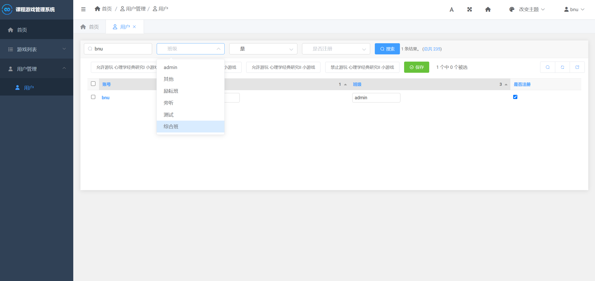
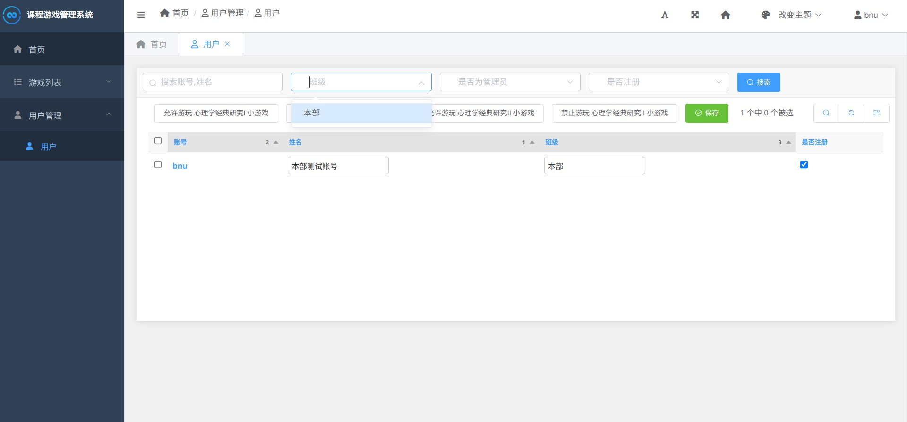

（OK 我承认我只是想水一篇……）

在给北师心理学部开发了心理学经典研究的小游戏后不久，珠海校区那边的老师表示那边也想用这个游戏进行教学，于是我经过了一些简单的适配之后让珠海那边的同学也可以进行这个游戏。说实话，这个适配的过程最困难的部分在于后端开发，比如说后台管理系统，比如说日志存储，等等。以后台管理为例，虽然目前为止仍然只有我自己一个超级用户，但是在以后加入其他普通管理员后，我认为还是有必要对本部和珠海两边的数据进行一定的隔离的。

目前，这一部分操作其实已经做了不少了，譬如我成功让本部管理员只能看到本部的数据、珠海的管理员只能看到珠海的数据。然而，有一个bug我始终没能解决：虽然数据是各自只能看各自的，但是在后台界面的筛选界面（比如说筛选班级），本部的管理员也能看到珠海那边的班级。虽然这并不影响系统正常使用，但是这个问题还是挺烦的。



于是，我决定使用自定义过滤器来解决这个问题。

这一部分的代码在文档也是比较好找到的。

```python
class ClassListFilter(admin.SimpleListFilter):
    title = _('班级')
    parameter_name = 'custom_student_class'

    def lookups(self, request, model_admin):
        qs = model_admin.get_queryset(request)
        class_list = list(qs.values_list('user__student_class'))
        classes = list(map(lambda x: x[0], class_list))
        unique = list(set(classes))
        return list(map(lambda x: (x, _(x)), unique))

    def queryset(self, request, qs):
        if self.value() is None:
            return qs
        else:
            return qs.filter(user__student_class=self.value())
```

按说这段代码其实非常清晰明了，但是有一个问题：页面初始化的时候调用了一次过滤器的 `queryset` 方法，而此时 `self.value()` 的值是 `None`，于是这就导致筛选出的 `queryset` 为空，从而不显示任何数据——我不确定这到底是 Django 更新后的新特性，还是文档单纯忘记提这个，还是因为我使用的 Django SimpleUI 框架做了什么奇怪的事情，但反正我是遇到了这个问题。

解决方案倒是很简单，就是判断一下 `self.value()` 是否为空，如果是就将方法传入参数的 `queryset` 原模原样返回，即可解决。这样，后台系统终于可以像我预期的那样工作了。


