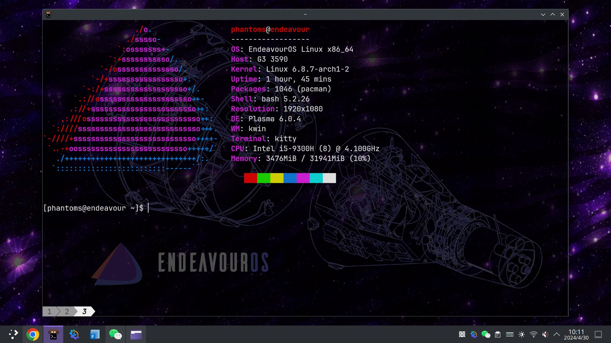

## 1 漫长的搜索

我一直在苦苦寻找一款让我满意的 Linux 发行版。

一个 Linux 发行版好与不好，是一件非常主观的事情。有的人偏爱稳定，让他用 Windows 他就能坚守 XP 十几年，对于新的特性完全不 care，对于这类人 Debian 就是完美的选择；有的人希望省事，不想要先做一大堆配置才能开始使用系统，这时 Ubuntu 及其衍生版则是更好的选择；有的人特立独行且独立自主，对于 KISS 原则看的无比重要，于是他们会选择 Arch 或者 Gentoo……

而事实往往还要比这更加复杂，因为很多时候，我们的需求并不能这样一句话概括。以我为例，我对于完美的 Linux 发行版的要求是，不要管得太多，要给我留出足够多的自定义空间，所以我直接 pass 掉了 Ubuntu 等一系列发行版；必须要滚动更新，因为我要最新版本的软件，于是 Fedora 和 Debian 等发行版也被我排除在外；生态要好，尤其是国内生态，所以 Garuda 这种官网都打不开的发行版也不会在考虑范围之内。

一开始，我的选择是 ArchLinux。然而，Arch 的初始配置实在过于简陋，我虽然喜欢自定义，但也不愿意花费几天的时间尝试各种各样的配置；更何况，ArchLinux 似乎越来越和各种 Linux 小鬼挂钩了，我非常讨厌 "I use Arch btw" 这种 KY 行为（一如我讨厌部分 Ubuntu 用户将其和 Linux 划等号的行为）。

于是，我换到了 openSUSE。然而，openSUSE 的部分初始配置于我而言还是有些冗余——KDE 的调教的确不错，但是它为我装了太多我用不到的软件；YAST 初看不错，但是实际上总感觉有些鸡肋；OPI 号称可以媲美 AUR 但也就那样，很多野包我是压根不敢用；RPM 包数量相对较少，Zypp 包管理器的一些包名很奇怪，这也都是踩在了我的雷点上。

## 2 机缘巧合

然后我就很久不用 Linux 了——准确来说，我的工作主要放在了 WSL 上，在 WSL 上使用大蜥蜴的体验还是可以的（毕竟已经使用了 WSL，要求也不会那么高）。然而，我还是有那么一些不甘心，因为在不考虑那些缺点的前提下，那一段使用 Linux 的体验还是不错的。

就在这两天，我注意到了 EndeavourOS 这个发行版。好吧我其实听说过这个发行版很久了，但了解仅限于它是一个基于 Arch 的发行版。之前我对 ArchLinux 衍生版的了解基本局限于 Manjaro，恨屋及乌，所以我对 EndeavourOS 的第一印象真不怎么好。然而，在我心血来潮阅读了几篇 EndeavourOS 的帖子之后，我发现这个发行版似乎满足了我的很多需求：包管理器不是一个问题，我本身就喜欢 pacman 和 AUR；初始配置足以令人满意，因为今年 EndeavourOS 已经不再使用 XFce 作为默认 DE，而是转而使用 KDE 6；但是这个初始配置似乎又并不多余，属于是紧贴 KISS 原则。

我心想，难道真让我碰上完美的发行版了？于是，抱着试一试也无妨的态度，我安装了 EndeavourOS。

## 3 使用体验

我的评价是，爽。

Arch 安装也许不难，但是它麻烦，EndeavourOS 的图形化安装则直接解决了这一点，而且它提供的默认主题真的很漂亮。

更重要的是，在使用 Arch 的时候必须手动安装的一些东西——网络配置、中文字体、桌面环境、安装 yay……——EndeavourOS 全都替我们做好了。我从开始安装，到配置差不多完全，中间甚至还花了几个小时解决 chromium 和 wps 不能输入中文的问题，总共也就用了 5 个多小时。事实上，我不管是用 openSUSE 还是 Fedora，第一次配置都要花差不多同样的时间，还享受不到 Arch 系的诸多便捷之处。

这还没完，EndeavourOS 真的没有装太多多余的东西。openSUSE 的 KDE 会装一堆附带的软件、游戏，而 EndeavourOS 则只装了一些必要的工具，游戏什么的都没有预装，这样我卸载不需要的包的时间就大大减少了。

总之就是，Arch 的优点，EndeavourOS 基本上保留了；它的缺点，EndeavourOS 都帮我们规避了。

## 4 总结

现在也许是开始使用 Linux 最好的时间。我认为 EndeavourOS 的使用体验这么好部分也是源于和半年前的对比，但这种对比或多或少不太公平——KDE 5 就是没有 KDE 6 用着舒服；此前只能靠 wine 勉强体验的微信现在也有了原生的 Linux 版本。但这也说明，现在的 Linux 越来越适合新手以及那些因为国产软件无法使用而望而却步的用户。

而 EndeavourOS 的优点，也在与它的易用性和自由程度的完美平衡。它的默认配置不多不少，自定义能力和 Arch 不相上下——实话实说，我们真的在意那一点点损失的自定义吗，我相信 50% 以上的人第一次拿到 Arch 都会做相同的工作，比如安装 yay，安装一些必要的软件包，除非你是什么极端原教旨主义者，否则为什么不让 EndeavourOS 帮你把这些大概率同质的工作做了呢？此外，EndeavourOS 身后有着庞大的 Arch 社区作为支持，同时又可以完美避开 KY 小鬼（Arch 的云玩家大概率看不上 EndeavourOS 吧）。

所以，2024 年，为什么不尝试一下 EndeavourOS 呢？
