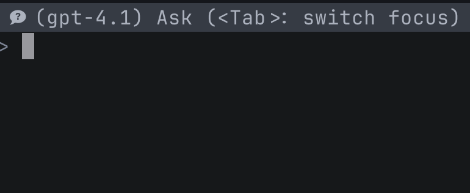

虽然在不久前我还是古法编程的忠实信徒，但在最近的一段时间，我还是拥抱了 vibe coding，因为使用 AI 进行编程确实是很香，我不再需要浪费时间处理那些功能比较基础但是代码量又不是很小的工作。目前看来，AI 除了会让我因为太久不亲自写代码而技艺生疏，似乎真的是一个很棒的工具。

而为了更加方便地使用 AI 功能，我通过 [avante.nvim](https://github.com/yetone/avante.nvim) 插件将其集成到了我的 neovim 中。这个插件的功能相当强大，使用体验很好，我可以在其中很便捷地和 GPT-4 聊天、要求它给我解释一段代码，可以把需求告诉 Claude Sonnet 4 让它帮我快速生成一个页面或是 app 的代码文件，除了裸连 GitHub copilot 速度有一点点慢之外，整个过程中的使用体验还是相当好的。

当然，使用体验再好也不可能是十全十美的。如果你看了 avante 的文档，会发现它的功能相当复杂，但许多功能并没有提供自定义的能力。诚然，这个插件本身已经非常优秀了，但这些大大小小用着不顺手的地方，我怎么看怎么不爽——毕竟，我对我的 neovim 做了那么多自定义，又怎么能对一个插件无可奈何呢？

所以，我在我的配置里做了如下配置，针对 avante 做了一些优化。

## 1 快捷切换 avante 窗口

在 avante 的默认配置中，我们可以通过 <kbd>Tab</kbd> 在输入、对话、选中的文件等子窗口之间进行切换，但这个设计其实相当不方便，譬如说当我们切换到左侧的代码窗口后，就没有办法精确跳转回到右侧边栏中的某个子窗口。为了解决这个问题，我决定编写一个函数来直接切换到目标窗口。

要实现这个功能，我们要做的其实就只有找到目标窗口的 window id。通过浏览 avante 的源代码，我们可以很轻松地在 `require("avante")` 得到的 table 中找到 `.current.sidebar` 字段。而如果我们打开 `avante/sidebar.lua` 文件，会在其中看到一个名为 `switch_window_focus` 的函数，这里面通过 `sidebar.containers[<win>].winid` 就能够得到各个子窗口的 window
id。

我们打开 avante 边栏，然后尝试运行一下 `:= require("avante").current.sidebar.containers`，可以看到这里面包含 `input`、`result`、`selected_files` 等字段，正好对应侧边栏的子窗口。我们尝试运行 `:= require("avante").current.sidebar.containers.result.winid`，发现确实可以输出相应的值。

这样，我们要做的就很简单了，只需要编写这样一个函数就可以实现切换到 result 窗口：

```lua
local function switch_to_avante_result()
  local candidate = require("avante").current.sidebar.containers.result
  if win then
      vim.api.nvim_set_current_win(candidate.winid)
  end
end
```

然后，将其绑定到快捷键上，即可。其他的子窗口的切换也类似。

## 2 快捷切换 model

你知道的，我并非大富大贵，copilot pro 也是因为我有学生认证才能免费使用。而学生认证的 copilot pro，每个月限制 300 次 premium request——比如说，你和 claude sonnet 4 互动一次算作 1 次 premium request，和 claude opus 4 互动一次算作 10 次 premium requests（详见 <https://docs.github.com/en/copilot/concepts/billing/copilot-requests#model-multipliers>），只有和 GPT-4 这种低端一点的模型互动才是真的免费畅吃的。所以为了节省，我需要在提问的时候切换模型，一些简单的问题就去问免费的 GPT，复杂的任务再去找 claude。

Avante 本身提供了一个 `AvanteModels` 命令来切换模型，但这个命令在我看来有以下问题：

- 第一次使用会从 github 请求可用的模型，因此会卡顿一小段时间才显示可选列表
- 可选列表太长了，里面很多重复子项（一堆 GPT-4）和我压根不可能去用的选项（比如 GPT-3.5）
- 展示的名称包含信息比较少，我想要把 multiplier、模型特点等信息一起呈现出来

追根溯源，avante 展示模型列表的代码位于 `avante/model_selector.lua` 中。在 `create_model_entries` 中，我们发现它通过调用 `provider_cfg:list_models()` 函数获取列表，而 `provider_cfg` 是调用 `create_model_entries` 时传入的，这个值具体为 `require("avante.providers")[provider_name]`。由于我使用的是 copilot 作为 provider，所以我这里运行了 `:= require("avante.providers").copilot:list_models()` 查看结果：

```lua
{ {
    display_name = "GPT-4.1",
    id = "gpt-4.1",
    max_input_tokens = 128000,
    max_output_tokens = 16384,
    name = "copilot/GPT-4.1 (gpt-4.1)",
    policy = true,
    provider_name = "copilot",
    tokenizer = "o200k_base",
    version = "gpt-4.1-2025-04-14"
  },
  -- ...
  {
    display_name = "GPT-4.1",
    id = "gpt-4.1-2025-04-14",
    max_input_tokens = 128000,
    max_output_tokens = 16384,
    name = "copilot/GPT-4.1 (gpt-4.1-2025-04-14)",
    policy = true,
    provider_name = "copilot",
    tokenizer = "o200k_base",
    version = "gpt-4.1-2025-04-14"
  } }
```

这就很简单了，我们只要覆盖掉这个 `list_models` 函数，直接让它返回一个列表就可以避免从 github 请求可用模型产生的卡顿，而且我们还可以对这个列表进行精简并添加自定义信息：

```lua
local copilot = require("avante.providers")["copilot"]
function copilot:list_models()
    return {
        {
            display_name = "GPT-4.1",
            id = "gpt-4.1",
            max_input_tokens = 128000,
            max_output_tokens = 16384,
            name = "copilot/GPT-4.1 (free)", -- 查看 model_selector.lua 可以看到呈现的名称使用了这个字段
            policy = true,
            provider_name = "copilot",
            tokenizer = "o200k_base",
            version = "gpt-4.1-2025-04-14",
        },
        {
            display_name = "Claude Sonnet 4",
            id = "claude-sonnet-4",
            max_input_tokens = 128000,
            max_output_tokens = 16000,
            name = "copilot/Claude Sonnet 4 (*1)",
            policy = true,
            provider_name = "copilot",
            tokenizer = "o200k_base",
            version = "claude-sonnet-4",
        },
    }
end
```

## 3 提问的时候直接显示模型

默认情况下，你只有在消息发送出去才能看到当前使用的是什么模型——这其实挺吓人的，如果你亲戚家热爱编程的熊孩子偷偷把你当前的模型换成了 claude opus 4，而你又在不知情的情况下向 LLM 发送了一条消息，这可会耗费你足足 10 次 premium requests，简直肉疼（直接退出是没有用的，消息发出来就计费呦）。所以我希望能在输入窗口直接提示当前的模型是什么。

默认的窗口 title 很简单，只有 `󱜸 Ask (<Tab>: switch focus)` 这一句话。


通过检索源代码，我们发现这个功能好像根本没给我们留任何切入的角度。源代码 (`avante/sidebar.lua`) 是这样的：

```lua
header_text = string.format(
  "%s%s (%d:%d) (<Tab>: switch focus)",
  Utils.icon("󱜸 "),
  ask and "Ask" or "Chat with",
  self.code.selection.range.start.lnum,
  self.code.selection.range.finish.lnum
)
```

这里面似乎没有任何一个值是可以全局访问的。

欸，注意到 `Utils.icon` 这处调用了吗？我们如果修改这个函数的返回值，在图标后面加上模型名称，不就可以了吗？

又注意到，获取当前模型名称的代码也在当前代码文件中：`Config.get_provider_config(Config.provider).model`。

综上，我们只需如下就可以实现在图标后面显示当前使用的模型的功能：

```lua
local utils = require "avante.utils"
local old_icon = utils.icon
function utils.icon(string_with_icon, utf8_fallback)
    if string_with_icon == "󱜸 " then
        return string.format("󱜸 (%s) ", require("avante.config").get_provider_config("copilot").model)
    else
        return old_icon(string_with_icon, utf8_fallback)
    end
end
```


