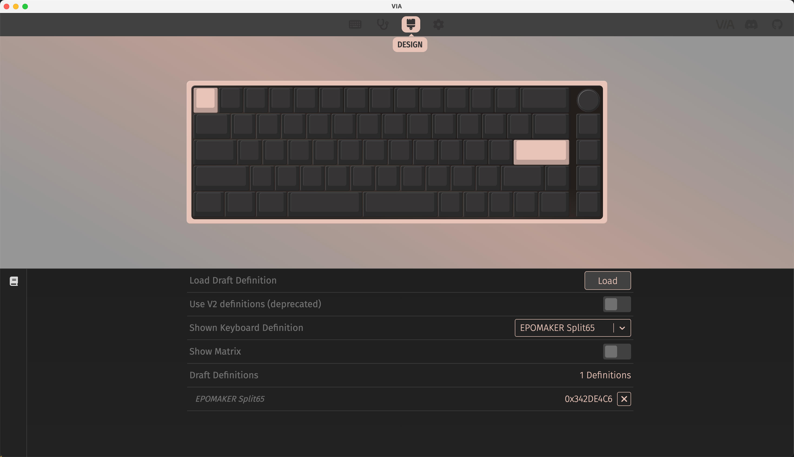
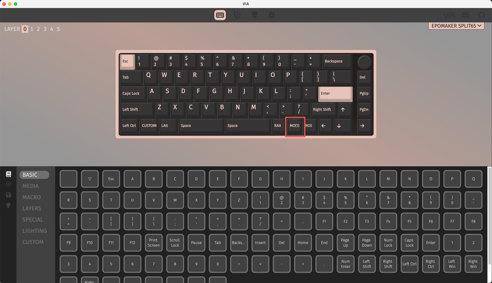
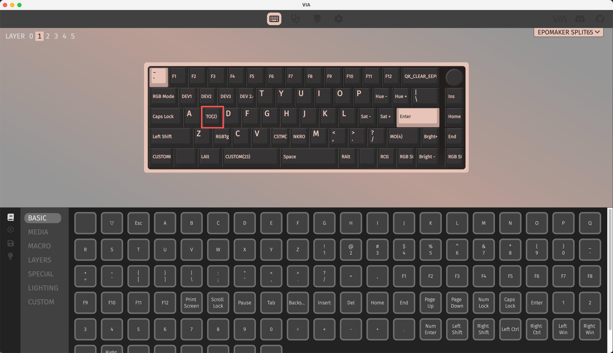
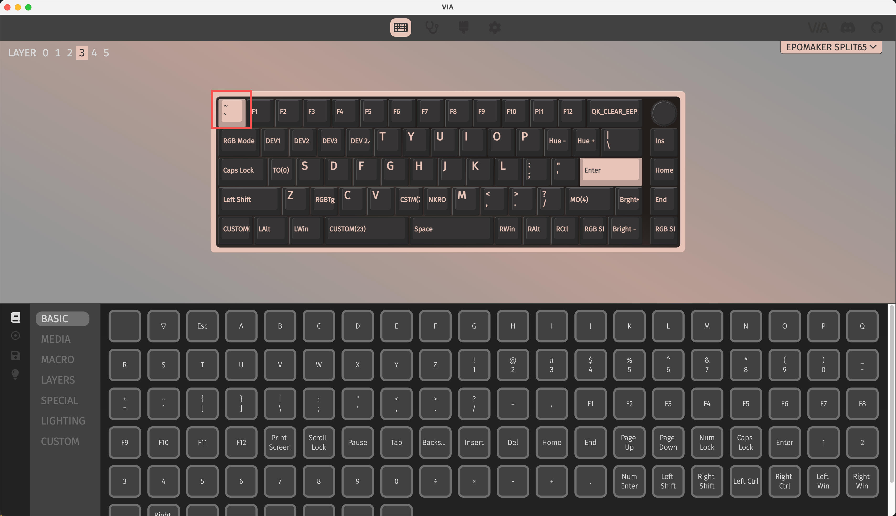
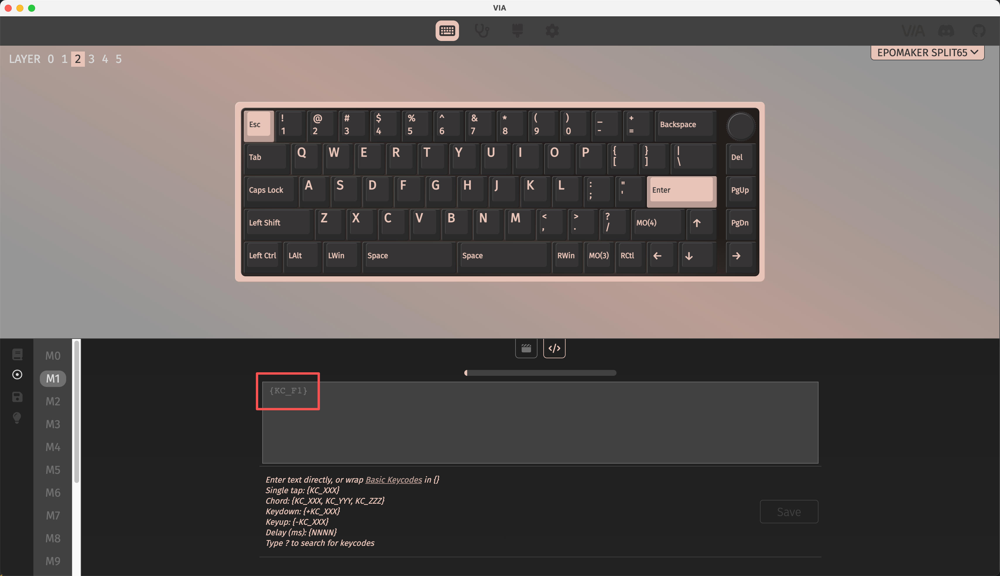
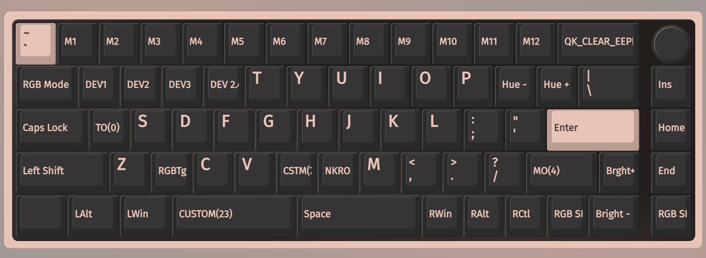

最近我买了 epomaker 的一把新键盘 split65，这是我的第一把分体键盘，虽然我的旧键盘没什么问题，但是我一直都很好奇分体键盘用起来是什么感受，遂购入。

键盘到手后，我发现了一个严重的问题——这并不源于分体键盘，而是源于这个配列，因为 65% 配列少了 f 区，于是我遇到了以下问题：

- 当我需要打 <kbd>`</kbd> 的时候，我需要按下 <kbd>fn</kbd> + <kbd>Esc</kbd>
- 当我需要按 <kbd>F1</kbd> 的时候，我需要按下 <kbd>fn</kbd> + <kbd>1</kbd>
  - 我用的是 mac，上面这一条实现的效果其实是 mac 的亮度调暗（相当于 mac 上按下 <kbd>fn</kbd> + <kbd>f1</kbd>）
  - 我需要按下 <kbd>fn</kbd> + <kbd>ctrl</kbd> + <kbd>1</kbd> 
  - 然后我需要再按下 <kbd>ctrl</kbd> 才行

对于一个常用浏览器以及终端的人来说，这几乎意味着这把键盘压根不可用，因为我平白无故需要多按很多键，且多出来的这个 <kbd>fn</kbd> 键是出现在了我很不熟悉的一个位置，导致我的输入效率大幅降低。

不过好在 split65 支持 VIA 改键，于是我采用了这种方案，并在这篇博客中记录这一过程中踩过的坑。

## 1 开始使用

VIA 是可以在浏览器中直接使用的：<https://www.usevia.app/>。不过，如果你使用的是 firefox 或者 safari 就没用办法使用，因为这个网站需要支持 WebHID 的浏览器。所以，这种情况下你要么换成 chrome，要么下载 VIA 打包好的应用：<https://github.com/WestBerryVIA/via-releases/releases>。

epomaker 的说明书告诉我要从官网下载一个配置文件：<https://epomaker.com/blogs/via-json/epomaker-split65-via-json-file> 并导入 VIA，但是在导入之前我们需要在设置里面打开 `show design tab`，此时页面顶端会出现第四个标签栏，我们在那里才能导入配置。



随后，我们回到第一个标签页，开始对键盘进行改键。

## 2 开始改键

我们首先看原始的键位图：



似乎没什么特殊的，但是这里出现了一个 `MO(1)` 的特殊键（位置在键盘上对应 <kbd>fn</kbd>），它是做什么的呢？

看到页面顶端的 layer 了吗？每一个 layer 中按键的 mapping 是不一样的，而 MO 就是在键盘按下的时候切换到指定的 layer，抬起后就切换回来。所以这个键在按下后就是切换到了
 layer 1。那我们继续看 layer 1:



我们会发现这里键的绑定就发生了变化。

对于这把键盘，我们可以按 <kbd>fn</kbd> + <kbd>s</kbd> 切换到 mac 模式。回到我们看刚才这两张图，按下 <kbd>fn</kbd> 进入 layer 1，此时 <kbd>s</kbd> 被绑定到了 `TO(2)` 上，这意味着按下这个键会永久切换到 layer 2，而 layer 2 里面对应的就是 mac 的配置。这意味着，我们接下来要做的修改都需要在 layer 2 中进行。

默认情况下，layer 2 的 <kbd>fn</kbd> 被绑定到了 `MO(3)`。我们已经知道这是什么意思，这意味着切换到 layer 3:



可以看到 layer 3 这里 <kbd>Esc</kbd> 被替换为了 <kbd>&grave;</kbd>，这也是我们按下 <kbd>fn</kbd> + <kbd>Esc</kbd> 实现输入 <kbd>&grave;</kbd> 的原理。其实，这种按键方式让我不适的主要原因是我不想去按那个 <kbd>fn</kbd> 键，因为它的位置很偏，我每次都需要去找一下。所以，我只要让右 <kbd>shift</kbd>（which 我从来不用）也能实现 <kbd>fn</kbd> 的功能就可以了，所以我们点击该键，将其修改为 `MO(3)`。

然而这还没完。我前面还提到了功能键的问题。虽然我们在这里可以看到功能键似乎就是正常对应了 <kbd>F1</kbd> - <kbd>F12</kbd>，但实际使用起来它就不是正常的功能键。

然而，机缘巧合，我发现如果通过宏发送这些键，就可以正常使用了。所以我做了这样的操作：

- 在宏中将 M1 到 M12 分别对应为 <kbd>F1</kbd> - <kbd>F12</kbd>
- 将右 <kbd>shift</kbd> map 到 `MO(4)`
- 将 `MO(4)` 的 <kbd>F1</kbd> - <kbd>F12</kbd> map 到 M1 到 M12





这样，我在按下 <kbd>fn</kbd> + 数字键的时候可以使用 mac 的相应硬件功能，在按下 <kbd>rshift</kbd> + 数字键的时候可以正常使用功能键。

当然，实际操作中我没有一个一个手动修改，因为 VIA 支持保存和导入键盘配置文件，所以我是直接对文本的配置文件做了批量的修改：

<details>
    <summary>完整配置</summary>

```json
{
  "name": "EPOMAKER Split65",
  "vendorProductId": 875422918,
  "macros": [
    "",
    "{KC_F1}",
    "{KC_F2}",
    "{KC_F3}",
    "{KC_F4}",
    "{KC_F5}",
    "{KC_F6}",
    "{KC_F7}",
    "{KC_F8}",
    "{KC_F9}",
    "{KC_F10}",
    "{KC_F11}",
    "{KC_F12}",
    "",
    "",
    ""
  ],
  "layers": [
    [
      "KC_NO",
      "KC_NO",
      "KC_NO",
      "KC_NO",
      "KC_NO",
      "KC_NO",
      "KC_NO",
      "KC_NO",
      "KC_NO",
      "KC_ESC",
      "KC_1",
      "KC_2",
      "KC_3",
      "KC_4",
      "KC_5",
      "KC_6",
      "KC_NO",
      "KC_NO",
      "KC_TAB",
      "KC_Q",
      "KC_W",
      "KC_E",
      "KC_R",
      "KC_T",
      "KC_NO",
      "KC_NO",
      "KC_NO",
      "KC_CAPS",
      "KC_A",
      "KC_S",
      "KC_D",
      "KC_F",
      "KC_G",
      "KC_NO",
      "KC_NO",
      "KC_NO",
      "KC_LSFT",
      "KC_Z",
      "KC_X",
      "KC_C",
      "KC_V",
      "KC_B",
      "KC_NO",
      "KC_NO",
      "KC_NO",
      "KC_LCTL",
      "CUSTOM(22)",
      "KC_LALT",
      "KC_NO",
      "KC_NO",
      "KC_SPC",
      "KC_NO",
      "KC_NO",
      "KC_NO",
      "KC_NO",
      "KC_NO",
      "KC_NO",
      "KC_NO",
      "KC_NO",
      "KC_NO",
      "KC_NO",
      "KC_NO",
      "KC_NO",
      "KC_7",
      "KC_8",
      "KC_9",
      "KC_0",
      "KC_MINS",
      "KC_EQL",
      "KC_NO",
      "KC_BSPC",
      "KC_MUTE",
      "KC_Y",
      "KC_U",
      "KC_I",
      "KC_O",
      "KC_P",
      "KC_LBRC",
      "KC_RBRC",
      "KC_BSLS",
      "KC_DEL",
      "KC_H",
      "KC_J",
      "KC_K",
      "KC_L",
      "KC_SCLN",
      "KC_QUOT",
      "KC_NO",
      "KC_ENT",
      "KC_PGUP",
      "KC_N",
      "KC_M",
      "KC_COMM",
      "KC_DOT",
      "KC_SLSH",
      "KC_NO",
      "KC_RSFT",
      "KC_UP",
      "KC_PGDN",
      "KC_NO",
      "KC_SPC",
      "KC_NO",
      "KC_RALT",
      "MO(1)",
      "KC_RCTL",
      "KC_LEFT",
      "KC_DOWN",
      "KC_RGHT"
    ],
    [
      "KC_NO",
      "KC_NO",
      "KC_NO",
      "KC_NO",
      "KC_NO",
      "KC_NO",
      "KC_NO",
      "KC_NO",
      "KC_NO",
      "KC_GRV",
      "KC_F1",
      "KC_F2",
      "KC_F3",
      "KC_F4",
      "KC_F5",
      "KC_F6",
      "KC_NO",
      "KC_NO",
      "RGB_MOD",
      "CUSTOM(0)",
      "CUSTOM(1)",
      "CUSTOM(2)",
      "CUSTOM(5)",
      "KC_T",
      "KC_NO",
      "KC_NO",
      "KC_NO",
      "KC_CAPS",
      "KC_A",
      "TO(2)",
      "KC_D",
      "KC_F",
      "KC_G",
      "KC_NO",
      "KC_NO",
      "KC_NO",
      "KC_LSFT",
      "KC_Z",
      "RGB_TOG",
      "KC_C",
      "KC_V",
      "CUSTOM(7)",
      "KC_NO",
      "KC_NO",
      "KC_NO",
      "CUSTOM(21)",
      "KC_NO",
      "KC_LALT",
      "KC_NO",
      "KC_NO",
      "CUSTOM(23)",
      "KC_NO",
      "KC_NO",
      "KC_NO",
      "KC_NO",
      "KC_NO",
      "KC_NO",
      "KC_NO",
      "KC_NO",
      "KC_NO",
      "KC_NO",
      "KC_NO",
      "KC_NO",
      "KC_F7",
      "KC_F8",
      "KC_F9",
      "KC_F10",
      "KC_F11",
      "KC_F12",
      "KC_NO",
      "QK_CLEAR_EEPROM",
      "KC_MUTE",
      "KC_Y",
      "KC_U",
      "KC_I",
      "KC_O",
      "KC_P",
      "RGB_HUD",
      "RGB_HUI",
      "KC_BSLS",
      "KC_INS",
      "KC_H",
      "KC_J",
      "KC_K",
      "KC_L",
      "RGB_SAD",
      "RGB_SAI",
      "KC_NO",
      "KC_ENT",
      "KC_HOME",
      "MAGIC_TOGGLE_NKRO",
      "KC_M",
      "KC_COMM",
      "KC_DOT",
      "KC_SLSH",
      "KC_NO",
      "MO(4)",
      "RGB_VAI",
      "KC_END",
      "KC_NO",
      "KC_SPC",
      "KC_NO",
      "KC_RALT",
      "KC_NO",
      "KC_RCTL",
      "RGB_SPD",
      "RGB_VAD",
      "RGB_SPI"
    ],
    [
      "KC_NO",
      "KC_NO",
      "KC_NO",
      "KC_NO",
      "KC_NO",
      "KC_NO",
      "KC_NO",
      "KC_NO",
      "KC_NO",
      "KC_ESC",
      "KC_1",
      "KC_2",
      "KC_3",
      "KC_4",
      "KC_5",
      "KC_6",
      "KC_NO",
      "KC_NO",
      "KC_TAB",
      "KC_Q",
      "KC_W",
      "KC_E",
      "KC_R",
      "KC_T",
      "KC_NO",
      "KC_NO",
      "KC_NO",
      "KC_CAPS",
      "KC_A",
      "KC_S",
      "KC_D",
      "KC_F",
      "KC_G",
      "KC_NO",
      "KC_NO",
      "KC_NO",
      "KC_LSFT",
      "KC_Z",
      "KC_X",
      "KC_C",
      "KC_V",
      "KC_B",
      "KC_NO",
      "KC_NO",
      "KC_NO",
      "KC_LCTL",
      "KC_LALT",
      "KC_LGUI",
      "KC_NO",
      "KC_NO",
      "KC_SPC",
      "KC_NO",
      "KC_NO",
      "KC_NO",
      "KC_NO",
      "KC_NO",
      "KC_NO",
      "KC_NO",
      "KC_NO",
      "KC_NO",
      "KC_NO",
      "KC_NO",
      "KC_NO",
      "KC_7",
      "KC_8",
      "KC_9",
      "KC_0",
      "KC_MINS",
      "KC_EQL",
      "KC_NO",
      "KC_BSPC",
      "KC_MUTE",
      "KC_Y",
      "KC_U",
      "KC_I",
      "KC_O",
      "KC_P",
      "KC_LBRC",
      "KC_RBRC",
      "KC_BSLS",
      "KC_DEL",
      "KC_H",
      "KC_J",
      "KC_K",
      "KC_L",
      "KC_SCLN",
      "KC_QUOT",
      "KC_NO",
      "KC_ENT",
      "KC_PGUP",
      "KC_N",
      "KC_M",
      "KC_COMM",
      "KC_DOT",
      "KC_SLSH",
      "KC_NO",
      "MO(4)",
      "KC_UP",
      "KC_PGDN",
      "KC_NO",
      "KC_SPC",
      "KC_NO",
      "KC_RGUI",
      "MO(3)",
      "KC_RCTL",
      "KC_LEFT",
      "KC_DOWN",
      "KC_RGHT"
    ],
    [
      "KC_NO",
      "KC_NO",
      "KC_NO",
      "KC_NO",
      "KC_NO",
      "KC_NO",
      "KC_NO",
      "KC_NO",
      "KC_NO",
      "KC_GRV",
      "KC_F1",
      "KC_F2",
      "KC_F3",
      "KC_F4",
      "KC_F5",
      "KC_F6",
      "KC_NO",
      "KC_NO",
      "RGB_MOD",
      "CUSTOM(0)",
      "CUSTOM(1)",
      "CUSTOM(2)",
      "CUSTOM(5)",
      "KC_T",
      "KC_NO",
      "KC_NO",
      "KC_NO",
      "KC_CAPS",
      "TO(0)",
      "KC_S",
      "KC_D",
      "KC_F",
      "KC_G",
      "KC_NO",
      "KC_NO",
      "KC_NO",
      "KC_LSFT",
      "KC_Z",
      "RGB_TOG",
      "KC_C",
      "KC_V",
      "CUSTOM(7)",
      "KC_NO",
      "KC_NO",
      "KC_NO",
      "CUSTOM(21)",
      "KC_LALT",
      "KC_LGUI",
      "KC_NO",
      "KC_NO",
      "CUSTOM(23)",
      "KC_NO",
      "KC_NO",
      "KC_NO",
      "KC_NO",
      "KC_NO",
      "KC_NO",
      "KC_NO",
      "KC_NO",
      "KC_NO",
      "KC_NO",
      "KC_NO",
      "KC_NO",
      "KC_F7",
      "KC_F8",
      "KC_F9",
      "KC_F10",
      "KC_F11",
      "KC_F12",
      "KC_NO",
      "QK_CLEAR_EEPROM",
      "KC_MUTE",
      "KC_Y",
      "KC_U",
      "KC_I",
      "KC_O",
      "KC_P",
      "RGB_HUD",
      "RGB_HUI",
      "KC_BSLS",
      "KC_INS",
      "KC_H",
      "KC_J",
      "KC_K",
      "KC_L",
      "KC_SCLN",
      "KC_QUOT",
      "KC_NO",
      "KC_ENT",
      "KC_HOME",
      "MAGIC_TOGGLE_NKRO",
      "KC_M",
      "KC_COMM",
      "KC_DOT",
      "KC_SLSH",
      "KC_NO",
      "MO(4)",
      "RGB_VAI",
      "KC_END",
      "KC_NO",
      "KC_SPC",
      "KC_NO",
      "KC_RGUI",
      "KC_RALT",
      "KC_RCTL",
      "RGB_SPD",
      "RGB_VAD",
      "RGB_SPI"
    ],
    [
      "KC_NO",
      "KC_NO",
      "KC_NO",
      "KC_NO",
      "KC_NO",
      "KC_NO",
      "KC_NO",
      "KC_NO",
      "KC_NO",
      "KC_GRV",
      "MACRO(1)",
      "MACRO(2)",
      "MACRO(3)",
      "MACRO(4)",
      "MACRO(5)",
      "MACRO(6)",
      "KC_NO",
      "KC_NO",
      "RGB_MOD",
      "CUSTOM(0)",
      "CUSTOM(1)",
      "CUSTOM(2)",
      "CUSTOM(5)",
      "KC_T",
      "KC_NO",
      "KC_NO",
      "KC_NO",
      "KC_CAPS",
      "TO(0)",
      "KC_S",
      "KC_D",
      "KC_F",
      "KC_G",
      "KC_NO",
      "KC_NO",
      "KC_NO",
      "KC_LSFT",
      "KC_Z",
      "RGB_TOG",
      "KC_C",
      "KC_V",
      "CUSTOM(7)",
      "KC_NO",
      "KC_NO",
      "KC_NO",
      "KC_NO",
      "KC_LALT",
      "KC_LGUI",
      "KC_NO",
      "KC_NO",
      "CUSTOM(23)",
      "KC_NO",
      "KC_NO",
      "KC_NO",
      "KC_NO",
      "KC_NO",
      "KC_NO",
      "KC_NO",
      "KC_NO",
      "KC_NO",
      "KC_NO",
      "KC_NO",
      "KC_NO",
      "MACRO(7)",
      "MACRO(8)",
      "MACRO(9)",
      "MACRO(10)",
      "MACRO(11)",
      "MACRO(12)",
      "KC_NO",
      "QK_CLEAR_EEPROM",
      "KC_MUTE",
      "KC_Y",
      "KC_U",
      "KC_I",
      "KC_O",
      "KC_P",
      "RGB_HUD",
      "RGB_HUI",
      "KC_BSLS",
      "KC_INS",
      "KC_H",
      "KC_J",
      "KC_K",
      "KC_L",
      "KC_SCLN",
      "KC_QUOT",
      "KC_NO",
      "KC_ENT",
      "KC_HOME",
      "MAGIC_TOGGLE_NKRO",
      "KC_M",
      "KC_COMM",
      "KC_DOT",
      "KC_SLSH",
      "KC_NO",
      "MO(4)",
      "RGB_VAI",
      "KC_END",
      "KC_NO",
      "KC_SPC",
      "KC_NO",
      "KC_RGUI",
      "KC_RALT",
      "KC_RCTL",
      "RGB_SPD",
      "RGB_VAD",
      "RGB_SPI"
    ],
    [
      "KC_NO",
      "KC_NO",
      "KC_NO",
      "KC_NO",
      "KC_NO",
      "KC_NO",
      "KC_NO",
      "KC_NO",
      "KC_NO",
      "KC_TRNS",
      "KC_TRNS",
      "KC_TRNS",
      "KC_TRNS",
      "KC_TRNS",
      "KC_TRNS",
      "KC_TRNS",
      "KC_NO",
      "KC_NO",
      "KC_TRNS",
      "KC_TRNS",
      "KC_TRNS",
      "KC_TRNS",
      "KC_TRNS",
      "KC_TRNS",
      "KC_NO",
      "KC_NO",
      "KC_NO",
      "KC_TRNS",
      "KC_TRNS",
      "KC_TRNS",
      "KC_TRNS",
      "KC_TRNS",
      "KC_TRNS",
      "KC_NO",
      "KC_NO",
      "KC_NO",
      "KC_TRNS",
      "KC_TRNS",
      "KC_TRNS",
      "KC_TRNS",
      "KC_TRNS",
      "KC_TRNS",
      "KC_NO",
      "KC_NO",
      "KC_NO",
      "KC_TRNS",
      "KC_TRNS",
      "KC_TRNS",
      "KC_NO",
      "KC_NO",
      "KC_TRNS",
      "KC_NO",
      "KC_NO",
      "KC_NO",
      "KC_NO",
      "KC_NO",
      "KC_NO",
      "KC_NO",
      "KC_NO",
      "KC_NO",
      "KC_NO",
      "KC_NO",
      "KC_NO",
      "KC_TRNS",
      "KC_TRNS",
      "KC_TRNS",
      "KC_TRNS",
      "KC_TRNS",
      "KC_TRNS",
      "KC_NO",
      "KC_TRNS",
      "KC_TRNS",
      "KC_TRNS",
      "KC_TRNS",
      "KC_TRNS",
      "KC_TRNS",
      "KC_TRNS",
      "KC_TRNS",
      "KC_TRNS",
      "KC_TRNS",
      "KC_TRNS",
      "KC_TRNS",
      "KC_TRNS",
      "KC_TRNS",
      "KC_TRNS",
      "KC_TRNS",
      "KC_TRNS",
      "KC_NO",
      "KC_TRNS",
      "KC_TRNS",
      "KC_TRNS",
      "KC_TRNS",
      "KC_TRNS",
      "KC_TRNS",
      "KC_TRNS",
      "KC_NO",
      "KC_TRNS",
      "KC_TRNS",
      "KC_TRNS",
      "KC_NO",
      "KC_TRNS",
      "KC_NO",
      "KC_TRNS",
      "KC_TRNS",
      "KC_TRNS",
      "KC_TRNS",
      "KC_TRNS",
      "KC_TRNS"
    ]
  ],
  "encoders": [
    [
      ["KC_VOLD", "KC_VOLU"],
      ["KC_VOLD", "KC_VOLU"],
      ["KC_VOLD", "KC_VOLU"],
      ["KC_VOLD", "KC_VOLU"],
      ["KC_VOLD", "KC_VOLU"],
      ["KC_VOLD", "KC_VOLU"]
    ]
  ]
}
```

</detail>
