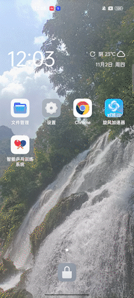

今年我参加了一个大创项目，主要负责项目的前端开发。因为需求中涉及到在移动端呈现一个 3D 人物模型的运动，因此我选择了使用 Flutter 编写移动端（我似乎也没有别的选择，因为我的 Java 是半吊子，Kotlin 完全不会，更何况后期我们可能有跨平台的需求），模型呈现选择了 Unity。于是，怎么将二者结合在一起成了一个很大的问题——一是这个需求实在很冷门，毕竟想做游戏的话 Unity 本身就支持移动端部署，只想简单呈现 3D 模型的话 Flutter 本身也有一些包提供了轻量级的 3D 渲染，像是我们这个项目里的既要支持移动端又要实时呈现较为复杂的 3D 模型运动的需求我真没见过几次；二是将 Unity 嵌入到 Flutter 中真的不是一件简单的工作。

不过所幸我在 GitHub 上找到了一个名为 [flutter-unity-view-widget](https://github.com/juicycleff/flutter-unity-view-widget) 的项目，目前有 1.9K 的 star。我在看了它的 README 之后发现这个项目维护的还是不错的，虽然这种混合开发在开发体验上难免有所牺牲，但它至少把我需要干的活干了。不过，在整个过程中，我还是遇到了一些奇奇怪怪的问题，所以在这篇博客里记录一下。

具体的安装步骤以及一些注意事项我就不再赘述了，README 中已经写的非常详细了。但是我在安装过程中遇到了一个 README 中没有提到的问题：在我使用 `flutter run` 的时候，报了这样一个错误：

```
Execution failed for task ':unityLibrary:BuildIl2CppTask'.
> NDK is not installed
```

这个是一个很奇怪的问题，因为我已经完全按照项目文档中所说的那样安装了 NDK 也相应修改了 `android/local.properties`，于是我就去提了一个 [issue](https://github.com/juicycleff/flutter-unity-view-widget/issues/832)。经过了一位热心朋友的解答后，我意识到我还需要在 `android/unityLibrary/build.gradle` 中显式指出 NDK 的路径。原本的那行代码是这样的：

```gradle
commandLineArgs.add("--tool-chain-path=" + android.ndkDirectory)
```

我需要将 `android.ndkDirectory` 修改成 NDK 安装的绝对路径：

```gradle
commandLineArgs.add("--tool-chain-path=" + "C:/Installed/UnityEditor/2022.2.0f1c1/Editor/Data/PlaybackEngines/AndroidPlayer/NDK")
```

几个月后我回去再翻这个 issue 的时候，我发现这个问题似乎很多人都遇到了，而且后续的一些提交和 [PR](https://github.com/juicycleff/flutter-unity-view-widget/pull/880) 中也都提到了这个 issue（还是有点小骄傲的，我也算是为了这个项目做了一点小小的贡献）。不过，似乎这个问题只会在比较新的一些版本中出现（我用的是 2022.2.0，2023 版本也会有这个现象）。

而我遇到的另一个问题则应该是所有版本都会出现、而且 README 中没有写清楚的了。你会发现，这个 README 中从头到尾没有详细写到底怎么从 flutter 向 unity 消息，所以我们基本只能靠猜了。在项目提供的 demo 中有这样一段代码：

```dart
// Communcation from Flutter to Unity
void setRotationSpeed(String speed) {
  _unityWidgetController?.postMessage(
    'Cube',
    'SetRotationSpeed',
    speed,
  );
}
```

我们大概能看出，这段代码是调用绑定在 `Cube` 上的 `MonoBehaviour` 类中的 `SetRotationSpeed` 方法，并传一个字符串作为参数。于是，参照这个方法，我很自然地编写了下面的代码：

```csharp
// motion.cs
using System.Collections;
using System.Collections.Generic;
using UnityEngine;

public class motion : MonoBehaviour
{
    // 此处略去 Start 和 Update 以及一些初始化的方法

    public void Rotate(string info)
    {
        // 此处略去解析的过程
        joint.transform.Rotate(0, 1, 0);
    }
}
```

然后在 flutter 中调用：

```dart
Timer.periodic(const Duration(milliseconds: 16), (_) {
  widget.controller.postMessage('Avatar', 'Rotate', 'head: 0, 1, 0;');
});
```

这很自然对吧，调用一个方法更新 `GameObject` 的 `transform` 理应是可以的，但是实际项目跑起来的时候，手机上的模型是一动也不动。然后我又回去重新看了 demo 中给出的代码：它的做法是，通过 flutter 调用方法修改一个参数，至于具体如何控制物体运动，是在 `Update` 方法内。也就是，我不能在 `Update` 以外更新物体的状态？

于是，我在 C# 类中添加了一个公共的向量，用来记录关节的旋转，在 `Update` 中根据这个向量控制人物模型运动，而在 flutter 和 unity 通讯的时候只修改这个向量的值，再次运行的时候，就成功了：


