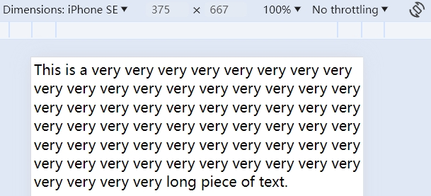
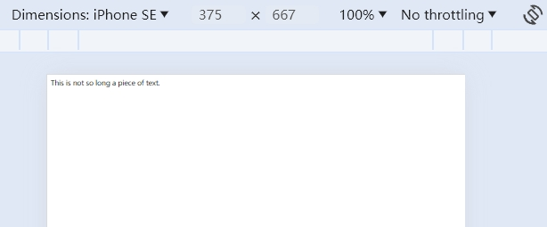
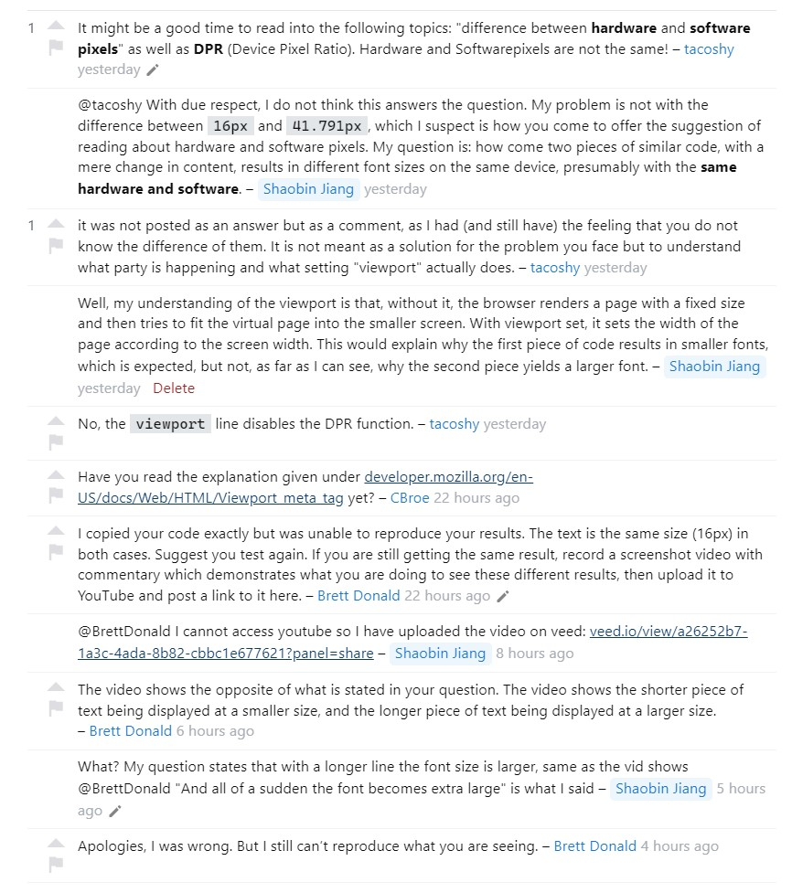

这几天在 jsPsych 的讨论区里日常回答问题的时候，发现了一个有趣的[提问](https://github.com/jspsych/jsPsych/discussions/3266)：

> However, I have a problem. When the stimulus is on two lines, the font is bigger:

原问题比较长，大概就是一个移动端的网页，当显示一段很长的文字、导致文字被分成多行显示的时候，这段文字看起来就会很大；反之，如果这段文字只有一行，则显示出来的字体非常小。我在尝试解决这个问题的时候，为了避免 jsPsych 框架本身的干扰，对代码进行了简化，最终发现下述代码就可以还原出问题：

```html
<!doctype html>
<html lang="en">
    <head>
        <meta charset="UTF-8" />
        <title>Document</title>
    </head>
    <body>
        <div>
            This is a very very very very very very very very very very very very very very very very very very very
            very very very very very very very very very very very very very very very very very very very very very
            very very very very very very very very very very very very very very very very very very very very very
            very long piece of text.
        </div>
    </body>
</html>
```

此时的页面看起来是这样的：



```html
<!doctype html>
<html lang="en">
    <head>
        <meta charset="UTF-8" />
        <title>Document</title>
    </head>
    <body>
        <div>This is not so long a piece of text.</div>
    </body>
</html>
```

现在的页面是这样的：



很明显，第二段代码渲染出的字体要小得多。

## 1 直接原因：缺失的 viewport

我倒是很快发现了解决方案：我只需要在代码中加上这一行即可：

```html
<meta name="viewport" content="width=device-width, initial-scale=1.0" />
```

上述代码是基于原讨论区提供的代码魔改的，而提问者的代码里就没有设置 `viewport`——这个问题卡了我很长时间，一开始我给出了很多个解决方案但是提问者都表示不好用，直到我把她的代码完整复制下来，仔细读了一遍才发现，她没有指定 `viewport`。很惭愧，我一直在给别人讲 HTML 的初始代码只要依靠编辑器生成即可，无需深入了解其中的含义，然而此时我发现，我自己也不是很清楚 `viewport` 具体有什么作用，为什么 `viewport` 的缺失会导致这个问题。

于是我查阅了一下资料。大概是这样的，在很久以前，网页一般只是为电脑设计的，至于移动端的兼容，大多数人并不会考虑这个问题。于是，那个时候的网页一般有着固定的宽度（后经查证，这个固定宽度在移动端一般是 [980 px](https://developer.mozilla.org/en-US/docs/Web/CSS/Viewport_concepts#mobile_viewports)），而如果在移动设备上，浏览器窗口小于这个固定宽度，就会先在一个虚拟的窗口上按固定大小进行渲染，然后再缩小画面塞到浏览器窗口。

这下倒是解决了第二段代码得到的网页字体看起来很小的问题——这个字体本来是在一个正常的 980 像素宽的窗口中渲染的，现在被缩小塞进一个只有 375 像素宽的窗口，自然看起来很小。但是为什么第一段代码渲染出来的字体却是正常的未经缩小的大小呢？

## 2 背后的原因：Google Chrome 的奇妙特性

研究到这里，我已经彻底不知道该怎么进行下去了，网上能查到的资料，基本是在讲 `initial-scale` 的作用是什么。人们已经默认了正常的开发者一定会加上 viewport meta，而几乎没有什么人关心为什么这个标签没有被加上的时候会出现 bug。甚至，我在 stackoverflow 上提问的时候，下面的评论更多在关心我到底懂不懂 viewport 的作用是什么，而不是回答问题本身……



<center class="caption">有一说一这几位的评价真快把我整破防了</center>

直到最终，我在 segmentfault 上提问了一下，才终于弄明白问题所在——事实证明，这个特性如果不是别人给我指出来的话，我自己根本不可能查得到。帖子的链接在[这里](https://segmentfault.com/q/1010000044782024?_ea=343938228)。

简单来说，这是一种叫做 font boosting 的特性（是否真的叫这个名字存疑，因为 Bing 国际版搜不到这个名词），由于移动端在没有 viewport 的时候会将页面缩小塞进屏幕，所以有些时候显示出的字体会非常小。所以此时：

> ...many mobile browsers apply **a text inflation algorithm to enlarge the text** to make it more readable. **When an element containing text uses 100% of the screen's width, the algorithm increases its text size**...

这段话出自 CSS 属性 `text-size-adjust` 的[文档](https://developer.mozilla.org/en-US/docs/Web/CSS/text-size-adjust)，这是一个实验特性，在 Chrome 中支持但是 Firefox 中不支持。如果要禁用这一自动缩放的行为，只需要添加下述 CSS 代码：

```css
html {
    text-size-adjust: none;
}
```
