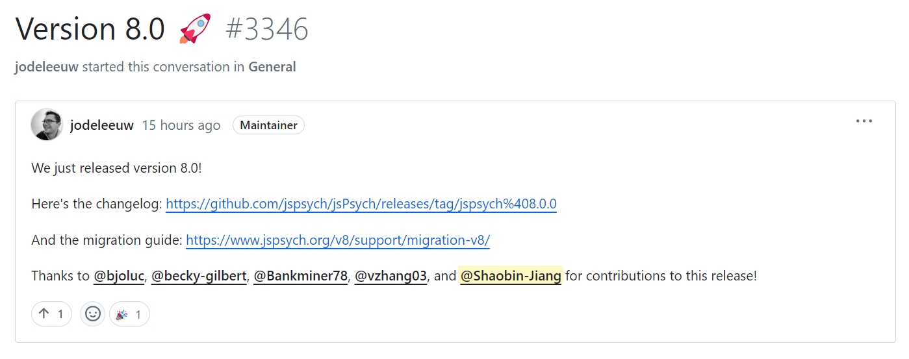
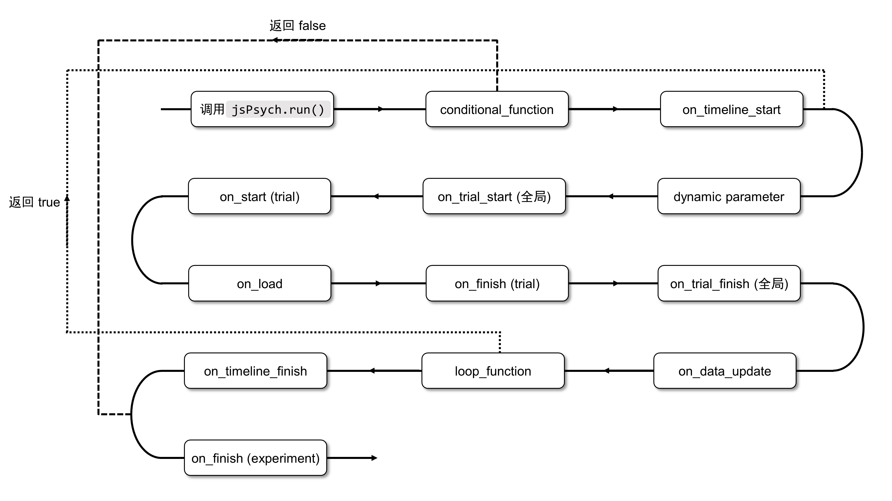
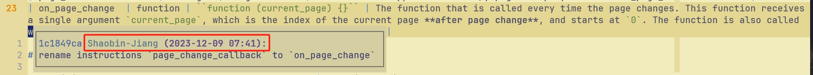

就在今天早上的 5:30，jsPsych 的 8.0 版本正式发布，我在早上起床后也是第一时间收到了作者 Josh de Leeuw 的 @。



<center class="caption"><a href="https://github.com/jspsych/jsPsych/discussions/3346" target="_blank">https://github.com/jspsych/jsPsych/discussions/3346</a></center>

看到这个提醒我还是蛮高兴的，因为这也算是我第一次真正参与到一个成熟的开源项目的开发中。虽然看 changelog 里面我也只是贡献了一个 minor change 和一个 patch change（其实还有一个插件的新特性但是不属于 core library 的提交），但能为我喜爱和支持的项目贡献代码还是很开心的一件事。

当然，我主要关注的还是自己捣鼓的那一部分内容，关于 v8 版本中更大的那些变动此前一直没有太注意。正好，我还在维护着 [jsPsych 的中文文档](https://shaobin-jiang.github.io/jsPsych-Chinese-Documentation/)，于是今天花了一整天时间把中文文档升级到了 v8，也顺便借此机会了解了一下 jsPsych 新版本有哪些变动。

## 1 普通使用者应该关心的问题

首先要提到的肯定是那些仅仅使用 jsPsych 开发实验、并不怎么关心框架本身开发甚至是插件开发的使用者应该关心的问题。jsPsych v8 如官方文档所说：

> Version 8.x of jsPsych focused on a complete rewrite of the core library... Most of the changes in version 8.x are behind the scenes.

因而，这次的变化对于普通的 jsPsych 使用者并不算太多——至少，相比于从 6.x 到 7.x 的变化可要少太多了，上一个版本变化直接导致所有旧版本代码都无法继续使用，而这一次版本升级你的旧代码还有可能能继续使用。

你可以参照如下条目，检查一下自己的代码是否需要进行修改。

### 1.1 jsPsych 相关文件的引入

如果你一直是把 jsPsych 的代码下载到本地再进行引用，或者是严格按照 jsPsych 的官方文档给出的版本号进行引入（例如 `https://unpkg.com/jspsych@7.3.4`），那么这一部分应该没有什么需要看的了。

但是，如果有人像我一样懒得查版本号或者是按照我的[新版教学视频](https://www.bilibili.com/video/BV11H4y1s7HJ/)里那样，选择直接通过 `@latest` 引入最新版本的话（例如 `https://unpkg.com/jspsych@latest`），就需要注意了，因为现在 `@latest` 默认引入的是 `8.0.0` 版本的 jsPsych 和相应的 CSS 文件；此外，插件的版本也统一升级了一个大版本号，虽然多数插件的使用没有发生什么变化，但是在本篇博文的后面你会看到[部分插件](./#14--button-response-%E7%B3%BB%E5%88%97%E6%8F%92%E4%BB%B6)在新版本中也有了很大的改变。

虽然我很推崇使用新版本的软件，但是反正 7.x 版本也并没有停止维护（甚至 6.x 都还没有停止维护），所以你完全可以继续使用旧版本，只不过不能通过 `@latest` 引入了。现在，jsPsych 的库文件和 CSS 文件可以设置版本号为 `7.3.4`——如果你要用旧版，这个是一定一定要改的。

而至于插件的版本号，你可以去官方文档的 v7 中查看（很遗憾，因为种种复杂的原因，我的那份中文文档里面并没有把版本号放在里面）。如果你懒得一个一个去查，那就注意一下，在新版本刚发布的这个节点下，大概率有向下兼容问题的是**所有的** \*-button-response 插件（html-button-response / image-button-response / ……）；此外，instructions 插件也更新了新的特性，但是不会出现旧版本代码用不了的问题。

### 1.2 时间线变量的使用

在 jsPsych 7.x 中，我们有一个经典的案例：

```javascript
let child_timeline = {
    type: jsPsychHtmlKeyboardResponse,
    stimulus: function () {
        return ``;
    },
    timeline: [{}],
    timeline_variables: [
        {stim: 'blue'},
        {stim: 'orange'},
    ],
};
```

这是一个在 6.x 和 7.x 当中都反复强调的事情：如果要使用时间线变量的值，则需要在函数中使用。在新版本中，这一行为发生了变化，如果我们不需要立刻使用某个值，则可以继续照常使用 `.timelimeVariable()`；但如果要立刻使用某个变量的值，则需要改成 `.evaluteTimelineVariable()`。

注意，**这并不意味着你可以直接在函数外面使用`.evaluteTimelineVariable()`，这个方法仍然需要在函数内部使用**：

```javascript
let child_timeline = {
    type: jsPsychHtmlKeyboardResponse,
    stimulus: function () {
        // 在函数外部使用只会得到 undefined
        return ``;
    },
    // 函数外部仍然需要 `.timelineVariable()`
    choices: jsPsych.timelineVariable('choices'),
    timeline: [{}],
    timeline_variables: [
        {stim: 'blue', choices: ['f', 'j']},
        {stim: 'orange', choices: ['j', 'k', 'l']},
    ],
};
```

顺带一提的是，这一新版本中移除了 `.timelineVariable()` 的 `call_immediate` 参数——为什么是顺道一提呢？因为我相信你根本没听说过这个参数，毕竟这个参数从 6.x 版本之后就没什么大的作用了。

### 1.3 子时间线相关的特殊事件

在新版本中，另一个重大的变化在于 `conditional_function` / `on_timeline_start` / `on_timeline_finish` 等事件变成了只执行一次。

旧版本中，如果你为子时间线设置了 `loop_function`，那么子时间线每一次循环都会把 `conditional_function`、`on_timeline_start` 和 `on_timeline_finish` 执行一次。这么设计到底是否合理见仁见智，但反正我个人是不怎么喜欢旧版本的这种设计。我在自己的书里放了这样一张生命周期的图：


到了新版本，这个生命周期变成了这样：



<center class="caption">可以点开大图左右切换进行对比</center>

不难看到变化在哪里。首先，新版本中，当 `loop_function` 返回 `true` 的时候，不会再执行 `conditional_function` 和 `on_timeline_start` 了——它们只会在第一次循环的一开始执行。再者，`on_timeline_finish` 被挪到了 `loop_function` 后面，只有当 `loop_function` 返回 `false`、时间线不再循环之后，才会执行 `on_timeline_finish` 一次。

```javascript
let counter = 0;
let child_timeline = {
    type: jsPsychHtmlKeyboardResponse,
    stimulus: 'hello world',
    timeline: [{}],
    conditional_function: function () {
        alert('conditional function');
        return true;
    },
    loop_function: function () {
        counter++;
        return counter < 2;
    }
};
```

如果你仍然依赖旧版本的行为，可以在外层再嵌套一层时间线，然后把循环相关的代码（不管是 `repetitions` 还是 `loop_function`）挪到外层的时间线。

```javascript
let counter = 0;
let child_timeline = {
    timeline: [
        {
            type: jsPsychHtmlKeyboardResponse,
            stimulus: 'hello world',
            timeline: [{}],
            conditional_function: function () {
                alert('conditional function');
                return true;
            },
        },
    ],
    loop_function: function () {
        counter++;
        return counter < 2;
    }
};
```

### 1.4 \*-button-response 系列插件

这个插件主要发生了两个重大的变化。其一便是 `button_html` 参数。

旧版本中，这个插件使用了一个类似于模板的 `%choice%` 写法，十分丑陋且极不方便——一旦你想要给不同的按钮设置不同的样式，这种写法等于完全没有用，还得在 `choices` 数组中进行修改。在新版本中，`button_html` 变成了一个函数，这个函数接受两个传入参数，分别为 `choices` 中的值以及相应的序号（从 `0` 开始），我们只需要根据这两个传入参数 return 相应的 HTML 就可以。所以，现在我们的写法就变成了：

```javascript
let trial = {
    type: jsPsychHtmlButtonResponse,
    stimulus: 'button-response demo',
    choices: ['Button 1', 'Button 2'],
    button_html: function (choice, index) {
        if (index === 0) {
            return `<button>${choice}</button>`;
        } else {
            return `<button style="color: red;">${choice}</button>`;
        }
    },
};
```

值得一提的是，这个修改引入了 8.0 版本中另一个重要的改变。在此前的版本中，虽然 jsPsych 的插件中会对参数类型进行标注，但是这个标注也就是起个注释的作用，比如旧版本的 `button_html` 标记了 `array: true`，但你不把这个值设置为数组也是可以的。新版本对此更为严格了——标注了 `array: true` 的参数必须是数组。当然，你不必在意这个在哪里标注，只要看到文档里标记的数据类型是数组，就按照它说的设置就好了。

而另一个重磅的修改是，旧版本的 `margin_horizontal` 和 `margin_vertical` 都被移除了，取而代之的是三个新的属性：`button_layout`、`grid_rows` 和 `grid_columns`。其中，`button_layout` 就是设置包裹所有按钮的父元素的 `display` 样式——你可以将其设置为 `flex`，也可以使用它的默认值 `grid`。如果使用后者，就可以进一步使用 `grid_rows` 和 `grid_columns` 这两个属性（**必须设置 `button_layout` 为 `grid` 或使用默认值**）。字面意思，就是设置这些按钮排列成几行几列。我的印象中，从 6.3 版本的时代、我刚开始做 jsPsych 教程的时候，就已经有人在问我怎么实现这个功能，到了前一段时间还是有人问同样的问题。现在新版本提供了这个选项，实在是功德无量。具体操作如下：

```javascript
let trial = {
    type: jsPsychHtmlButtonResponse,
    stimulus: 'Html-Button-Response Demo',
    choices: ['Button 1', 'Button 2', 'Button 3', 'Button 4', 'Button 5', 'Button 6', 'Button 7', 'Button 8'],
    button_html: function (choice) {
        return `<button style="margin: 0.5em;">${choice}</button>`;
    },
    // 可以不写另一个 grid_columns，会根据按钮的数量自动计算
    grid_rows: 2,
};
```

### 1.5 进度条

新版本的进度条变得真正有用了——在旧版本中，进度条只会在顶级时间线节点结束后更新。比如说，下面这段代码：

```javascript
let jsPsych = initJsPsych({
    show_progress_bar: true,
});

let trial = {
    type: jsPsychHtmlKeyboardResponse,
    stimulus: 'Trial 1',
};

let child_timeline = {
    type: jsPsychHtmlKeyboardResponse,
    timeline: [{stimulus: 'Trial 2.1'}, {stimulus: 'Trial 2.2'}],
    repetitions: 2,
};

jsPsych.run([trial, child_timeline]);
```

进度条只会更新 2 次，一次在 `trial` 结束后，一次在 `child_timeline` 的四个试次结束后。这显然蠢的一批。但是在新版本中，同样的代码，进度条会更新 5 次，这明显好多了。不过，很遗憾的是，截至目前，进度条和 `loop_function` 配合的还不是很好，此时可能需要我们手动设置进度。

而进度的设置和获取在新版本中也发生了变化。旧版本中，我们需要使用 `.setProgressBar()` 和 `.getProgressBarCompleted()`，而新版本中，我们只需要对 `jsPsych.progressBar.progress` 进行设置或访问就可以了，这个 API 变动方便了很多。

### 1.6 中止时间线和实验

这里涉及到了一些 API 变化。在 v7 中，中止当前时间线和实验分别为 `jsPsych.endCurrentTimeline()` 和 `jsPsych.endExperiment()`，而在 v8 中，它们分别变成了 `jsPsych.abortCurrentTimeline()` 和 `jsPsych.abortExperiment()`。

此外，还添加了一个新的方法 `jsPsych.abortTimelineByName()`。只要你给子时间线添加了 `name` 属性，就可以通过这个名字直接中止时间线。要知道，`.abortCurrentTimeline()` 只会中止直接包含当前试次的时间线，如果这条时间线还嵌套在其他时间线内部，这个方法是管不到更上层的时间线的；而 `.abortTimelineByName()` 就可以：

```javascript
let jsPsych = initJsPsych();

let timeline_1 = {
    timeline: [
        {
            type: jsPsychHtmlKeyboardResponse,
            stimulus: 'Trial 1',
            on_finish: function () {
                // 如果是 abortCurrentTimeline，还会再执行一次 timeline_1
                jsPsych.abortTimelineByName('target');
            },
        },
        {type: jsPsychHtmlKeyboardResponse, stimulus: 'Trial 2'},
    ],
};

let timeline_2 = {
    timeline: [timeline_1, timeline_1],
    // 在这里设置 name
    name: 'target',
};

jsPsych.run([timeline_2]);
```

### 1.7 一些被删除的特性

首先，CSS 中的 `max-width: 95%` 终于被删除了，旧版本中这个设定主要是避免 IE 上 flex 布局的一些 bug。考虑到 jsPsych 似乎很早就表示不支持 IE 了，这个设定的移除还是有一点晚。不过终于装载了这个修改我还是很高兴的，因为我不止一次需要手动移除这个限制。

另一个被移除的特性是 `exclusion` 属性。这个属性在 6.x 中在 `jsPsych.init`（好古老又熟悉的 API）中用于对被试使用的设备进行限制，但考虑到 jsPsych 早在 3 年前的 7.1 版本发布时就发布了 browser-check 插件，这个特性的作用也不是那么大了。终于，在 `8.0` 版本中，该属性被彻底删除。

被删除的特性不止这些，但是我认为普通的使用者不需要关注另外那些被删除的特性。

## 2 新引入的特性

新版本中还引入了一些很酷的新特性。jsPsych 真的在不断锐意进取，维护者也很愿意听取社区的意见，这真的是一件很难得的事情。譬如说，有一个很小的细节，新版本的文档中示例代码中终于不再使用 `var` 了，而是在必要的地方换成了 `const`，这就是很好的进步——说实话，我真的不想在帮别人 debug 的时候看到满天乱飞的 `var` 了。

对于一般的使用者而言，jsPsych 的 v8 版本主要添加了以下的新特性：

### 2.1 数据记录

数据记录部分最令人兴奋的更新是，jsPsych 终于允许我们跳过某个试次的数据记录了。过往使用 jsPsych 的一大痛点在于，只要你不在实验结束的时候对数据做一定的删减，就会得到一坨包含大量无用信息的数据，哪怕你只是添加了一个注视点试次，这个试次也会被包含在数据对象里。但是在 v8 中，我们只需要给试次添加一个 `record_data: false`，就可以不记录这个试次的数据了：

```javascript
let jsPsych = initJsPsych({
    on_finish: function () {
        jsPsych.data.displayData();
    },
});

let fixation = {
    type: jsPsychHtmlKeyboardResponse,
    stimulus: '<span style="font-size: 10em;">+</span>',
    choices: 'NO_KEYS',
    trial_duration: 300,
    record_data: false,
};

let trial = {
    type: jsPsychHtmlKeyboardResponse,
    stimulus: 'Press Any Key',
};

jsPsych.run([fixation, trial]);
```

虽然因为 jsPsych 默认会记录很多属性、导致最后得到的数据看起来仍然十分杂乱，但是有了 `record_data` 这个新特性后，我们收集的数据还是会精简一些。此外，新版本中还移除了旧版本中的  `timeline_node_id` 以及使用这一属性的 `jsPsych.data.getDataByTimelineNode()` 和 `jsPsych.getCurrentTimelineNodeID()` 方法，这样数据中彻底用不到的东西又少了一些。

此外，新版本中数据记录的另一变化在于时间线变量的记录。在 v7 中，想要获取当前这一轮的时间线变量的值，可以使用 `jsPsych.getAllTimelineVariables()`；而在 v8 中，这一方法被移除，取而代之的是试次对象的 `save_timeline_variables` 属性——你可以将其设置为 `true`，此时 jsPsych 会自动将每一轮的时间线变量添加到数据中一个名为 `timeline_variables` 的字段中；也可以将其设置为一个数组，其中是需要记录的时间线变量的名称。例如：

```javascript
let trial = {
    type: jsPsychHtmlKeyboardResponse,
    stimulus: jsPsych.timelineVariable('content'),
    trial_duration: jsPsych.timelineVariable('duration'),
    timeline: [{}],
    timeline_variables: [
        {content: 'Trial 1', duration: 2000},
        {content: 'Trial 2', duration: 2000},
        {content: 'Trial 3', duration: 2000},
        {content: 'Trial 4', duration: 2000},
        {content: 'Trial 5', duration: 2000},
        {content: 'Trial 6', duration: 2000},
    ],
    save_timeline_variables: ['content'],
    on_finish: function (data) {
        console.log(data);
    }
};
```

此时，你会得到类似这样的数据：

```javascript
{
    "rt": null,
    "stimulus": "Trial 1",
    "response": null,
    "trial_type": "html-keyboard-response",
    "trial_index": 0,
    "plugin_version": "2.0.0",
    "timeline_variables": {
        "content": "Trial 1"
    },
    "time_elapsed": 2003
}
```

### 2.2 进度条

除了前文所说的设置和获取进度的 API 发生了改变，进度条的另一大变化在于可以通过函数设置进度条旁边的文字了。这个变动也是我提交的一个 [minor change](https://github.com/jspsych/jsPsych/pull/3201)。

在 v7 中，你只能通过 `message_progress_bar` 在进度条旁边设置一个固定的文本；如果你想要实时显示进度的百分比，就需要动点心思，在试次的 `on_finish` 获取包含这段文本的元素，然后手动对其进行修改，十分麻烦。所以我给出的设计方案是，让 `message_progress_bar` 也可以是一个函数，如果将其设置为函数，则会接受当前的进度为传入参数（取值范围为 0 - 1），然后将需要呈现的文本作为返回值返回：

```javascript
let jsPsych = initJsPsych({
    show_progress_bar: true,
    message_progress_bar: (progress) => `当前进度：${progress * 100}%`,
});

let trial = {
    type: jsPsychHtmlKeyboardResponse,
    stimulus: 'Trial 1',
};

let child_timeline = {
    type: jsPsychHtmlKeyboardResponse,
    timeline: [{stimulus: 'Trial 2.1'}, {stimulus: 'Trial 2.2'}],
    repetitions: 2,
};

jsPsych.run([trial, child_timeline]);
```

### 2.3 instructions 插件

我在 v8 中贡献的另一处[修改](https://github.com/jspsych/jsPsych/pull/3190)是针对 instructions 插件的。

说来有意思，我在翻译文档的时候，因为要一处一处比对文档中的变化。新版本更新后可能有上百处变化，我比对到后面已经烦了，正好在翻译到 instructions 插件的时候破防了，大骂到底是谁闲的没事添加了这么长一坨东西，然后：



<center class="caption">是我啊，那没事了.jpg</center>

这个修改的初衷是，虽然 instructions 插件提供了很方便的前后浏览多页指导语的功能，但是我们很难知道当前位于第几页（我以前的做法是启用 `show_page_number` 然后添加一个 `setInterval` 不断获取当前页码，但这显然很不方便）。这个需求还是蛮合理的，比如说我希望在第一页上隐藏向前的按钮，在最后一页上将向前翻页的按钮文字替换为“开始实验”，这都需要我实时获取当前的位置。

我给出的方案是添加一个 `on_page_change` 参数，在页面切换后触发。该函数接受一个传入参数，为切换的页码（从 0 开始）。此时，我们就可以写出如下的代码：

```javascript
let trial = {
    type: jsPsychInstructions,
    pages: ['<p>Page 1</p>', '<p>Page 2</p>', '<p>Page 3</p>', '<p>Page 4</p>'],
    show_clickable_nav: true,
    show_page_number: true,
    on_page_change: page_change,
    on_load: function () {
        // 当前版本中 on_page_change 不会在刚进入第一页的时候触发，需要手动调用
        page_change(0);
    },
};

function page_change(page) {
    if (page === 0) {
        document.querySelector('#jspsych-instructions-back').style.visibility = 'hidden';
    }

    if (page === 3) {
        document.querySelector('#jspsych-instructions-next').innerText = 'Start Experiment';
    }
}
```

### 2.4 异步的 `on_finish`

这又是一个非常非常棒的新特性。事实上，我在 v8 开发早期看到这个提案的时候就对其非常期待。我们可以设想这样的情境：

- 当前试次结束了，我们需要把数据先上传到服务器，再进入下一个试次
- 多人在线实验，被试 A 这边结束了试次，需要等其他被试都结束这个试次再统一进入下一个试次

不难看到这些东西都属于非常常规的异步操作，但凡可以写一个 `async` / `await` 都随便解决，但是在旧版本中，我们不能在 `on_finish` 中写这些逻辑，因为`on_finish` 不支持这种操作；如果依赖官方提供的插件，就需要我们在 `on_load` 做一系列非常麻烦的修改：

- 把 `choices` 设置成 `NO_KEYS`，把 `trial_duration` 设置为 `null`（相当于禁用 jsPsych 对输入的检测）
- 自己手动编写一个被试键盘输入的监听
- 在监听到合法的输入后，先执行我们的异步操作
- 在异步操作结束后，再调用 `finishTrial()` 方法

这种做法，麻烦，不好维护，看起来也十分不优雅不合理。但是这一切麻烦，随着 `on_finish` 支持异步告一段落。以下面的代码为例，我们这里就用一个 `setTimeout` 来作为异步的程序：

```javascript
let trial = {
    type: jsPsychHtmlKeyboardResponse,
    stimulus: jsPsych.timelineVariable('stimulus'),
    timeline_variables: [{stimulus: 'trial 1'}, {stimulus: 'trial 2'}],
    timeline: [{}],
    on_finish: function () {
        return new Promise(function (resolve, _) {
            setTimeout(function () {
                resolve();
            }, 2000);
        });
    },
};
```

好起来了，真的好起来了。

## 3 插件 / 扩展开发者需要注意的改变

熟练使用 jsPsych 的人经常会自己开发插件或者扩展来增强实验的功能，也有的人是想要参与到 jsPsych 的维护工作中、对 jsPsych 官方提供的插件进行编写和修改的。在新版本中，出现了一些新的变动，是我们在开发插件和扩展的时候需要注意的。

### 3.1 `finishTrial()` 方法的新变化

在新版本中，`finishTrial()` 方法会清空屏幕内容 + 停止由 jsPsych 创建的尚未结束的倒计时。

虽然这个变动不是我提交的，但是是我最先在 [Discussions](https://github.com/jspsych/jsPsych/discussions/3241) 中提出来的。之所以提出这个，是因为我经常在 `on_load` 中对插件做很多调整，包括手动调用 `finishTrial()`，但是我经常会忘记清屏和清空倒计时，这就会导致一些很讨厌的 bug，比如说进入下一个试次的时候出现我在上一个试次添加的东西，比如说下一个试次进行到一半被上一个试次没有结束的倒计时结束掉……

于是改 bug 到红温的我就去问作者，你们能不能把这两个功能做进去啊，反正我看你们所有的插件里面都会在调用 `finishTrial()` 的时候顺便清屏和停止倒计时。

然后，这个修改就在 8.0 中实装了。现在我们可以只调用 `finishTrial()` 而不用加上 `display_element.innerHTML = ''` 和 `this.jsPsych.pluginAPI.clearAllTimeouts();` 了。

### 3.2 更加严格的 `info` 以及新增的 `data` 和 `version` 属性

这一改变针对插件和扩展。首先，我们需要在 `info` 中添加 `version` 属性，或是从 `package.json` 中 `import`，或是手动指定版本号，因为现在会在试次数据中自动带上版本号。我们更推荐使用从 `package.json` 中引入的方法，因为这个版本号会随着我们提交 changeset 而自动改变。

此外，我们还需要在 `info` 中添加 `data` 属性，这个属性和此前就已经存在的 `parameters` 属性类似，只不过它的作用是描述插件 / 扩展生成的数据，类似这样：

```javascript
const info = {
    name: 'my-awesome-plugin',
    version: version,
    parameters: { 
        image: {
            type: ParameterType.IMAGE,
            default: undefined
        },
        image_duration: {
            type: ParameterType.INT,
            default: 500
        }
    },
    data: {
        response: {
            type: ParameterType.STRING,
        },
    },
}
```

`info` 中对于参数的要求也更加严格了。除了前面所说的标注有 `array: true` 的参数必须是数组以外，新版本还要求 `parameters` 必须列出所有属性，不包含在这里面的属性无法使用时间线变量和动态参数等高级特性。

新版本中，如果我们是在向官方提交插件 / 扩展，jsPsych 还推荐我们使用 JSDoc 对属性 / 数据进行注释，因为新版本使用了自动化工具生成文档。

### 3.3 插件中异步的 `trial()` 方法

这个主要是针对一些需要异步加载的场景。一般情况下，如果我们的试次加载只涉及到一些同步的操作，比如说像 html-keyboard-response 这种设置元素的 `innerHTMl` 的，那么试次的 `on_load` 只需要在插件的 `trial()` 方法结束后触发就可以了；但是如果试次的加载涉及到异步的操作、且我们需要 `on_load` 在异步操作结束后才触发，情况就有一些复杂了。

在 7.x 版本中，如果我们需要手动控制何时触发 `on_load`，就需要显式地在 `trial()` 方法中返回一个 `Promise` 对象。在做完这一步之后，我们就可以在我们的异步操作后面接上 `.then()` 然后调用 `on_load`：

```javascript
// 7.x
trial(display_element, trial, on_load){
    let trial_complete;

    do_something_asynchronous()
        .then(function () {
            on_load();
        })
        .then(function () {
            do_the_rest_of_the_trial(); // invoke end_trial at the proper time
        });

    const end_trial = () => {
        this.jsPsych.finishTrial({...})
    }

    return new Promise(()=>{})
}
```

值得一提的是，当时这个 `Promise` 啥用都没有，就仅仅是一个标识而已，可以看到，我们甚至不需要让它 `resolve()`。

但是在 8.0 版本中，情况发生了变化。我们可以不再调用 `finishTrial()` 方法，而是直接 `resolve(data)`。此时，我们再使用这种 `return new Promise()` 的方法就有点麻烦了，因为我们并不想把所有实验代码都放在 `Promise` 内部；此外，前面那一坨 `.then()` 的 chaining 看起来也不是很美观，所以我们不如干脆把整个 `trial()` 方法变成异步的，然后直接 `return data`，这下就会清爽很多：

```javascript
async trial(display_element, trial, on_load){
    let trial_complete;

    await do_something_asynchronous()

    on_load();

    await do_the_rest_of_the_trial();

    return data_generated_by_the_trial;
}
```

### 3.4 新的 `pluginAPI` —— `AudioPlayer`

新版本在 `jsPsych.pluginAPI` 模块下添加了一个新的模块——`AudioPlayer`。这个模块主要是用来更好地管理音频的播放和事件监听。

---

好吧，说是使用起来变化不大，但这到底还是一个大的版本号变动，总结下来变化也不少。希望这篇博文对于迁移到 jsPsych 8.0 版本有所帮助。
