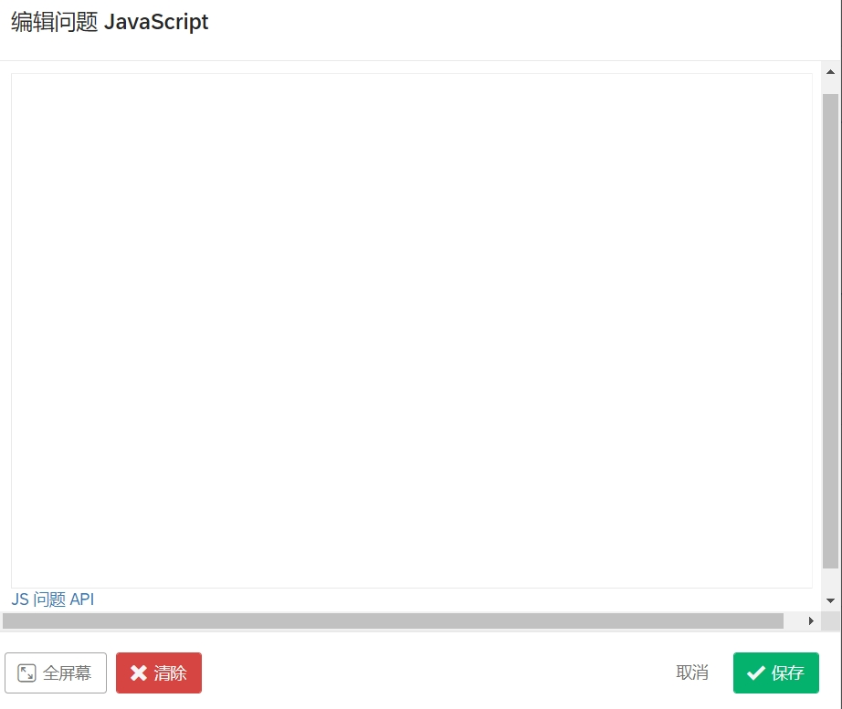
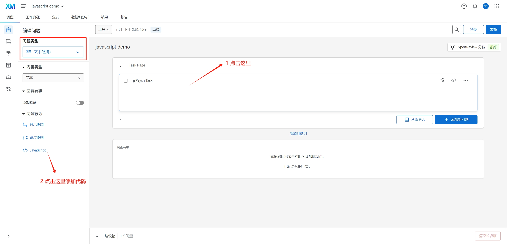
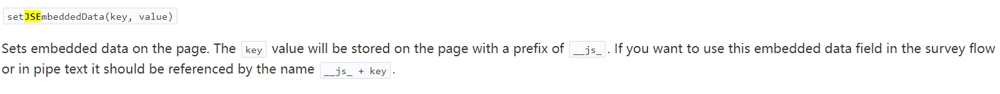
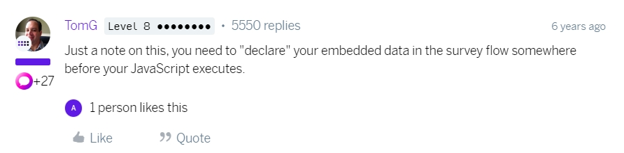
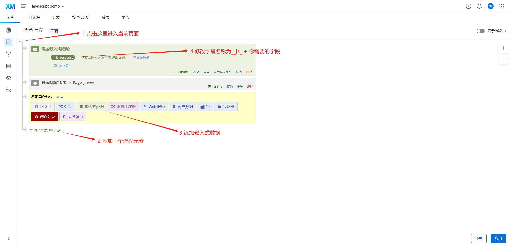

将 jsPsych 嵌入到 Qualtrics 中，很奇怪的需求，不是吗？是的，我在看到这个需求的时候，就是这样想的——咱要么直接把问卷和实验部分分开进行，要么把问卷部分一起放在前端那边写完。然而，这两种更合理的方案倒也是各有各的缺点。实验和问卷分开或多或少会影响用户体验，前端一把梭则需要更大的开发工作量，毕竟如果要用到 Qualtrics 的一些高级功能，靠自己实现还是有些难度的。

况且，在 Qualtrics 中进行行为实验也不是不可实现，比如说 QRTEngine (Qualtrics Reaction Time Engine) 就是这样一种尝试。虽然这个项目因为 Qualtrics 频繁的 API 变动而早已停止维护，但是这至少说明类似需求是可行的。一般性的框架可能难以维护，但是如果只是单一的实验，做一些针对性的代码编写还是值得一试。

## 1 关于 jsPsych 相关文件的引入

一般来说，我们在编写 jsPsych 实验的时候会在 `head` 标签中引入相应的 javascript 和 css 文件。然而，qualtrics 只为我们提供了编写 javascript 的空间，这该怎么办呢？



这一步倒是最简单的一步，我们只要动态在 `head` 内对相应内容进行引用即可。需要注意的事情是，jsPsych 的这几个文件引入是有顺序要求的，插件文件必须在 jsPsych.js 后面引入，否则会报一个 `jsPsychModule not defined` 这样的错误；此外，我们还需要确保 `initJsPsych` 这一系列代码在 jsPsych 加载完成后才被执行，所以这里就需要用到异步了。

```javascript
load('script', 'https://unpkg.com/jspsych@latest')
    .then(function () {
        return load('script', 'https://unpkg.com/@jspsych/plugin-html-keyboard-response@latest');
    })
    .then(function () {
        return load('style', 'https://unpkg.com/jspsych@latest/css/jspsych.css');
    });

function load(type, source) {
    let elem;

    switch (type) {
        case 'script':
            elem = document.createElement('script');
            elem.src = source;
            break;
        case 'style':
            elem = document.createElement('link');
            elem.href = source;
            elem.rel = 'stylesheet';
            elem.type = 'text/css';
            break;
    }

    return new Promise(function (resolve, _reject) {
        document.head.append(elem);

        elem.addEventListener('load', function () {
            resolve();
        });
    });
}
```

你可能会问我为什么不用 `async` 而是用这一长串 `.then`。很好的问题，我一开始就是用了 `async` 和 `await`，然后我发现 Qualtrics 好像不支持这个语法——Qualtrics 的代码编辑器似乎自带了语法检查，但是它采用的标准貌似非常古老，而且更坑的是，这个语法检查并不会准确告诉你问题出在哪，而是指挥模棱两可地说一句 `unexpected token`，剩下的全靠自己猜。我也是花了好半天才发现是 `async` 和 `await` 造成的问题。

要不说在 Qualtrics 里面写行为实验体验极差呢……

接着，我们把这部分代码放到 Qualtrics 里。这里手动创建一个问题类型为文本/图形的题目，然后给它添加 JavaScript 代码。默认情况下，初始代码是类似这样的结构：

```javascript
Qualtrics.SurveyEngine.addOnload(function () {});

Qualtrics.SurveyEngine.addOnReady(function () {});

Qualtrics.SurveyEngine.addOnUnload(function () {});
```

我们只需要把我们自己的代码放在 `addOnReady` 的函数体内即可，这样代码会在 Qualtrics 页面加载完成后执行。类似这样：

```javascript
Qualtrics.SurveyEngine.addOnReady(function () {
    load('script', 'https://unpkg.com/jspsych@latest')
        .then(function () {
            return load('script', 'https://unpkg.com/@jspsych/plugin-html-keyboard-response@latest');
        })
        .then(function () {
            return load('style', 'https://unpkg.com/jspsych@latest/css/jspsych.css');
        });
});
```



## 2 关于 jsPsych 的 `display_element`

jsPsych 是允许我们在初始化的时候就指定好实验跑在哪个 HTML 元素里的。一般情况下，我们会选择直接在 `body` 标签中运行实验；然而，到了 Qualtrics 这里，情况变得有所不同，因为添加 JavaScript 代码本质上是对 Qualtrics 本身的内容做出各种修改而不是单独开一个新的页面，which means 这个页面上本来就存在一些 Qualtrics 自己的东西——页面的 logo、翻页的箭头，等等。如果我们直接把 jsPsych 实验写在 `body` 里，就会导致 Qualtrics 自带的内容被清除。

这样有什么后果呢？我们需要翻到问卷的最后一页才能结束填写，数据才会被收集；而如果页面上的内容被清除，我们就没有翻页箭头可以点击，就不能翻到最后一页，就不能结束问卷填写，就不能拿到数据。所以，为了避免这个问题，我们就需要单独创建一个元素，把实验跑在这个元素里。实现方法也很简单，jsPsych 允许我们在 `initJsPsych` 方法中做一些初始化的配置，其中 `display_element` 就是控制实验呈现在哪个元素里的：

```javascript
let display_element = document.createElement('div');

display_element.style.width = '100vw';
display_element.style.height = '100vh';
display_element.style.position = 'absolute';
display_element.style.top = '0px';
display_element.style.backgroundColor = 'white';

document.body.append(display_element);

let jsPsych = initJsPsych({
    display_element,
});
```

这里需要注意的地方是，这个 `div` 元素会被添加到 Qualtrics 本身的内容的后面去，而为了更好的视觉效果，我们应该让这个元素覆盖掉 Qualtrics 本身的内容。所以，我们需要：

- 设置该元素的宽高，使其占满整个页面
- 将其定位设置为 `absolute`，使其脱离文档流
- 为其设置一个背景颜色，以覆盖下面的 Qualtrics 内容

## 3 将 jsPsych 收集的数据添加到 Qualtrics（关键步骤！）

很显然，Qualtrics 并不知道 jsPsych 的存在，也不会将其收集到的数据一并拿过来。所以，这时候我们就要用到一个 Qualtrics 提供的 javascript API 来添加数据了：



我们可以选择在 `on_finish` 中使用这个方法添加数据。

然而，这样做还是不够的，因为这种方式只会让当前实验的数据可以在下一个 Qualtrics 页面中可以访问，而不会被保存在最后下载的数据文件中。而要解决这个问题，我们还要先声明这个字段：



具体做法是，点击页面左侧边栏，进入“调查流程”页面，然后添加一个新的流程元素（选择嵌入式数据），并**将其移动到 jsPsych 实验流程前面**。随后，修改字段名称，比如说我们使用了 `Qualtrics.SurveyEngine.setJSEmbeddedData('response', '123');`，那么这个字段名称就应该是 `__js_response`。



## 4 实验结束后自动跳转到下一页

这又是一个比较简单的功能了。我们的实验和 Qualtrics 的那些控件位于同一个 DOM 内，直接调用 javascript 点击该按钮即可：

```javascript
document.querySelector('#NextButton').click();
```

到此为止，我们就将 jsPsych 嵌入到 Qualtrics 中了。

示例代码：

```javascript
Qualtrics.SurveyEngine.addOnReady(function () {
    load('script', 'https://unpkg.com/jspsych@latest')
        .then(function () {
            return load('script', 'https://unpkg.com/@jspsych/plugin-html-keyboard-response@latest');
        })
        .then(function () {
            return load('style', 'https://unpkg.com/jspsych@latest/css/jspsych.css');
        })
        .then(function () {
            let display_element = document.createElement('div');

            display_element.style.width = '100vw';
            display_element.style.height = '100vh';
            display_element.style.position = 'absolute';
            display_element.style.top = '0px';
            display_element.style.backgroundColor = 'white';

            document.body.append(display_element);

            let jsPsych = initJsPsych({
                display_element,
            });

            let trial = {
                type: jsPsychHtmlKeyboardResponse,
                stimulus: 'Hello world',
                on_finish: function (data) {
                    Qualtrics.SurveyEngine.setJSEmbeddedData('response', JSON.stringify(data));
                    display_element.remove();
                    document.querySelector('#NextButton').click();
                };
            };

            jsPsych.run([trial]);
        });
});

function load(type, source) {
    let elem;

    switch (type) {
        case 'script':
            elem = document.createElement('script');
            elem.src = source;
            break;
        case 'style':
            elem = document.createElement('link');
            elem.href = source;
            elem.rel = 'stylesheet';
            elem.type = 'text/css';
            break;
    }

    return new Promise(function (resolve, _reject) {
        document.head.append(elem);

        elem.addEventListener('load', function () {
            resolve();
        });
    });
}
```

## 5 一些碎碎念

Qualtrics + 外部 javascript 让我最为难受的是，它支持的语法实在是太过于老旧了。前文我们说了，`async` 和 `await` 会导致语法检查不通过，而除此以外，`?.` 运算符和模板字符串同样会导致错误。鉴于这几个特性都是 ES6 新加进来的，我合理推测 Qualtrics 的语法检查支持的还是 ES5 标准……

而除此以外，Qualtrics 中的开发体验的糟糕之处还包括但不限于：

- 乱七八糟的 API 文档：API 文档中提到的 `SurveyData` 类我自始至终没有找到，所以这个类中的很多方法我也使用不了；保存自定义数据也是在论坛里翻出来的
- Debug 困难：我没找到直接查看收集到的数据方法，这导致我为了确认我的数据到底有没有被保存下来花了好多功夫
- 一些功能莫名其妙使用不了：我尝试过使用 jsPsych 的 preload 插件，但是这个插件完全不起任何作用

所以，我的评价还是不变的——Qualtrics + jsPsych 显然不是一种好的组合，如果可以的话，还是将问卷功能合并到 jsPsych 中进行编写为好。
