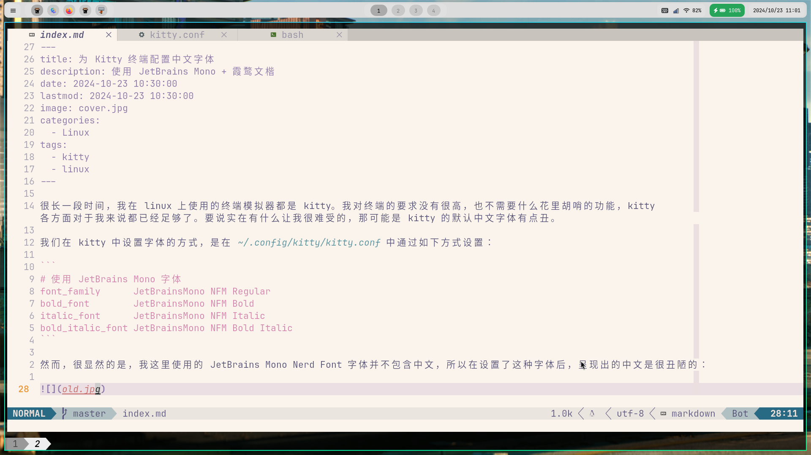
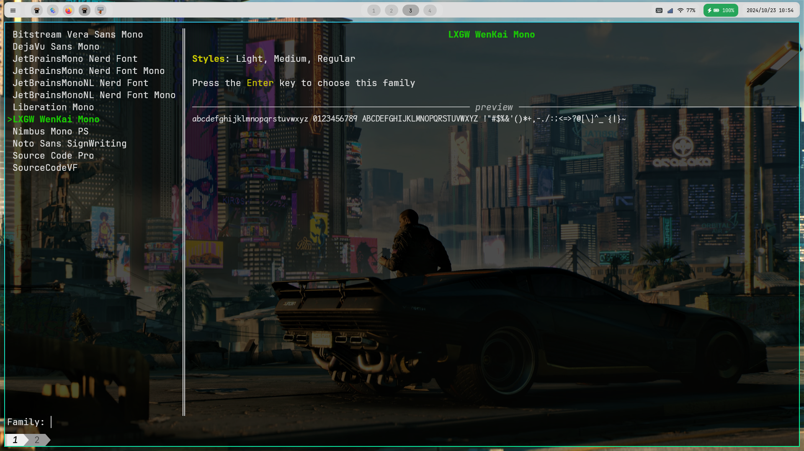
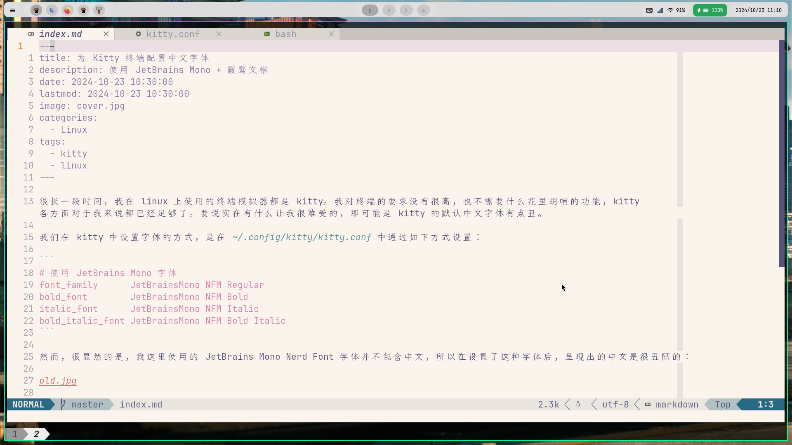

很长一段时间，我在 linux 上使用的终端模拟器都是 kitty。我对终端的要求没有很高，也不需要什么花里胡哨的功能，kitty 各方面对于我来说都已经足够了。要说实在有什么让我很难受的，那可能是 kitty 的默认中文字体有点丑。

我们在 kitty 中设置字体的方式，是在 `~/.config/kitty/kitty.conf` 中通过如下方式设置：

```
# 使用 JetBrains Mono 字体
font_family      JetBrainsMono NFM Regular
bold_font        JetBrainsMono NFM Bold
italic_font      JetBrainsMono NFM Italic
bold_italic_font JetBrainsMono NFM Bold Italic
```

然而，很显然的是，我这里使用的 JetBrains Mono Nerd Font 字体并不包含中文，所以在设置了这种字体后，呈现出的中文是很丑陋的：



此时，我们通过 `kitty --debug-font-fallback` 命令查看默认的 fallback 字体，可以看到使用的字体是 `Noto Sans CJK JP`。

按照写前端的人的思路，我们应该可以设置多个字体，将后面的字体作为 fallback。然而很遗憾，kitty 并不支持这种做法。在 kitty 的[文档](https://sw.kovidgoyal.net/kitty/conf/#opt-kitty.symbol_map)中，提到了一个叫做 `symbol_map` 的东西，它的作用是为一些特殊的 unicode 字符指定字体。其写法类似这样：

```
symbol_map U+E0A0-U+E0A3,U+E0C0-U+E0C7 PowerlineSymbols
```

看起来，这也不错，蛮清晰的。那么我们怎么指定中文字体的范围呢？可以将范围指定为 `U+4E00-U+9FA5`，这包含了大部分常用的中文字符。现在的问题，就是选择中文字体了。

我想要设置的中文字体，是[霞鹜文楷](https://github.com/lxgw/LxgwWenKai)。在 EndeavourOS 上，我们可以通过 `yay -S ttf-lxgw-wenkai` 对其进行安装。然而，你会发现，这个时候我们无法在 kitty 中使用这个字体。验证方式就是在终端运行 `kitty +list-fonts`，此时可选用的字体中并不包含我们刚刚安装的霞鹜文楷。

关于这个问题的答案在文档的 [faq](https://sw.kovidgoyal.net/kitty/faq/#kitty-is-not-able-to-use-my-favorite-font) 部分可以找到：

> ... it means that it is not monospace or is a bitmapped font

文档中提到，我们可以通过下面这行命令

```bash
fc-list : family spacing outline scalable | grep -e spacing=100 -e spacing=90 | grep -e outline=True | grep -e scalable=True
```

运行此命令后，的确没有找到霞鹜文楷字体。然而，该字体应该是 monospace 的，因为它是包含一个叫做 LXGW Wenkai Mono 的字体的。这又是怎么回事呢？继续向下阅读文档：

> Note that on Linux, the spacing property is calculated by fontconfig based on actual glyph widths in the font. If for some reason fontconfig concludes your favorite monospace font does not have spacing=100 you can override it by using the following ~/.config/fontconfig/fonts.conf

于是抱着尝试一下的态度，我在 `~/.config/fontconfig/fonts.conf` 中编写了如下的内容：

```xml
<?xml version="1.0"?>
<!DOCTYPE fontconfig SYSTEM "fonts.dtd">
<fontconfig>
<match target="scan">
    <test name="family">
        <string>LXGW Wenkai Mono</string>
    </test>
    <edit name="spacing">
        <int>100</int>
    </edit>
</match>
</fontconfig>
```

然后运行`fc-cache -r`并再次查看字体：



可以看到霞鹜文楷字体已经出现在了列表中。这样我们就可以在 `kitty.conf` 中使用该字体了：

```
symbol_map U+4E00-U+9FA5 LXGW Wenkai Mono
```

重启 kitty，成功。


