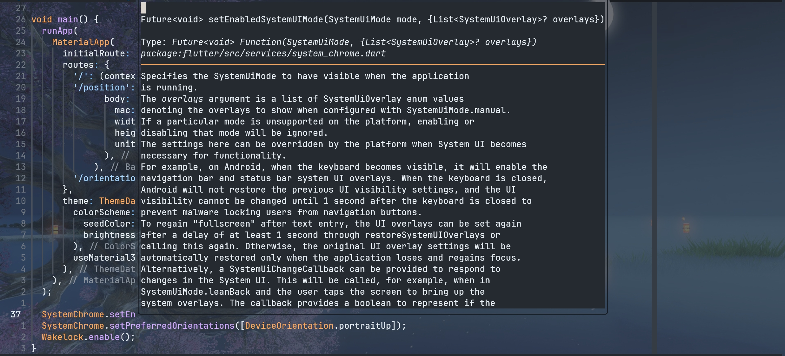
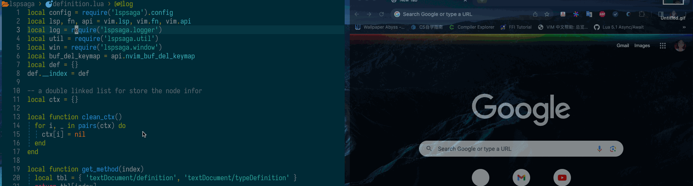

在将我的 neovim 配置得足够顺手的过程中，这些插件起到了重要的作用：

- [nvim-cmp](https://github.com/hrsh7th/nvim-cmp)：补全
- [none-ls](https://github.com/nvimtools/none-ls.nvim)：作为已经弃用的 null-ls 的替代品，主要用来格式化代码
- [lspsaga](https://github.com/nvimdev/lspsaga.nvim)：用来查看文档、diagnostics、code action 等；虽然 none-ls 也提供了这些功能，但是因为我从刚开始学习 neovim 的时候就用到了这个插件，所以一直没有弃用它

## 1 Lspsaga 的痛点

然而，我在使用 lspsaga 的时候，一直有一个很苦恼的地方：在查看的函数文档较长、无法在弹出的窗口中完整查看的时候（如下图），没有方便的快捷键可以滚动这段文档。



你可能会说，图中光标已经位于窗口中，为什么不正常进行浏览。那是因为，这是我在解决这个问题之后截的图。在初始状态下，`Lspsaga hover_doc` 命令并不会将光标移动到文档窗口中，而它又没有像 nvim-cmp 那样在补全时弹出文档的时候提供一个滚动的按键绑定。

然而，这似乎又是可以做到的，因为我在官网上找到了这张图：



作者在下面写到，将光标移入浮动窗口中使用了 <kbd>k</kbd> <kbd>k</kbd> 快捷键。然而，这显然不是 neovim 默认快捷键，而我翻阅了作者自己的 neovim 配置也并没有找到相关的绑定。所以这是怎么做到的呢？有网友给出的解决方案是按 <kbd>Ctrl</kbd> + <kbd>w</kbd> + <kbd>w</kbd>，但是这个快捷键的作用是（通过 `:h CTRL-W_W` 查看）：

> CTRL-W CTRL-W	Without count: move cursor to window below/right of the current one. If there is no window below or right, go to top-left window. With count: go to Nth window (windows are numbered from top-left to bottom-right). To obtain the window number see |bufwinnr()| and |winnr()|. When N is larger than the number of windows go to the last window.

实际使用起来，这个快捷键也并不是很靠谱。比如说，如果我打开一个 vertical split，然后在左侧窗口中打开文档并按上述快捷键，光标会移动到右侧窗口而非文档窗口中。显然，我不可能只在打开一个 window 的情况下查看文档，所以这个方案完全不可行。

## 2 尝试手动编写切换窗口的代码

这种时候，自然的思路是想办法通过 lua 切换到某一个指定的窗口。在 neovim 中，这一功能可以通过 `vim.api.nvim_set_current_win(winid)` 实现。所以，现在的问题就变成了：如何找到这个 `winid`。

不难发现，在 `lspsaga.nvim/lua/lspsaga/hover.lua` 中，显示文档窗口的函数是 `render_hover_doc`，而这个函数调用了 `open_floating_preview` 函数，其中有这样一段代码：

```lua
self.bufnr, self.winid = win
  :new_float(float_option, false, option_fn and true or false)
  :setlines(new)
  :bufopt({
    ['filetype'] = 'markdown',
    ['modifiable'] = false,
    ['buftype'] = 'nofile',
    ['bufhidden'] = 'wipe',
  })
  :winopt({
    ['conceallevel'] = 2,
    ['concealcursor'] = 'niv',
    ['showbreak'] = 'NONE',
    ['wrap'] = true,
  })
  :winhl('HoverNormal', 'HoverBorder')
  :wininfo()
```

其中，`self` 指向的是 `require("lspsaga.hover")`。因此，我猜想，是不是直接调用 `require("lspsaga.hover").winid` 就可以获取到这个值了呢？于是，我写下了这段代码：

```lua
function hover_doc()
    vim.cmd "Lspsaga hover_doc"
    print(require("lspsaga.hover").winid)
end
```

结果，打印出的结果是 `nil`。

值得一提的是，如果我使用 `vim.defer_fn` 将打印的代码延后 100 ms，就可以得到正确的 `winid`。然而，我并不喜欢这种通过定时器解决问题的办法。这一问题的出现，我猜测是从执行 `Lspsaga` 命令，到具体运行到这一大段代码的期间，可能有什么异步操作，即，我在打印 `winid` 的时候实际上上述那段代码还没有执行。

## 3 问题解决

这种时候，就体现出了使用 lua 配置 neovim 的好处了——我可以非常方便地对源函数进行二次修改。既然我不知道 lspsaga 的代码什么时候完成执行，那我干脆 hook 了你的函数不就完了吗，只要检测到函数结束就执行窗口切换操作。

那么该修改哪个函数呢？我并不确定 `open_floating_preview` 是否可行，因为我不知道这个函数里面是不是也存在异步。所以我选择从更深层一些的内容着手，也就是上面的代码中的 `new_float` 函数。

这个函数位于 `lspsaga.nvim/lua/lspsaga/window.lua` 中：

```lua
function win:new_float(float_opt, enter, force)
  vim.validate({
    float_opt = { float_opt, 't', true },
  })
  enter = enter or false

  self.bufnr = float_opt.bufnr or api.nvim_create_buf(false, false)
  float_opt.bufnr = nil
  float_opt = not force and make_floating_popup_options(float_opt)
    or vim.tbl_extend('force', default(), float_opt)

  self.winid = api.nvim_open_win(self.bufnr, enter, float_opt)
  return setmetatable(win, obj)
end
```

所以我只要做出如下的二次封装就行：

```lua
function()
    local win = require "lspsaga.window"
    local old_new_float = win.new_float
    win.new_float = function(self, float_opt, enter, force)
        local window = old_new_float(self, float_opt, enter, force)
        local _, winid = window:wininfo()
        vim.api.nvim_set_current_win(winid)

        win.new_float = old_new_float
        return window
    end

    vim.cmd "Lspsaga hover_doc"
end
```

首先，先用一个变量将旧的 `new_float` 存储起来——我不希望在（可能存在的）其他情况下也执行窗口切换的操作，我只想在查看文档的时候对函数进行修改。接着，对函数进行修改，第一步就是执行原函数并拿到返回值——我们的宗旨是保持功能不变、返回值不变，只在中间加料。在得到窗口之后，就可以通过 `wininfo`（lspsaga 提供的另一个方法）获取 `winid`，并执行切换了。

这里值得注意的是，`new_float` 的调用是 `:new_float` 而非 `.new_float`，前者相当于隐式地传入了一个 `self`。所以，由于我使用了 `win.new_float` 的方法定义函数，所以在函数的传入参数中要在开头加上一项。

问题解决。

---

2025 年 4 月 29 日更新：

经 GitHub Issue 中一位朋友的热心提醒，我发现作者所说的 <kbd>K</kbd><kbd>K</kbd> 是大写的 K。经验证，如果将 <kbd>K</kbd> 绑定到 `Lspsaga hover_doc` 后，即在浮窗显示后再次调用这个命令，确实会直接进入浮窗中。

然而，这种做法仍然存在弊端。和前面我们被迫使用 `defer_fn` 时的问题一样，过快地两次调用 `Lspsaga hover_doc` 仍然无法跳转到浮窗中。所以，歪打正着，本文的做法似乎仍然是更优的解法。
