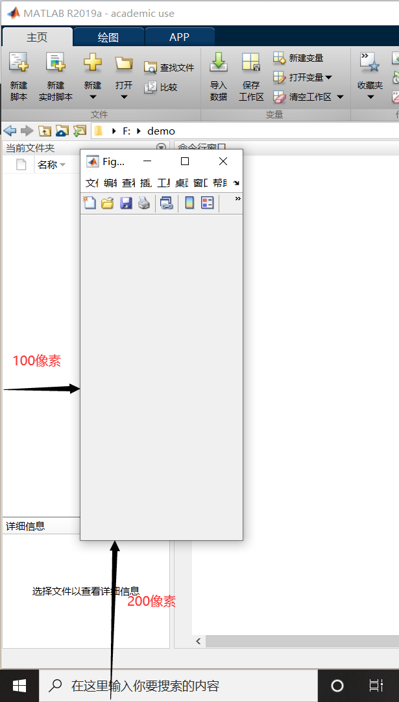
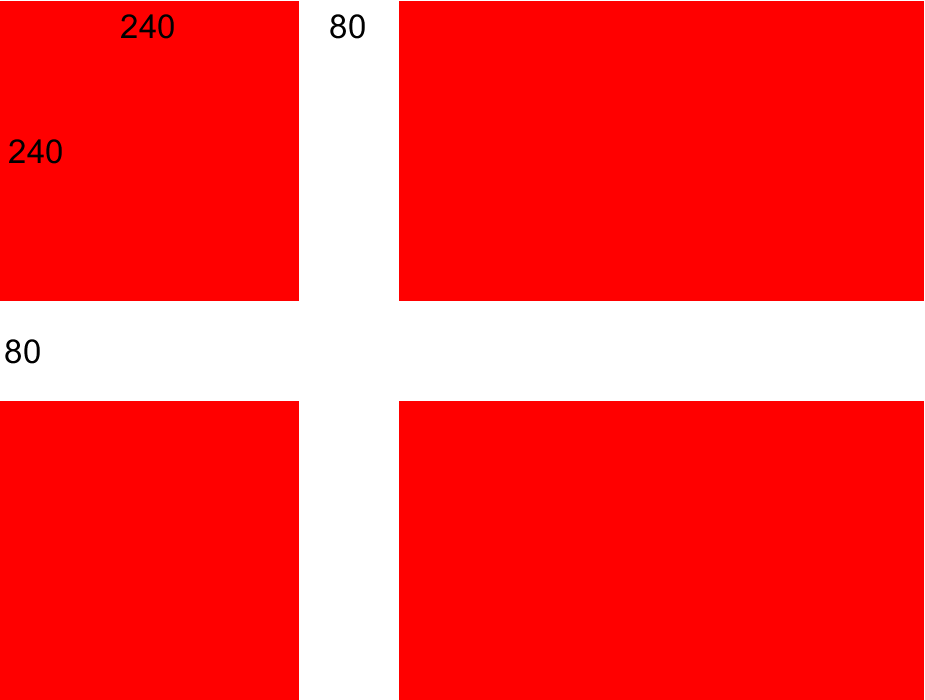
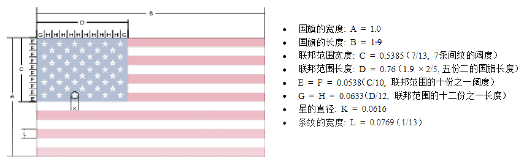

> 本篇内容最初于 2021 年 9 月 11 日发布于我的公众号 coding for psychers，因公众号停止更新，现将文章搬运到此博客

在心理学中，我们经常需要自己绘制一些简单的图形——例如，绘制一个十字的注视点。这种时候，使用MATLAB会是一个很好的选择。那么，本篇随笔会简单讲解如何使用MATLAB画图。特别地，我们会使用画国旗作为例子（是的，我借鉴了北师大心理学部蒋挺老师的设计；这个时候写这篇教程，也是因为蒋老师这周末留了画国旗的作业）。

## 1 画国旗的基本思路

需要特别说明，我们这里的画国旗，不光是要生成国旗图片，还要显示出来。既然要显示图片，自然地，我们就要**新建一个图窗**。MATLAB中，新建图窗使用`figure`命令。同时，我们可以赋予figure多种参数，来对窗口进行自定义。

```matlab
hFigure = figure;
```

上面的命令创建了一个最简单的窗口。当然，我们即使不将图窗赋给`hFigure`也可以创建图窗，但我们之所以要将其赋给一个变量，是因为我们后续需要操作这个窗口。例如，我们可以对这个窗口的大小和位置进行设置：

```matlab
set(hFigure, 'position', [100 200 200 400]);
```

我们使用了`set`命令对`hFigure`的`position`属性进行了设置，具体值为`[100 200 200 400]`。这四个数的含义是什么呢？它们依次代表：窗口左侧到屏幕左侧的距离、窗口底部到屏幕底部的距离、窗口的宽度、窗口的高度。四个值的单位均为像素。



使用`set`命令也可以一次性指定多个属性：

```matlab
set(hFigure, 'position', [100 200 200 400], 'name', 'my figure', 'numbertitle', 'off');
```

这样我们就将窗口的标题设置为了`my figure`。后面的`'numbertitle', 'off'`的作用是， MATLAB会默认在图窗标题前加上`Figure 1`、`Figure 2`，后面才是我们`name`属性指定的内容，而将`numbertitle`关掉，就只会显示`name`属性指定的内容。

我们也可以用简单的形式，在创建`hFigure`的时候直接指定这些属性：

```matlab
hFigure = figure('position', [100 200 200 400], 'name', 'my figure', 'numbertitle', 'off');
```

需要说明，`set`命令和上面这种直接指定的写法中，属性名**大小写不敏感**，所以我们也可以把属性写成`Name`、`NumberTitle`这样。但是，下面这种写法就必须按照正确的大小写来写：

```matlab
hFigure.Position = [100 200 200 400];
hFigure.Name = 'my figure';
hFigure.NumberTitle = 'off';
```

如果你对MATLAB有较深的了解，你会知道，`hFigure`实际上是一个实例化的figure类，而`Position`、`Name`等都是figure类的属性，上面代码中，我们就是使用`.`运算符访问类的属性。

现在，我们来进行第二步。MATLAB中，画图除了窗口，还需要建立一个坐标区。所绘制的图片需要绘制在坐标区中，坐标区需要放在窗口中。建立坐标区的命令是`axes`。我们接着上面的代码来建立坐标区：

```matlab
hAxes = axes('parent', hFigure, 'units', 'pixels', 'position', [0 0 200 400]);
```

上面的命令中，我们指定了`hAxes`的三个属性：`parent`、`units`和`position`。`parent`属性是将`hAxes`挂载到`hFigure`下；如果不指定这个值，代码是不知道我们要将`hAxes`放在哪个窗口中显示。在只有一个窗口的时候，这并不会造成影响，但是当我们打开多个窗口时，可能会有意想不到的影响。`units`属性指定的是后面`position`属性值的长度单位。在`figure`命令中，我们也可以指定这个属性，但因为`figure`中默认单位就是`pixels`，因此我们在前面的代码中没有指定；但对于`axes`命令有所不同，其`units`属性的默认值是`normalized`，是按照比例来计算的，左下角对应(0, 0)，右上角对应(1, 1)。最后一个`position`属性和`figure`类，但前两个参数分别是坐标区的左边和底边到**窗口**左边和底边的距离。因此，上边的命令创建了一个和`hFigure`等大且完全填充的坐标区。

## 2 绘制一个矩形

我们该怎么去在坐标轴上画出图形，例如矩形呢？按照我们正常的思路，应该是画出轮廓，然后再上色。这无疑是方法之一，但是对于矩形这种比较简单的图形，可以采用另一种方式。

我们知道，一个图形实际上由很多像素点组成。换言之，你可以这样理解，一张图片实际上是由许多个小的正方形拼起来的，每一个正方形都是纯色的且不可再分，这就是一个像素点。例如，我们来看下面这个黑底红字的T，你可以播放这个视频，看看像素点拼成一张图片的过程（当然，实际像素点并没有这么大，这是为了看得清楚）。

<center>
    <video width="50%" controls>
        <source src="01_2.mp4" type="video/mp4">
    </video>
</center>

可以看到，这个黑底红字的T实际上是由7 × 7个正方形拼接而成的，除了第二行第2-6个正方形和第4列第3-6个正方形是红色的，其他都是黑色。不知道你有没有发现，这和矩阵十分相似呢？

现在换一个情境：如果我们有一个7 × 7的方阵，除了第二行第2-6个元素和第4列第3-6个元素是值a，其他元素都是值b，然后我们再用值a来表示红色，用值b来表示黑色，是不是就可以用一个矩阵来表示上面那张图了呢？这就是矩阵和图形之间的对应关系。

所以我们现在要解决的问题，就是怎么用一个值来表示颜色。在这里，我们使用的是RGB色彩模式，也就是通过对红(R)、绿(G)、蓝(B)三个颜色通道的变化以及它们相互之间的叠加来得到各式各样的颜色。例如，红色的RGB值是(255, 0, 0)，黑色的RGB值是(0, 0, 0)。因此，我们需要使用一个三维的矩阵，矩阵的第一层存储R通道，第二层存储G通道，第三层存储B通道。不过需要注意的是，在MATLAB中，RGB值的范围是0-1而非0-255（事实上也不全是这样，但是你暂且可以这么理解，因为我们暂时只会用到这种方式）。

现在，让我们绘制一个600 × 400的黑色矩形。我们可以指定一个400 × 600 × 3的所有元素为0的矩阵，因此，它对应的图形是600 × 400像素的(因为400是行数，600是列数，所以400对应高度，600对应宽度)，同时对于每一个像素点，它的RGB值均为(0, 0, 0)，也就是黑色，所以：

```matlab
imshow(zeros(400, 600, 3), 'parent', hAxes);
```

代码中，`zeros(400, 600, 3)`创建了一个400行、600列、3层的、每个值均为0的矩阵。因此，这行代码绘制出来就是一个黑色的矩形。而后面的`parent`属性，是用来说明将这个黑色矩形绘制到哪个坐标区当中。

绘制黑色矩形的完整代码：

```matlab
hFigure = figure('position', [100 100 600 400]);
hAxes = axes('parent', hFigure, 'units', 'pixels', 'position', [0 0 600 400]);
imshow(zeros(400, 600, 3), 'parent', hAxes);
```

## 3 绘制法国国旗

既然我们在`imshow`函数中直接显示的是一个矩阵，那么如果我们改变矩阵中的某些值，输出的图形是不是就不是一个纯色的图呢？例如，我们将上面的代码进行修改：

```matlab
hFigure = figure('position', [100 100 600 400]);
hAxes = axes('parent', hFigure, 'units', 'pixels', 'position', [0 0 600 400]);
imgMat = zeros(400, 600, 3);
imgMat(:, 1:200, 1) = 1;
imshow(imgMat, 'parent', hAxes);
```

此时你会发现，我们得到了一个红黑相间的矩形，因为改动后，矩形的左1 / 3区域的RGB值变为了(255, 0, 0)，也就是红色（代码里是1,因为我们说过，目前这种写法里，RGB最大值是1，所以这里的1对应的实际上是真实RGB值的255）。

根据这个原理，我们就可以绘制法国国旗。法国国旗从左到右依次为蓝色、白色和红色，蓝色的RGB是(0, 0, 255)，白色的RGB是(255, 255, 255)，因此我们可以将矩阵的左1 / 3的三层分别设置为0 0 1，中1 / 3的三层分别设置为1 1 1，右1 / 3的三层分别设置为1 0 0：

```matlab
hFigure = figure('position', [100 100 600 400]);
hAxes = axes('parent', hFigure, 'units', 'pixels', 'position', [0 0 600 400]);
imgMat = zeros(400, 600, 3);
imgMat(:, 1:200, 3) = 1; % 左1 / 3
imgMat(:, 201:400, :) = 1; % 中1 / 3
imgMat(:, 401:600, 1) = 1; % 右1 / 3
imshow(imgMat, 'parent', hAxes);
```

## 4 绘制丹麦国旗



丹麦国旗的中心是一个十字，但这和绘制法国国旗的原理十分类似，我们只需要绘制一个红色的矩形，然后将这个矩阵中的一些行和一些列改为白色即可。丹麦国旗尺寸为740 × 560，具体尺寸可以参照上图。

```matlab
hFigure = figure('position', [100 100 740 560]);
hAxes = axes('parent', hFigure, 'units', 'pixels', 'position', [0 0 740 560]);

imgMat = zeros(560, 740, 3);
imgMat(:, :, 1) = 1; % 底色为红
% 简单写法：imgMat = cat(3, ones(400, 600), zeros(400, 600, 2));
% 这种写法用到了矩阵的拼接

imgMat(:, 241:320, [2 3]) = 1; % 修改第241列到320列的所有行；因为第一层已经是1了，所以我们只修改第2和3层
imgMat(241:320, :, [2 3]) = 1; % 修改第241行到320行的所有列
imshow(imgMat, 'parent', hAxes);
```

## 5 绘制日本国旗

日本国旗中多了一个圆，这让事情复杂了起来——我们怎么用矩阵表示圆呢？答案是，我们不再用矩阵表示圆，而是采取更加natural的方式，对一个圆形区域进行填充。

填充区域使用的是`fill`函数，其基本格式是`fill(x, y, c)`。其中，`x`是多边形所有顶点的**横坐标**组成的矩阵，`y`是多边形所有顶点的**纵坐标**组成的矩阵，而`c`是**填充的颜色**，可以是RGB值，也可以是颜色代码（例如，用`'r'`代替红色，用`k`代表黑色，用`w`代表白色，等等）。例如，我们有一个三角形，三个顶点坐标分别为：(0, 0)，(2, 0)，(1, $\sqrt{3}$)。我们要将这个等边三角形填充为黄色：

```matlab
hFigure = figure('position', [100 100 600 550]);
hAxes = axes('parent', hFigure, 'units', 'pixels', 'position', [100 100 400 350]);
fill([0 2 1], [0 0 sqrt(3)], 'y');
% or
% fill([0 2 1], [0 0 sqrt(3)], [1 1 0]);
axis([0 2 0 1.75]);
```

在上面的例子中，我们看到，`fill`函数的第一个参数中，我们依次填写了等边三角形三个顶点的横坐标，而第二个参数就是三个横坐标相对应的纵坐标。最后一个参数中，我们可以使用黄色的颜色缩写`'y'`，也可以使用RGB值`[1 0 0]`。

这里出现了一个我们没有见过的函数：`axis`。这个函数的作用是设置坐标轴的范围和纵横比，上面的`axis([0 2 0 1.75]);`就是将横坐标范围设置为0 - 2，将纵坐标范围设置为0 - 1.75。如果不对坐标轴范围进行约束，会导致绘图的比例和我们理想中不一样。特别地，如果只想写一句`axis`命令，必须像上面一样，将这条命令写在`fill`函数后面，否则，会导致`axis`命令不生效，例如：

```matlab
hFigure = figure('position', [100 100 600 550]);
hAxes = axes('parent', hFigure, 'units', 'pixels', 'position', [100 100 400 350]);
axis([0 200 0 175]);
fill([0 2 1], [0 0 sqrt(3)], 'y');
```

可以看到，这个时候，即便我设置了一个离谱的坐标区范围，但画出来的图还是正常的。

如果你想要将`axis`命令写在`fill`前面，也未尝不可，但这个时候，我们需要在它的后面加一个`hold on`：

```matlab
hFigure = figure('position', [100 100 600 550]);
hAxes = axes('parent', hFigure, 'units', 'pixels', 'position', [100 100 400 350]);
axis([0 2 0 1.75]);
hold on;
fill([0 200 100], [0 0 (100 * sqrt(3))], 'y');
```

可以看到，这个时候，坐标区信息被保存了下来。这是因为，`hold on`的作用是**保留前面的绘图**，并**保持绘制后坐标区的状态**。所以，虽然`fill`函数会调整坐标区范围，但因为我们在前面就已经使用了`hold on`，所以我们仍然会使用`axis([0 2 0 1.75])`规定的坐标区范围。**请记住这一点，后面还会提到。**

回到画圆这个问题，我们怎么使用`fill`命令画圆呢？我们知道，圆处处平滑，自然不可能列出来边界上所有的点。不过，我们也不需要画一个完美的圆形，只要让看图的人看不出这是一个不完美的圆形就可以。所以，只要我们画一个边数足够多的正多边形，就足以以假乱真。

```matlab
hFigure = figure('position', [100 100 600 550]);
hAxes = axes('parent', hFigure, 'units', 'pixels', 'position', [100 100 400 400]);

theta = 0:(pi / 60):(2 * pi);
x = 200 + 100 * cos(theta);
y = 200 + 100 * sin(theta);

axis([0 400 0 400]);
hold on;
fill(x, y, 'y');
```

我们首先定义了`theta`变量，它是一个从0到2$\pi$、每隔$\frac{\pi}{60}$取一次值所组成的数组。因此，我们绘制的正多边形是在圆周上每隔$\frac{\pi}{60}$取一个点连接而成的。下面对变量`x`和`y`的定义则使用了基本的参数方程，从而绘制出了一个圆心在(200, 200)、半径为100的圆。使用这个方法，我们也可以绘制椭圆。

现在，我们就可以来尝试着画日本国旗了。日本国旗长宽比3:2，中央圆形的直径为旗帜高度的3 / 5。我们先来绘制一个白色背景：

```matlab
hFigure = figure('position', [100 100 600 400]);
hAxes = axes('parent', hFigure, 'units', 'pixels', 'position', [0 0 600 400]);
imshow(ones(400, 600, 3), 'parent', hAxes);
```

然后，我们在图中心画一个半径为120的圆：

```matlab
theta = 0:(pi / 60):(2 * pi);
x = 300 + 120 * cos(theta);
y = 200 + 120 * sin(theta);
fill(x, y, 'r');
```

这个时候，我们会发现，我们的圆扭曲了。这是因为，我们没有设置坐标区范围：

```matlab
axis([0 600 0 400]);
```

此时，国旗就已经画出来了，但是还有问题：坐标区的刻度还存在；如果你仔细看，中心的圆是有黑边的。关闭坐标区刻度的解决方案如下：

```matlab
axis off; % 不显示坐标区的线条和背景
```

去掉圆形黑边的方式是用下面这句代码替换前面的`fill`命令：

```matlab
fill(x, y, 'r', 'edgealpha', 0); % 将边线的透明度设置为0，也就是透明；默认为1
```

好了，现在问题的确解决了，但是新问题出现了——我的背景呢？我画的白色矩形去哪了？

在MATLAB中，我们每一次新画的图都会覆盖前一次的画图，所以使用`fill`命令后，会将前面的`imshow`命令画出的白色背景覆盖掉。而此前我们之所以能看到白色背景，是因为**坐标区背景本来就是白色的，但是用了`axis`命令后，坐标区的背景也不显示了**。所以，咱们在`imshow`命令后面一行加上一个`hold on`。

完整代码：

```matlab
hFigure = figure('position', [100 100 600 400]);
hAxes = axes('parent', hFigure, 'units', 'pixels', 'position', [0 0 600 400]);
imshow(ones(400, 600, 3), 'parent', hAxes);
hold on;
theta = 0:(pi / 60):(2 * pi);
x = 300 + 120 * cos(theta);
y = 200 + 120 * sin(theta);
fill(x, y, 'r', 'edgealpha', 0);
axis([0 600 0 400]);
axis off;
```

*这一部分接下来的内容有一点点绕，如果你已经有点晕了，可以先跳到后面保存图片的部分。*

现在看似已经大功告成了，但事情并没有那么简单。我们现在来进一步思考一些问题：如果我将上面的`y`变量的定义语句换成`y = 100 + 120 * sin(theta);`，你觉得这个圆会怎么移动呢？是向上移动还是向下移动？我们记得，坐标区的原点在左下角，所以理论上它应该下移。然而，事实上，它会向上移。

再举例，你可以试着在白色背景上画一个上半圆：

```matlab
hFigure = figure('position', [100 100 600 400]);
hAxes = axes('parent', hFigure, 'units', 'pixels', 'position', [0 0 600 400]);
imshow(ones(400, 600, 3), 'parent', hAxes);
hold on;
theta = 0:(pi / 60):(pi);
x = 300 + 120 * cos(theta);
y = 200 + 120 * sin(theta);
fill(x, y, 'r', 'edgealpha', 0);
```

按照我们的数学知识，这就应该是上半圆，但画出来偏偏是一个下半圆。这是为什么呢？

不知道你有没有发现，我特意强调了，**在白色背景上**画上半圆。而问题恰恰就出在这个背景上。我们前文说过，`hold on`会保留坐标区绘图后的状态，而`imshow`命令会自动将原点设置在**左上角**，将y轴正方向变为**向下**。而且，不管这个`imshow`只要出现，它就会做出这个修改。

当你用`get(hAxes)`查看坐标区属性时，你会发现使用`imshow`之前，坐标区的`CameraUpVector`是`[0 1 0]`，但用了`imshow`之后，就变成了`[0 -1 0]`。如果我们在上面的代码最后加一句`hAxes.CameraUpVector = [0 1 0];`，就会显示一个上半圆。但此时，我们显示在图窗中的矩阵就上下颠倒了。虽然现在我们看不出来，因为它是纯白的，但它确实上下颠倒了。

上面这部分内容并不需要特意了解，你只要知道，使用`imshow`再使用`hold on`会导致坐标区上下颠倒。在作图时，记住这一点就好。

## 6 绘制美国国旗

美国国旗是一个很好的练习循环语句的例子：



其中，蓝色部分RGB = (0, 43, 127)，红色部分RGB = (196, 30, 58)。

我们首先将星星以外的地方画出来：

```matlab
hFigure = figure('position', [100 100 741 390]);
hAxes = axes('parent', hFigure, 'units', 'pixels', 'position', [0 0 741 390]);
imgMat = ones(390,741,3);

% 红色条纹
for ii=1:60:361
    imgMat(ii:(ii + 29), :, 1) = 196 / 255;
    imgMat(ii:(ii + 29), :, 2) = 30 / 255;
    imgMat(ii:(ii + 29), :, 3) = 58 / 255;
end

% 蓝色部分
imgMat(1:210, 1:296, 1) = 0;
imgMat(1:210, 1:296, 2) = 43 / 255;
imgMat(1:210, 1:296, 3) = 127 / 255;
imshow(imgMat,'parent',hAxes);
```

绘制红色条纹时，我们需要将矩阵的1 - 30行、61 - 90行、……、361 - 390行设置为红色，依次写会很麻烦，所以我们使用了循环语句。

现在到了一个比较麻烦的问题——画星星。这里，我们可以偷一个懒，用特殊字符代替画图。你可以用中文输入法打出★这个符号，所以我们只需要将这个字符显示在图片上即可。

将字符**打印到图窗**的命令是`text`，其基本格式是`text(x, y, str)`，分别规定了文字的横纵坐标和文字内容。除此之外，我们还可以指定多个属性如`fontsize`、`fontname`、`color`、`horizontalalign`、`verticalalign`等：

```matlab
hFigure = figure('position', [100 100 800 600]);
hAxes = axes('parent', hFigure, 'units', 'pixels', 'position', [100 100 600 400]);
axis([0 600 0 400]);
text(300, 200, 'Hello world', 'horizontalalignment', 'center', 'verticalalignment', 'middle');
```

特别地，这里不需要在`axis`后面再使用`hold on`，因为`text`命令会直接沿用当前坐标轴信息。

上面的代码中，我们需要重点说明`horizontalalignment`和`verticalalignment`两个参数。它们分别指定了对齐方式。但是，这个对齐方式可能不是我们想的那种对齐方式。它其实是告诉你，你所指定的`x`和`y`，到底是文字哪一部分的坐标——是将文字的最左端放到`x`的位置，还是把文字的中点放到`x`的位置：


了解了这些以后，我们就可以把美国国旗画完了：

```matlab
for xx = 74 / 3:148 / 3:(296 - 74 / 3)
    for yy = 21:42:189
        text(xx, yy, '★', 'horizontalalign', 'center', 'fontsize', 18, 'color', 'w');
    end
end
for xx = 148 / 3:148 / 3:(296 - 148 / 3)
    for yy = 42:42:168
        text(xx, yy, '★', 'horizontalalign', 'center', 'fontsize', 18, 'color', 'w');
    end
end
```

因为这些星星的排放非常规律，所以我们再次使用循环语句。这些数据可以根据前面图中给出的参数自行算出。

完整代码：

```matlab
hFigure = figure('position', [100 100 741 390]);
hAxes = axes('parent', hFigure, 'units', 'pixels', 'position', [0 0 741 390]);
imgMat = ones(390,741,3);

% 红色条纹
for ii=1:60:361
    imgMat(ii:(ii + 29), :, 1) = 196 / 255;
    imgMat(ii:(ii + 29), :, 2) = 30 / 255;
    imgMat(ii:(ii + 29), :, 3) = 58 / 255;
end

% 蓝色部分
imgMat(1:210, 1:296, 1) = 0;
imgMat(1:210, 1:296, 2) = 43 / 255;
imgMat(1:210, 1:296, 3) = 127 / 255;
imshow(imgMat,'parent',hAxes);
for xx = 74 / 3:148 / 3:(296 - 74 / 3)
    for yy = 21:42:189
        text(xx, yy, '★', 'horizontalalign', 'center', 'fontsize', 18, 'color', 'w');
    end
end
for xx = 148 / 3:148 / 3:(296 - 148 / 3)
    for yy = 42:42:168
        text(xx, yy, '★', 'horizontalalign', 'center', 'fontsize', 18, 'color', 'w');
    end
end
```

## 7 保存图片

怎么将我们绘制的图片保存下来呢？这里讲两种方式。

第一种：

```matlab
hFrame = getframe(gcf);
img = hFrame.cdata;
imwrite(img, 'pic.jpg');
```

这种做法实际上就是将当前图窗显示的内容截图下来，变成一个矩阵，其优点在于我们可以直接得到一个矩阵，可以进一步操作。缺点则是，它有一点点糊。所以，我们介绍第二种方法：

```matlab
set(gcf, 'InvertHardCopy', 'off'); % 没有这一行会导致打印出的图和实际效果不符
print('pic', '-dpng', '-r600');
```

这种做法的最大好处就是高清。以上面的美国国旗为例，在我的电脑上，第一种保存方法像素是926 × 487，第二种保存方法像素是4631 × 2438。如果你不需要这么高清，也可以将`print`函数中的`'-r600'`改为其他以`-r`开头的整数。如果设置为`-r0`，则和第一种方法得到的分辨率相同。
