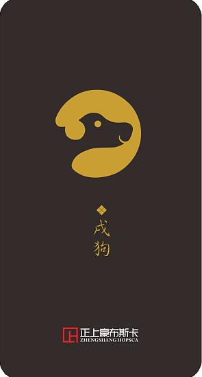

> 本篇内容最初于 2021 年 9 月 15 日发布于我的公众号 coding for psychers，因公众号停止更新，现将文章搬运到此博客

本篇教程将会讲解如何绘制如右图的效果：


图片素材：





## 1 思路分析

首先，我们来分析一下实现这个任务的思路。虽然解法多种多样，但是我所采用的思路是在每张图片中抠出一个扇形的区域，然后进行旋转并拼接在一起。

事实上，存在另一种思路，那就是，先将12张图片分别放到圆环上对应的位置，然后再盖一个蒙版。然而，这种思路存在一定的问题。当图片比较“胖”的时候，先放图片会导致图片彼此遮挡，从而影响最终的呈现效果。而先抠图，再拼接，就不会有遮挡的问题。

## 2 截取扇形区域

这里所说的抠图，是保留想要的区域，并将不想保留的区域替换为纯色。

我们从相对简单的抠图讲起——怎么抠出一个圆形？例如，我有一个矩阵：`img = ones(600, 600, 3)`。现在，我想要从矩形中心抠掉一个半径100的圆形，并将剩余部分替换为黑色，该怎么处理呢？

这就要说到**逻辑数组**了。MATLAB中，当我们将矩阵和数值比较时，得到的结果会是一个逻辑数组。例如：

```matlab
a = [1 2 3; 4 5 6; 7 8 9];
b = (a > 5)
% Output:
% b =
%
%  3×3 logical 数组
%
%   0   0   0
%   0   0   1
%   1   1   1
```

逻辑数组可以用来作为矩阵的**索引**。此时，如果你运行`a(b)`，你会发现，结果是`[7; 8; 6; 9]`，正好是a中所有大于5的元素。因此，我们可以用逻辑数组提取数组中满足**某个条件**的元素。如果逻辑值为1，则提取相应位置的元素；否则不提取。我们可以用这种方法把a中所有大于5的元素设置为0：

```matlab
a(a > 5) = 0;
```

使用逻辑矩阵提取元素时，需要注意逻辑矩阵和原始矩阵尺寸要完全相同。

而抠图的基本思路，就是用逻辑矩阵做一个“蒙版”，只要我们在逻辑矩阵中抠出一个圆形区域，那么我们就可以在原始图像矩阵中抠出一个圆形区域。然而，这是一件比较困难的事情，因为一个个像素点并不是连续的，我们很难表示出一个圆形。

我们再来看另一个知识点：前面的教程中，我们看到可以将矩阵作为图形呈现出来；而我们使用`imwrite`函数保存图片时，其实也是将一个矩阵保存为了图片。所以，我们可以先用`fill`函数画出一个圆，然后把这个圆截图，从而得到一个矩阵。这样，我们就有了一个可以表示一个近似圆形的矩阵。

```matlab
img = ones(600, 600, 3); % The original matrix

hFigure = figure('position', [100 100 600 600], 'visible', 'off');
hAxes = axes('parent', hFigure, 'units', 'pixels', 'position', [0 0 600 600]);
theta = 0:(pi / 60):(2 * pi);
fill(300 + 100 * cos(theta), 300 + 100 * sin(theta), 'k', 'edgealpha', 0);
axis([0 600 0 600]);
axis off;
hFrame = getframe(gcf);
imgFrame = hFrame.cdata;
close(hFigure);

img(imgFrame > 200) = 0;
imshow(img);
```

画图部分没有什么可讲的，唯一需要说明的是我们给`hFigure`指定了一个`visible`属性。当将这个属性设置为`off`时，该窗口会被隐藏，但是我们仍然可以进行截图的操作。这样可以提供更好的用户体验，因为你的用户可能只想看到最后的抠图结果。重点需要说明的是第13行代码：`img(imgFrame > 200) = 0`。

我们先思考一下，因为原始矩阵`img`是白色的，所以我们应该通过逻辑矩阵选取圆形区域以外的地方，并将其值设置为0（黑色），而这部分在我们截取的窗口内容中为**白色**，也就是RGB为255的地方。因为截下来的图并不一定会完美保留色彩信息，所以我们可以给一个范围，只要RGB大于200的都算作白色。然而，问题来了，我们前面的教程中说到过，在MATLAB中RGB的范围是0 - 1，那为什么这里写的是`imgFrame > 200`而非`imgFrame > 200 / 255`呢？

在前面的教程中提到关于RGB的取值范围时，我们说到，可以**暂时**认为RGB的范围是0 - 1，因为这个范围和数据类型是有关的，而我们当时的示例中所使用的数据类型下，RGB的范围确实是0 - 1。这里，我们可以详细来说一说。MATLAB中，默认数值类型是**double**，使用**double**类型指定RGB值的时候，取值范围时0 - 1；然而，无论是我们使用`getframe`截图得到的矩阵，还是使用`imread`函数读取图片得到的矩阵，其数值类型都是`uint8`的，即8位无符号整数，其取值范围是0 - 255，而使用这个数据类型表示RGB的取值时，取值范围也是0 - 255。我们以后在表示颜色的时候，可以使用`[1 0 0]`这样的格式，也可以使用`uint8([255 0 0])`这种方式。不过需要特别注意，**uint8**，是**unsigned integer**的缩写，千万不要拼成unit8。

以上就是抠图的一个基本思路。不过，这里还是有一些地方需要完善的。在Windows下，系统有一个缩放比率，你可以在设置中进行查看。如果设置为`125%`的缩放率，那么对600 × 600的窗口截图后得到的图片大小是`750 × 750`，也就是`600 * 1.25`。所以，我们应该先获取一下系统的缩放率（是的，我们调了Java）：

```matlab
scale = java.awt.Toolkit.getDefaultToolkit().getScreenResolution() / get(0, 'ScreenPixelsPerInch');
```

然后，我们需要将绘图阶段的一些参数根据这个缩放率进行调整，这样才能保证截图大小和原始矩阵尺寸匹配。

有了以上知识点，我们就可以对图像截取一个扇形区域。以其中一张图片为例：

```matlab
image = imread('material/1.jpg');

width = size(image, 2);
height = size(image, 1);

scale = java.awt.Toolkit.getDefaultToolkit().getScreenResolution() / get(0, 'ScreenPixelsPerInch');

hFigure = figure('position', [100 100 (width / scale) (height / scale)], 'visible', 'off');
hAxes = axes('parent', hFigure, 'units', 'pixels', 'position', [0 0 (width / scale) (height / scale)]);

centerX = width / scale / 2;
centerY = -150;
innerRadius = 280;
outerRadius = 500;
theta = 77:0.5:103;
fill([(centerX + innerRadius * cosd(theta)) (centerX + outerRadius * cosd(theta(end:-1:1)))], [(centerY + innerRadius * sind(theta)) (centerY + outerRadius * sind(theta(end:-1:1)))], 'k', 'edgealpha', 0);
axis([0 (width / scale) 0 (height / scale)]);
axis off;
hFrame = getframe(gcf);
mask = hFrame.cdata;
close(gcf);

ringCenterToRectCenter = height / 2 - centerY * scale;

image(mask > 200) = 0;
imshow(image);
```

得到如下效果：


## 3 旋转图片

在MATLAB中，我们可以通过`imrotate`函数旋转图片。`imrotate(a, angle)`会将图片`a`逆时针旋转`angle`度。例如，我们将上面的图片顺时针旋转60°：

```matlab
imshow(imrotate(image, -60));
```

会得到如下图的效果：


旋转后的原始图像部分大小不会改变，但是会被填补成一个正直摆放的矩形区域。为了方便演示，我们把原图片中扇形区域以外的地方用白色重新填充，来看一下效果：


## 4 拼接图片

因为旋转后的图片，除了目标区域以外都是黑色的，而黑色的RGB值是`(0, 0, 0)`，所以可以把这些图片拼接到一个大的黑色矩阵上，这样，拼接后的图片整体背景仍然是黑色的。

```matlab
clc, clear, close all;
image = imread('material/1.jpg');

% Get info of the images
width = size(image, 2);
height = size(image, 1);

% Get the scaling factor for windows
scale = java.awt.Toolkit.getDefaultToolkit().getScreenResolution() / get(0, 'ScreenPixelsPerInch');

% Initialize a window
hFigure = figure('position', [100 100 (width / scale) (height / scale)], 'visible', 'off');
hAxes = axes('parent', hFigure, 'units', 'pixels', 'position', [0 0 (width / scale) (height / scale)]);

% Draw mask
centerX = width / scale / 2;
centerY = -150;
innerRadius = 280;
outerRadius = 500;
theta = 77:0.5:103;
fill([(centerX + innerRadius * cosd(theta)) (centerX + outerRadius * cosd(theta(end:-1:1)))], [(centerY + innerRadius * sind(theta)) (centerY + outerRadius * sind(theta(end:-1:1)))], 'k', 'edgealpha', 0);
axis([0 (width / scale) 0 (height / scale)]);
axis off;
hFrame = getframe(gcf);
mask = hFrame.cdata;
close(gcf);

ringCenterToRectCenter = height / 2 - centerY * scale;

outImage = uint8(zeros((height + width) * 2, (height + width) * 2, 3));
for ii = 1:12
    rot = -30 * (ii - 1);
    image(mask > 200) = 0;
    image = imrotate(image, rot);
    rotatedImageWidth = size(image, 2);
    rotatedImageHeight = size(image, 1);
    bkg = uint8(zeros((height + width) * 2, (height + width) * 2, 3));
    shiftX = ringCenterToRectCenter * sind(-rot) + height + width;
    shiftY = -ringCenterToRectCenter * cosd(-rot) + height + width;
    bkg(floor(shiftY - rotatedImageHeight / 2):floor(shiftY + rotatedImageHeight / 2 - 1), floor(shiftX - rotatedImageWidth / 2):floor(shiftX + rotatedImageWidth / 2 - 1), :) = image;
    outImage = outImage + bkg;
    image = imread(sprintf('material/%d.jpg', min(ii + 1, 12)));
end

imshow(outImage);
```

上面的代码中，我们将输出图片的宽和高都设置为了`(height + width) * 2`。这很容易理解，因为旋转后的图片的宽度和高度都不可能超过`height + width`，故这样设置输出图片的宽高一定能够将所有部分都容纳进去。另一个比较重要的部分是我们对拼接图片时偏移位置的计算。这基于一个前提，那就是不管怎么旋转图片，原始图片的中心仍然在旋转后图片的中心。通过简单的三角函数计算，我们可以得到这个位移量。

现在的效果如下：


## 5 设置透明背景

现在，效果已经出来了，但是问题在于，它的背景是黑色的，很丑。所以，我们可以给它设置一个透明背景。添加透明度通道的方法和上面的很类似。

```matlab
clc, clear, close all;
image = imread('material/1.jpg');

% Get info of the images
width = size(image, 2);
height = size(image, 1);

% Get the scaling factor for windows
scale = java.awt.Toolkit.getDefaultToolkit().getScreenResolution() / get(0, 'ScreenPixelsPerInch');

% Initialize a window
hFigure = figure('position', [100 100 (width / scale) (height / scale)], 'visible', 'off');
hAxes = axes('parent', hFigure, 'units', 'pixels', 'position', [0 0 (width / scale) (height / scale)]);

% Draw mask
centerX = width / scale / 2;
centerY = -150;
innerRadius = 280;
outerRadius = 500;
theta = 77:0.5:103;
fill([(centerX + innerRadius * cosd(theta)) (centerX + outerRadius * cosd(theta(end:-1:1)))], [(centerY + innerRadius * sind(theta)) (centerY + outerRadius * sind(theta(end:-1:1)))], 'k', 'edgealpha', 0);
axis([0 (width / scale) 0 (height / scale)]);
axis off;
hFrame = getframe(gcf);
mask = hFrame.cdata;
close(gcf);

ringCenterToRectCenter = height / 2 - centerY * scale;

outImage = uint8(zeros((height + width) * 2, (height + width) * 2, 3));
alpha = uint8(zeros((height + width) * 2, (height + width) * 2));
for ii = 1:12
    rot = -30 * (ii - 1);
    image(mask > 200) = 0;
    imageAlpha = uint8(ones(size(image, 1), size(image, 2)) * 255);
    imageAlpha(rgb2gray(mask) > 200) = 0;
    image = imrotate(image, rot);
    imageAlpha = imrotate(imageAlpha, rot);
    rotatedImageWidth = size(image, 2);
    rotatedImageHeight = size(image, 1);
    bkg = uint8(zeros((height + width) * 2, (height + width) * 2, 3));
    tempAlpha = uint8(zeros((height + width) * 2, (height + width) * 2));
    shiftX = ringCenterToRectCenter * sind(-rot) + height + width;
    shiftY = -ringCenterToRectCenter * cosd(-rot) + height + width;
    bkg(floor(shiftY - rotatedImageHeight / 2):floor(shiftY + rotatedImageHeight / 2 - 1), floor(shiftX - rotatedImageWidth / 2):floor(shiftX + rotatedImageWidth / 2 - 1), :) = image;
    tempAlpha(floor(shiftY - rotatedImageHeight / 2):floor(shiftY + rotatedImageHeight / 2 - 1), floor(shiftX - rotatedImageWidth / 2):floor(shiftX + rotatedImageWidth / 2 - 1)) = imageAlpha;
    outImage = outImage + bkg;
    alpha = alpha + tempAlpha;
    image = imread(sprintf('material/%d.jpg', min(ii + 1, 12)));
end

imwrite(outImage, 'out.png', 'alpha', alpha);
```

