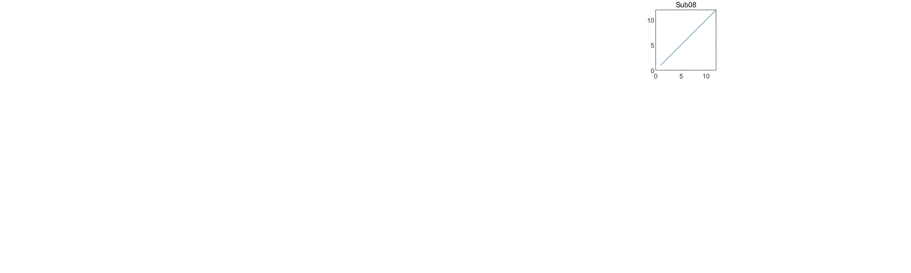
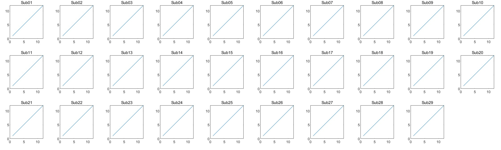
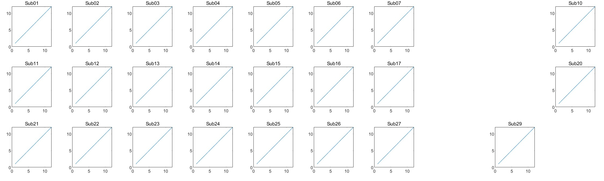

在帮同学 debug matlab 代码的时候，遇到了一个奇怪的问题——为什么用 matlab 的 `subplot` 命令绘图的时候，有一部分子图莫名其妙的没有显示（如封面所示）？

我们先来看原始代码（这里对原始代码进行了修改，但保留了造成 bug 的原因）：

```matlab
clc; clear; close all;

subplot_num = 29;
cols = 10;
rows = 3;
imgLength = 150;

h_figure = figure('position', [50, 50, cols * imgLength, rows * imgLength]);

for ii = 1 : subplot_num
    h_axes = subplot(rows, cols, ii);

    row = floor((ii - 1) / cols) + 1;
    col = mod(ii - 1, cols) + 1;

    set(h_axes,...
        'units', 'pixels',...
        'position', [(col - 1) * imgLength + 30, (rows - row) * imgLength + 35, 100, 100]...
        );

    plot(h_axes, 1 : 12, 1 : 12);
    title(sprintf('Sub%02d', ii));
end
```

可以说，这段代码非常清晰明了，那就是将一个图窗分成了 3 行 10 列，然后在每个格子里**使用 `subplot` 命令创建一个坐标区**，并在这个坐标区里进行后续的绘制。所以当同学告诉我，这段代码运行后会出现上图的效果——也就是有部分子图显示不出来——的时候，我也是很懵的。

## 错误排查

### 可能性1：行列计算错误

我首先排查的点，是每次循环中 `row` 和 `col` 的计算是否正确。如果出现了计算的错误，可能会导致两个坐标区重叠起来，从而导致视觉上看起来部分坐标区消失了。虽然原始的代码中，两个量的计算方式并非如此，但是我在检查了一次后仍然确认了其计算的正确性。因此，这并不是造成bug的问题。

### 可能性2：绘图命令调整了坐标区的设置

接着，我又想到，会不会是最后的绘图命令导致了坐标区的位置出现了问题？这显然是可能的，例如 `imshow` 命令就会导致坐标区的原点被调整到左上角，同时坐标区的 `XLim` 和 `YLim` 属性也会被调整。所以我猜想绘图命令对坐标区做了什么奇怪的调整。

于是我在循环的最后，也就是当前这一次绘图结束的位置，对计算出的理论位置和坐标区的实际位置进行了输出：

```matlab
fprintf('subplot %d calculated pos: %d, %d\n', ii, (col - 1) * imgLength + 30, (rows - row) * imgLength + 35);

actual_pos = get(h_axes, 'position');
fprintf('  actual position: %d, %d\n', actual_pos(1), actual_pos(2));
```

输出的结果是：

```text
...
subplot 7 calculated pos: 930, 335
  actual position: 930, 335
subplot 8 calculated pos: 1080, 335
  actual position: 1080, 335
subplot 9 calculated pos: 1230, 335
  actual position: 1230, 335
...
subplot 17 calculated pos: 930, 185
  actual position: 930, 185
subplot 18 calculated pos: 1080, 185
  actual position: 1080, 185
subplot 19 calculated pos: 1230, 185
  actual position: 1230, 185
...
subplot 27 calculated pos: 930, 35
  actual position: 930, 35
subplot 28 calculated pos: 1080, 35
  actual position: 1080, 35
```

可以看到，这几个出了问题的子图，坐标区的实际位置和计算位置是完全相同的。所以说，坐标区是被正确画出来了，但是没显示出来？还是另有原因？

### 突破口：从单个子图入手

我决定从单个子图入手，看看一次只画一张子图是否正常。于是，我将 `for ii = 1 : subplot_num` 改成了 `for ii = 7`，然后：


完全正常。我又单独画了第 8、9、17、18 张子图，都是完全正常的。

接着，我又把循环的条件改成了 `for ii = [7, 8]`。这时，神奇的事情发生了：



只有第 8 张子图被画了出来。随后，我又试着画第 7 - 9 张图、第 7 - 10 张图，无一例外地，都只有最后一张图被画了出来。这说明，一开始 bug 的出现，并不是第 7、8、9 张图没有画出来，而是，从第 8 张图开始，到第 10 张图结束，每一张新图会覆盖前一张子图。

### 排查：`subplot` 命令

说来惭愧，我这还是第一次知道 `subplot` 命令的返回值是一个坐标区。当然也正是因为我对它的这个功能十分陌生，所以才会怀疑是不是这里出了问题。于是我查阅了 `subplot` 的文档，看到了其中这样一句话：

> subplot(m,n,p) 将当前图窗划分为 m×n 网格，并在 p 指定的位置创建坐标区。……**如果指定的位置已存在坐标区，则此命令会将该坐标区设为当前坐标区**。

这简直和我们的 bug 一模一样，如果新的坐标区把旧的坐标区拿来直接用了，那先前画的图肯定就被覆盖了。于是，我把创建坐标区的代码更换了一下：

```matlab
h_axes = axes('parent', h_figure);
```



bug 解决。

## 分析：为什么 `subplot` 命令造成了这个问题

我们把代码倒退回到使用 `subplot` 创建坐标区。如果真的是因为上面猜测的那样，`subplot` 使用了先前创建的坐标区，那么就应该存在这样的情况：当前 `subplot` 计算出的理论位置已经有坐标区存在了（因为我们手动调整了坐标区的位置）。

我们在使用 `subplot` 创建坐标区后立刻获取其位置：

```matlab
h_axes = subplot(rows, cols, ii);
set(h_axes, 'units', 'pixels');
subplot_pos = round(get(h_axes, 'position'));
fprintf('subplot %d calculated pos: %d, %d\n', ii, subplot_pos(1), subplot_pos(2));
```

然后在循环末尾获取坐标区的实际位置：

```matlab
actual_pos = get(h_axes, 'position');
fprintf('  actual position: %d, %d\n', actual_pos(1), actual_pos(2));
```

输出结果：

```text
subplot 6 calculated pos: 792, 320
  actual position: 780, 335
subplot 7 calculated pos: 911, 320
  actual position: 930, 335
subplot 8 calculated pos: 1030, 320
  actual position: 1080, 335
subplot 9 calculated pos: 1149, 320
  actual position: 1230, 335
subplot 10 calculated pos: 1268, 320
  actual position: 1380, 335
```

这里提醒一下，坐标区的长宽都是 `100`。

从输出结果可以看到，对于子图 7，`subplot` 计算的理论横坐标是 `911`，而子图 6 的横坐标范围是 `780` - `880`，二者没有重叠，所以子图 6 没有被覆盖。而从子图 8 开始：

| 子图 | 理论横坐标 | 前一张子图横坐标 |
| :-: | :------: | :-----------: |
| 8 | `1030` | `930` - `1030` |
| 9 | `1149` | `1080` - `1180` |
| 10 | `1268` | `1230` - `1330` |

我们很清楚地看到，`subplot` 计算的理论横坐标都落在了前一张子图的范围内，所以也是从第 8 张子图开始，每一张子图都会覆盖它前面的一张，因为 `subplot` 直接把前面的坐标区拿来用了，也就是说，我们后续设置位置的坐标区就是之前创建的，我们根本就没有创建新的坐标区。

我们可以进一步验证。可以看到，第 8 张子图的横坐标正好卡在第 7 张的右边界上，那么我们把每一张子图的宽度设置为 `99`，使得第 8 张子图和第 7 张子图没有重叠，看看结果：



第 7 张子图并没有被覆盖。

## 总结

可以推测，`subplot` 的工作流程是，计算当前子坐标区的理论位置，然后检查这个范围内有没有已经创建的坐标区；它使用的不是 `subplot` 此前计算的其他子坐标区的理论位置——事实上任何两个 `subplot` 命令之间都是独立的。所以，如果真的要对坐标区位置进行精细控制，还是不要使用 `subplot` 这种高度封装的方法，而是应该从头使用 `axes` 来进行编写。
