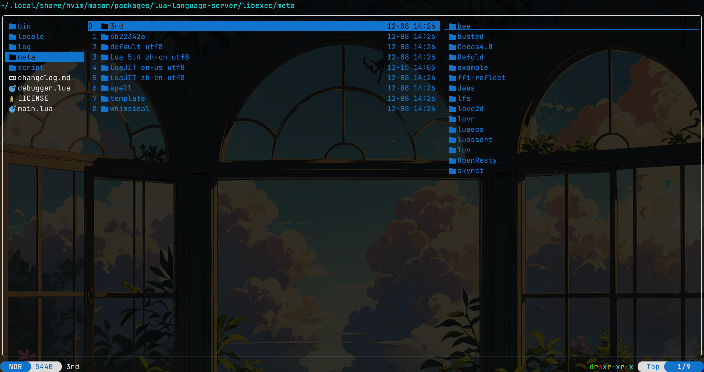

虽然没有系统的调查，但是在 neovim 中，[lua-language-server](https://github.com/LuaLS/lua-language-server) 已经成为了 lua lsp 的第一选择。你会看到很多教程（包括我自己的教程）在配置 lua 的补全这一块的时候推荐你安装这个 lsp。

lua-language-server 是一个很好的工具，4K 的 star 足以说明大家对它的认可。然而，如果你有过长时间使用这个 lsp 的经历，就会意识到它的一个严重问题——它太慢了，慢得让人心烦。比如说你在编写你的 neovim 配置中的 lua 代码，即便你经过了一系列优化，确保它只读取你的配置文件和 neovim 自己的 runtime file，它可能也会花费大量的时间。

```lua
-- part of my configuration for lua-language-server
-- ensures that only vim runtime files and lib uv are read
{
    workspace = {
        library = {
            vim.env.VIMRUNTIME,
            "${3rd}/luv/library",
        },
        checkThirdParty = false,
    },
}
```

当我打开我的配置文件时，可以看到 lua-language-server 开始读取，此时进度显示只需要读取 190 多个文件，但这个过程却要持续好几秒，这期间补全、跳转什么的都用不了。这就很没意思了，那我还费力优化 neovim 启动速度干啥呢？

于是我就在想，这种性能问题不可能只有我一个人在意。现在那么多 rewrite in rust 的项目，就没有人用 rust 实现一个快一点的 lua lsp 吗？

然后，我就找到了 [emmylua_ls](https://github.com/EmmyLuaLs/emmylua-analyzer-rust)。实际体验下来，虽然它的配置相对来说比较麻烦，但是带来的性能提升实在是太过于夸张了。

## 1 安装

大多数 lsp 在通过 Mason 安装的时候，会自动把可执行文件下载下来。但至少在目前，emmylua_ls 不支持这样做。lspconfig 的对应部分提到：

> The default cmd assumes that the emmylua_ls binary can be found in $PATH. It might require you to provide cargo binaries installation path in it.

所以，我们需要先通过 `cargo install emmylua_ls`，并将 `~/.cargo/bin` 添加到 `$PATH` 中。

然后，我们需要回到 neovim 中，在 Mason 中安装 emmylua_ls，并在配置中启动它：

```lua
-- place these at the proper position in your config
vim.lsp.config("emmylua_ls", {})

vim.lsp.enable("emmylua_ls")
```

## 2 配置

不同于 lua-language-server，emmylua_ls 更推荐你在项目根路径下用 `.emmyrc.json` 进行配置。比如说，对于 neovim 配置文件夹，我就编写了如下配置：

```json
{
  "runtime": {
    "version": "LuaJIT",
    "requirePattern": [
      "lua/?/init.lua",
      "lua/?.lua",
      "?/lua/?/init.lua",
      "?/lua/?.lua"
    ]
  },
  "workspace": {
    "library": ["$VIMRUNTIME", "$HOME/.local/share/nvim/lazy"],
    "ignoreGlobs": ["**/*_spec.lua"]
  }
}
```

如果你配置过 lua-language-server，这里面的配置你应该相对来说比较熟悉。这里需要重点需要说一下 `workspace.library` 这一部分，我们首先包括了 `$VIMRUNTIME`，这样 neovim 自己的 runtime file 以及你的配置文件就都会被读取；相比于我们之前对于 lua-language-server 的配置，这里面还增加了 lazy 安装的插件路径——需要注意，这<b style="color: red;">只适用于在 Mac 或 Linux 上并使用 lazy 进行插件管理的 neovim 配置</b>，如果你用 Windows 或者使用其他插件管理器，则需要相应变更这个路径。

这里就体现出了 emmylua_ls 的强大了，过去使用 lua-language-server 的时候要是敢把所有的插件都加载进来，不等个大十几秒是读不完的，但是现在 emmylua_ls 读取几千个文件可能也就是一小会的时间。

当然，这里还有一点点小问题，因为不同的插件文件结构有所不同，所以 emmylua_ls 也不总能正确分析所有的插件，比如说你可能会发现对着插件路径按下跳转的时候会跳到奇怪的地方，但是个人认为这无伤大雅。

不过现在的配置还不够，如果你现在就去编写代码，会发现所有的 `vim.uv` 都没有补全。回顾我们在 lua-language-server 中的配置，我们添加了这样一个 library：`${3rd}/luv/library`。这其实是 lua-language-server 自己打包了一系列第三方的 meta 信息，可以在 `~/.local/share/nvim/mason/packages/lua-language-server/libexec/meta/3rd` 下找到。然而，emmylua_ls 没有提供这些，所以就需要我们手动去搞一份这些 meta。



我们可以先安装 lua-language-server 然后复制一份过去——比如说，你需要 libuv 的补全就把刚才这个文件夹里的 `luv` 文件夹复制过去。又或者，你可以直接从 <https://github.com/LuaCATS/luv> 这里 clone 一份。至于把它放到哪里呢？你可以直接放在你的配置文件的 `lua` 文件夹下，因为前面我们说过，我们的配置已经确保 emmylua_ls 会读取 `$VIMRUNTIME`，所以你把 luv meta 放在你的配置文件夹下，就可以被一并读取。

---

实际体验下来，性能提升实在是太大了，再也不用在打开 lua 项目之后先等好半天才能开始写代码了。

虽然 emmylua_ls 相对来说没那么成熟，star 数量暂时也只有不到 400，配置起来也没那么方便，但是它的作者现在保持着积极的更新，相信它是未来可期的。
