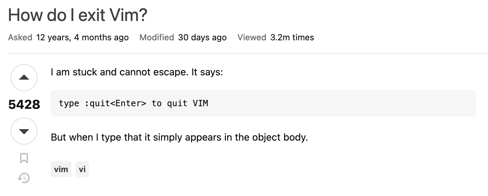
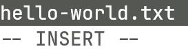
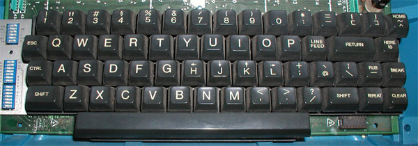

我希望你在看完上一篇教程之后意犹未尽地点开了这一篇，因为我在上一篇里埋了一个坑——我没有告诉你如何退出 neovim。关于如何退出 vim 的梗实在是过于广为流传，我也没必要在这里讲一些烂梗来充数，你只需要知道 stackoverflow 上面真的有相关的提问而且收到了 5000+ vote，就能大概明白这东西并不是我们想象中的那样简单。



## 1 模式

要实现上述的退出 neovim 的功能，我们需要先了解 neovim 的模式 (mode)，这一名词我们在前文提到过。我们在设计一个假想的全键盘操作的编辑器的时候，提到过可以设计一个“快捷键模式”，在这个模式下所有的按键不会被当作输入，而是作为快捷键被解析。在 neovim 中，这个模式叫做 `normal mode`，这也是我们启动 neovim 的时候所默认处于的模式。你可以尝试在这个模式下反复按下空格键，此时你会发现空格并不会被输入到文本当中。

我们继续。既然这个 normal mode 就是我们所谓的“快捷键模式”，那么这个模式下有哪些快捷键呢？这里，我们先介绍一个快捷键：<kbd>i</kbd>。我们在编辑的时候，除了噼里啪啦敲快捷键，更主要的还是文本的输入，那么从 normal mode 进入这个文本输入模式就是通过这个快捷键。按下 <kbd>i</kbd> 后，我们进入的模式叫做 `insert mode`。此时，如果你的 neovim 没有经过任何配置，那么它的左下角是应该显示 `-- INSERT --` 的（根据你的语言设置可能会有所不同）。此时，我们就可以愉快地进行输入了，输入的位置位于刚才光标所在处的**前面**。



注意，这里按下的是小写的 <kbd>i</kbd> 键。虽然你会发现大写的 <kbd>I</kbd> 键同样可以让我们开始输入，但后面我们会了解到，二者的功能是有区别的。

在 insert mode 当中，我们习惯的很多输入方式都是可以沿用的。比如说，按 <kbd>Enter</kbd> 换行，按 <kbd>Home</kbd> 和 <kbd>End</kbd> 跳转到行首 / 行尾，按上下左右移动光标等。但是，更多更方便更常用的操作并不是在 insert mode 中、而是在 normal mode 中进行的。而当我们想要回到 normal mode，可以按 <kbd>Esc</kbd> 键。

## 2 命令

除了开篇所说的退出 neovim 之外，我们迫切需要的另一个功能是保存文件。当然，仔细想想，我们对于一个编辑器需要的功能非常多，如果每一个功能都用快捷键去表示，显然记忆的负荷太大了。那，有没有一种办法让这些“快捷键”更容易记忆呢？一种解决方案就是，让它们更贴合实际的语义——如果我们直接把我们要干什么告诉 neovim，是不是就容易记忆了呢？

在 neovim 中，这种方式叫做命令。在 normal mode 下，我们可以输入 `:`，然后输入命令内容并敲回车，就可以执行一条命令。例如，`:write` 就可以将当前文件保存。再比如，如果要退出 neovim，我们可以使用 `:quit` 完成。

当然，你可能会觉得这些命令还是有些长。这种情况下，我们可以给一些非常常用的命令绑定快捷键（后面的教程会讲）；而针对保存、退出这些内置的命令，neovim 为我们提供了缩写。`:write` 可以简写为 `:w`，`:quit` 可以简写为 `:q`，我们还可以用 `:wq` 直接进行保存并退出。在熟练使用 neovim 后，`:w` / `:q` / `:wq` 的使用频率相对会更高。

另外，默认情况下，只要我们改写了文件，就必须保存才能退出。如果我们改变了文件，但不想保存直接退出，可以通过 `:q!` 强制退出。

> 一个有一点点用的不算冷的知识：在按下冒号开始敲命令的时候，我们也是进入了一个新的模式：`command mode`，所以此时我们也可以使用 <kbd>Esc</kbd> 回到 normal mode。

## 3 光标移动

前文提到，我们可以使用上下左右键移动光标。然而，这并不是一个很好的选择，一是因为 neovim 的哲学之一是让你的手尽可能保持在键盘中心区域、减少移动，二是这些按键一次只能移动一位，并不是很高效。对于成熟的 neovim 用户来说，更高效的光标移动是在 normal mode 下通过 <kbd>k</kbd>（上）/ <kbd>j</kbd>（下）/ <kbd>h</kbd>（左）/ <kbd>l</kbd>（右）进行的。

我相信每一个初学者在看到这个键位的时候一定非常崩溃——这完全没有规律可循嘛！但是，这个设计在我看来其实蛮巧妙的，原因如下：

- 这几个键位于编辑区的中间一行，作为非常常用的按键，位置很合适
- 这几个键彼此离得很近，我们可以集中完成光标的移动
- 标准打字动作要求我们将食指分别放在 <kbd>f</kbd> 和 <kbd>j</kbd> 键上
  - 我们上下移动的频率远高于左右移动（你会发现，很多时候我们不需要左右移动，因为有跳转到行首、行尾等诸多快捷键）
- 这个键位安排符合人体构造
  - <kbd>h</kbd> 和 <kbd>l</kbd> 分别位于最左面和最右面，对应左和右
  - <kbd>j</kbd> 和 <kbd>k</kbd>，虽然没有左右那么直观，但是——当你的右手食指放置在 <kbd>j</kbd> 键上、中指放在 <kbd>k</kbd> 键上时，你会发现你的中指很自然地比你的食指更靠近键盘上半部分，所以 <kbd>j</kbd> 对应向下而 <kbd>k</kbd> 对应向上。

> 不过实际上，这大概不是 vim 采用这种设计的原因。据资料显示，vim 使用 hjkl 是因为 Bill Joy 在发明 vi（vim 的前身）的时候使用的键盘上的 hjkl 键上印有 ↑ ↓ ← → 符号，如下图：
>
> 

好的，我姑且认为你接受了这个按键设计的合理性。还记得前面我说的一句话吗，上下左右键一次只能移动一位，那 hjkl 键一次就可以移动多位了？是的，你可以在这些键前面加上数字来实现一次性移动多位，例如 `100j` 就是向下移动 100 行，`20l` 就是向右移动 20 个字符。不过需要说明的是，当一行只有 19 个字符而你按下了 `20l`，你并不会来到下一行，而是会来到这一行的末尾。

如果你觉得这样跳转还不够快，我们还可以使用 `gg` 和 `G` 来跳转到第一行 / 最后一行。

好的，现在你已经开始进行一些简单的文本编辑了。你可以尝试一下下面的任务：

> 打开一个文件 `foo.py`，在其中输入下面的代码：
>
> ```python
> def foo():
>     print("hello world")
> ```
>
> 保存文件，然后将函数 `foo` 重命名为 `bar`，再重新保存并退出。
