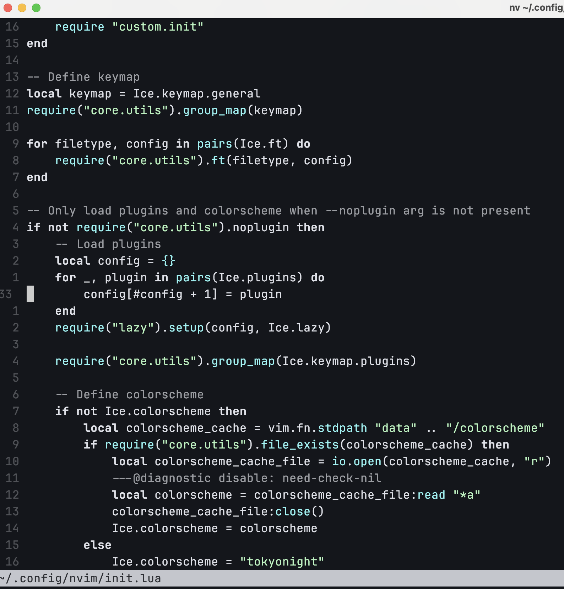
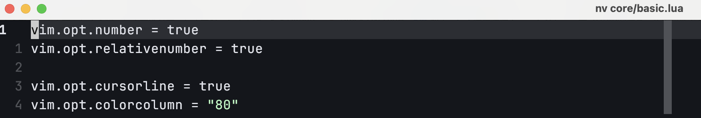

千呼万唤始出来——我们终于（虽然也没有等很久）进入 neovim 的配置部分了。

Neovim 的配置主要使用的是一种叫做 lua 的编程语言。如果你有过游戏开发相关的经验，或许会听说过这门简单而高效的脚本语言。不过，为什么是“主要”使用呢？我们在第一讲提到过，neovim 是 vim 的一个 fork 版本，在 vim 流行的年代，lua 还并没有被发明出来。那个时候，vim 的配置使用的是另一门叫做 vimscript 的语言。而 neovim 继承自 vim，自然也保留了对 vimscript 的兼容。所以，我们实际上可以使用这两种语言配置 neovim。

> 补充一下，neovim 还支持使用其他语言如 python、javascript 等进行配置，但是这些配置过程涉及到一些更为复杂的操作，笔者本人也鲜有接触这些的机会，因此本系列教程并不会包含这一部分内容。

不过，我的态度一向是更推荐使用 lua 进行配置。虽然在进行一些简单的配置的时候，vimscript 看起来会更简单一些，但是在编写一些复杂的功能的时候，lua 明显要更加清晰明了。当然了，这是一个见仁见智的问题，但本教程会尽可能使用 lua 进行配置。不过，我并不计划专门划出一部分来讲解 lua 的基本语法——那些基础的特性只需要演示一次即可，高级一些的特性则是几乎用不到；第一讲我们也提到过，并不建议没有编程基础的朋友们学习 neovim，而如果你有编程基础，相信看懂这里的 lua 代码并不是什么问题。

## 1 Neovim 的配置文件

在 neovim 中，配置文件往往位于以下位置：

- Unix: `~/.config/nvim/init.lua`
- Windows: `~/AppData/Local/nvim/init.lua`

如果你确实不知道这个路径代表什么，你也可以在 neovim 中输入 `:= vim.fn.stdpath("config")` 并按下 <kbd>Enter</kbd> 即可：其中 `:` 的作用我们在前面讲过，是进入命令；`=` 的作用是**执行一段 lua 代码并输出结果**（你也可以用 `:lua ` 来执行 lua 代码，区别在于后者不会将结果输出）。至于 `vim.fn.stdpath("config")`，这段 lua 代码的作用就是返回配置文件所在的文件夹的完整路径。

`init.lua` 文件会在 neovim 启动的时候被执行。我们可以尝试在文件中添加代码：

```lua
print("hello world")
```

保存退出，重启 neovim，你会看到左下角输出了 "hello world"。

> 有一些教程会教你使用 `source` 命令刷新配置，但是这个命令对于一些复杂的配置就不好用了，所以本系列教程都会使用重启 neovim 的方式刷新配置。

很好，现在我们有了第一个配置文件。不过在实际配置过程中，我们往往不会将所有的代码放在 `init.lua` 中——以我自己的配置为例，编写这份教程的时候，我的配置文件有 3500 多行代码，我显然需要将这些代码组织为不同的文件。在 neovim 配置中，通用的做法是创建一个 `lua` 文件夹，然后将各个模块放在其中。例如，我们在配置文件夹下创建 `lua/module.lua` 并在其中加入代码：

```lua
print("hello world")
```

现在，你的文件结构应该是：

```
📂 nvim
--  📄 init.lua
--  📂 lua
----  📄 module.lua
```

保存文件，然后打开 `init.lua`——这里就涉及到了一个新的操作；在 neovim 中打开一个文件，可以使用 `edit` 命令，也可以简写为 `e`——我们只需要输入 `:e <filename>` 即可打开对应的文件。

> 这里可能会有一个问题，就是打开新文件后，之前打开的文件该去哪里寻找。这涉及到了 buffer 和 window 的概念，在初学阶段多说无益，而且我们很快就会使用到相关的插件，所以这里暂且不对此做更多讲解。

打开 `init.lua` 后，我们将这里的代码清空，改为引用 `module.lua`。这里，我们引入一个新的技巧——此前，我们要删除再插入新内容，需要先 `d` 再 `i`，但实际上，我们只需要直接 `c` (change) 就可以进入 `insert mode`——其用法和 `d` 几乎完全一样，唯一的区别在于删除内容后会直接进入 `insert mode`。所以，这里我们可以使用 `cc` 删除整行，然后键入以下代码：

```lua
require("module")
```

此时，我们再次重启 neovim，会发现更改后的代码仍然生效。

对于位于 `lua/` 下的文件，我们可以直接进行 `require`；在进行引用的时候，我们也无需添加 `.lua` 扩展名。而如果我们将配置文件夹结构变得更复杂一些呢？

```
📂 nvim
--  📄 init.lua
--  📂 lua
----  📂 core
------  📄 module.lua
----  📂 plugins
------  📄 module.lua
```

此时，我们就可以通过 `require("core.module")` / `require("plugins.module")` 引入相应的模块了。

## 2 一些有用的配置

在这里，我们讲解一些最最基础的 neovim 配置。在我的配置结构中，一般将这些代码放在 `lua/core/basic.lua` 中，所以在 `init.lua` 中，我们需要 `require("core.basic")` 来引入该文件。

### 2.1 行号

Neovim 的初始界面看着这么别扭的一个很重要的原因就是没有显示行号。所以，我们可以通过下面的代码实现：

```lua
vim.opt.number = true
```

其中，`vim.opt` 用来存放大多数全局的配置项，而这里的 `number` 就代表是否显示行号。在 `basic.lua` 中添加这行代码后，我们重启 neovim，就可以发现现在 neovim 有行号了。

不过，这还是不够的。记得前面我们一直在痛苦地数行数吗？如果能一眼看到某一行内容相对于当前行有多少距离，岂不美哉？在 neovim 中，我们就可以用相对行号来实现：

```lua
vim.opt.relativenumber = true
```

此时，我们可以看到，当前行上面的一行显示的不再是绝对行号，而是 `1`——这样，我们可以更加方便地使用 `j` / `k` 进行跳转了。



### 2.2 显示设置

这里，我们涉及到两项配置：

```lua
vim.opt.cursorline = true
vim.opt.colorcolumn = "80"
```

其中：

- `cursorline` 的作用是高亮当前行；如下图，第一行的背景就被高亮了
- `colorcolumn` 的作用是高亮某一列，一般用来表示一行代码推荐的最长长度，如下图中右侧部分的竖条——注意，这个值是一个字符串！



### 2.3 <kbd>Tab</kbd> 键与缩进

这里主要涉及以下配置：

```lua
vim.opt.expandtab = true
vim.opt.tabstop = 4
vim.opt.shiftwidth = 0
```

这里，我们首先使用 `expandtab` 属性将 <kbd>Tab</kbd> 转为空格。这是一个蛮常见的设置，比如 VsCode 中就会通过 "Editor: Insert Spaces" 设置项将制表符转为空格。在 neovim 中，当我们设置了 `expandtab` 后，按下 <kbd>Tab</kbd> 就会自动被转换为空格。基于此，第二行代码自然也很好理解，它就是设置一个制表符对应几个空格。这里我选择将其设置为 `4`。

（你可能会有疑问——如果对于不同的文件想设置不同的数值该怎么办呢？这涉及到一些更加高级的操作，我们会在后面提到）

按说，此时就已经可以了。但是如果现在打开 neovim 并在一行的开头敲下 <kbd>Tab</kbd>，你会发现这添加的空格数量好像不止 4 个——是的，实际上此时会有 8 个空格被添加。这是为什么呢？因为 neovim 默认启用了 `smarttab` 选项，该选项的作用之一就是，在开头敲下 <kbd>Tab</kbd> 时，添加 `shiftwidth` 个空格；而该选项的默认值，就是 8。所以，这里才出现了第三行代码：`vim.opt.shiftwidth = 0`，它会将 `shiftwidth` 设置为和 `tabstop` 相同的值。

重启 neovim，再在一行的开头敲下 <kbd>Tab</kbd>，此时我们会看到，neovim 正确地插入了 4 个空格。

### 2.4 `autoread`

这里只涉及一行代码：

```lua
vim.opt.autoread = true
```

其作用很简单，就是当你在 neovim 中打开的文件被其他外部程序修改了之后，neovim 会自动重新加载它。这还是很实用的功能，比如说你用 neovim 打开 git 仓库中的一个文件，然后使用了 `git branch`，此时如果文件被修改了，neovim 就会重新加载。

## 3 结尾

到目前位置，完整的代码为：

```lua
vim.opt.number = true
vim.opt.relativenumber = true

vim.opt.cursorline = true
vim.opt.colorcolumn = "80"

vim.opt.tabstop = 4
vim.opt.shiftwidth = 0
vim.opt.expandtab = true

vim.opt.autoread = true
```

当然，neovim 的配置项远远不止这些——光是本讲内容中我提到但是没有深入讲解的配置项就还有好几个。但是，没讲到的那些配置项，或是并非所有人的刚需，或是涉及到一些我们没有讲到的知识，因此我暂时只在这里讲解上述这些配置项。如果你还想要了解其他配置项，也可以自行搜索或查阅文档。

对了，不要忘记本讲新学到的操作：`c` (change)。在今后的编辑中，你应该在合适的场景中使用它而不是 `ddi`。在后面的教程中，我们也会穿插一些新的实用技巧，希望屏幕前的你能随着对于教程的学习不断熟练、精进自己的 neovim 操作。
