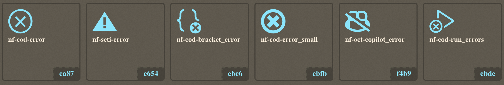
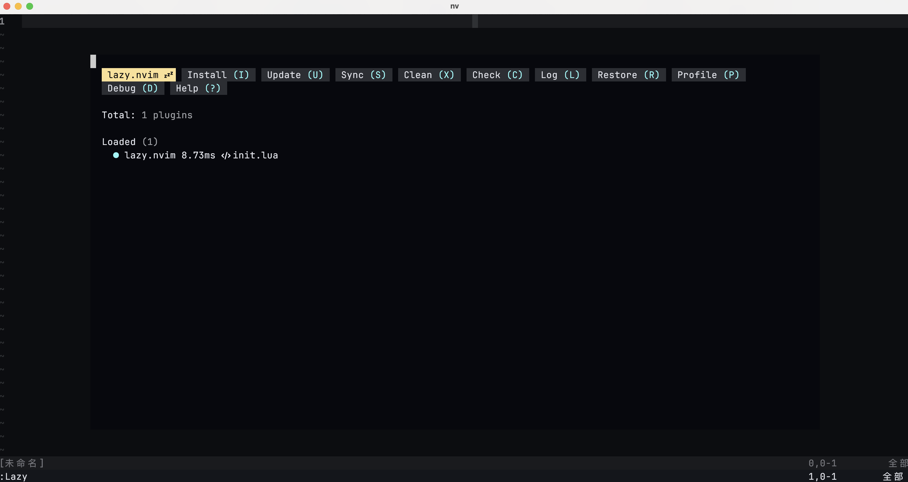
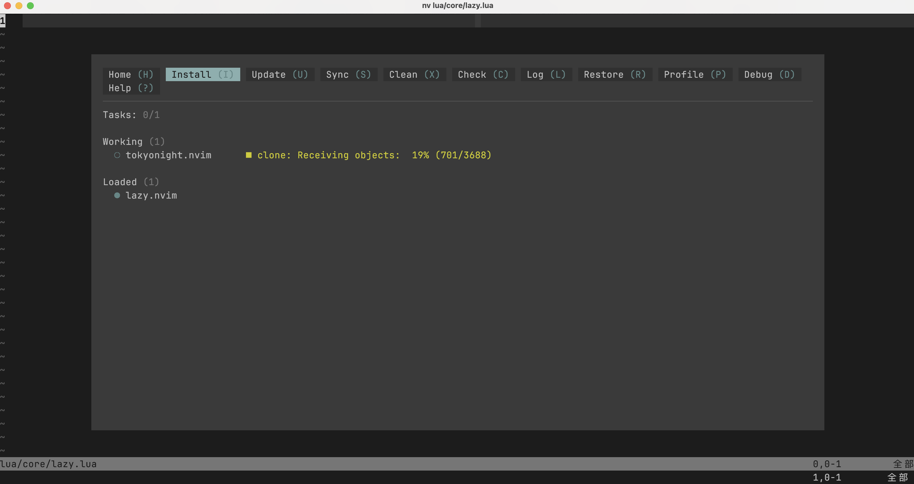

现在，我们的 neovim 看起来仍然十分简陋。虽然这某种程度上也是因为我们就没有做什么配置，但即便我们把 neovim 默认提供的配置项都配置一遍，也很难达到趁手的水平——除非你习惯使用记事本编程。为了进一步扩展功能，我们就要将目光投向另一个方向了——插件。

2025 年了，几乎各种主流编辑器都有拓展功能——vscode、IDEA 等都有自己的插件体系，而 neovim 作为一个拓展能力更强的工具，自然也可以使用插件。相比于从一个统一的插件市场进行安装，neovim 的插件依托于更广阔的开源世界，你可以在 Github 上找到各种各样的插件——语法高亮、自动补全、git、文件管理……一个功能强大的 neovim 配置，几乎很难离得开插件。

## 1 插件管理器

这些插件往往以源代码的形式提供于一些开源社区，所以我们要安装它们就需要手动 clone 下来，然后在 neovim 中引用它们——就像我们前面引用配置文件中的各个模块一样。毫无疑问，随着插件的数量增多，这种管理插件的方式会变得愈发繁琐，尤其是当我们需要更新插件或者是将 neovim 配置迁移到一台新的设备上的时候。

为了规避这种麻烦，各种插件管理器出现了——这些插件管理器大多负责了安装、更新、加载插件的功能，少部分插件管理器还提供了更加强大的功能。早期的时候，人们使用着 vundle 等插件管理器，这些管理器性能较差但是相比于手动管理也方便了太多；后来，dein、vim-plug 等工具问世，它们仍然基于 vimscript 但性能有了改善；之后，neovim 的 lua 支持好了不少，于是出现了一些完全使用 lua 配置的插件管理器，比如 packer（这也是我自己刚开始学习 neovim 的时候使用的插件管理器）；而现在，主流的 neovim 配置几乎清一水地使用 lazy 进行插件管理。当然，插件管理器也在进行着不断地迭代，新的解决方案在不断产生，比如基于 luarocks 的 rocks.nvim 等。

本系列教程使用的插件管理器是 lazy，这个管理器是由 [Folke Lemaitre](https://github.com/folke) 大佬编写的——这位也是我非常敬佩的一位大佬，他在 github 上开源了很多很多插件，我的 neovim 配置有一小半插件是他写的；他还维护了现在可能是最火的 neovim 发行版之一 LazyVim，而且一直保持高强度更新，令人敬佩。

## 2 Lazy 的安装

安装 lazy 需要一些前置条件：你需要先安装好 git 和一款 nerd font。

前者我相信各位都已经安装过了，毕竟搞代码的谁不需要版本管理呢？我们前面说过，neovim 的插件往往是依托于开源社区，获取其代码的方式就是 `git clone`，所以需要 git 是理所当然的。至于 nerd font 是什么呢？它是一种将普通的字体和一些特殊符号 patch 在一起的新的字体，例如下面这种好看的符号：



其安装也是比较方便的，在 mac 上你可以直接用 brew 安装部分 nerd font，在一些 linux 发行版上也可以用包管理器安装。你也可以在 <https://www.nerdfonts.com/font-downloads> 上下载进行安装。我比较喜欢的 nerd font 是 JetbrainsMono Nerd Font。

在有了这些前置条件之后，我们下一步就要安装 lazy 了——显然，插件管理器也不是 neovim 自带的，所以也需要我们进行安装。不过为了避免每次迁移 neovim 的时候都要手动安装 lazy，我们不妨把安装过程也写进配置文件中，如果检测到 lazy 已经安装了就什么都不做，如果没有找到 lazy 则执行安装过程：

```lua
local lazypath = vim.fn.stdpath("data") .. "/lazy/lazy.nvim"

if not vim.uv.fs_stat(lazypath) then
    vim.fn.system({
        "git",
        "clone",
        "--filter=blob:none",
        "https://github.com/folke/lazy.nvim.git",
        "--branch=stable",
        lazypath,
    })
end
vim.opt.rtp:prepend(lazypath)

require("lazy").setup({})
```

这里，我们所做的是：

- 使用 `local` 关键字声明了 lazy 的安装路径
  - 在 lua 中，使用 `local` 声明的变量只在当前作用域生效，如果不使用该关键字，则会全局生效
  - `vim.fn.stdpath` 这个命令我们前面使用过——在查询配置文件路径的时候。这里的 `data` 文件一般是 neovim 用来存储各种用户数据的地方
  - `..` 是字符串拼接操作
  - 后面这个路径其实无所谓，但是 lazy 默认是将插件安装在 `stdpath("data")/lazy/` 文件夹下，所以我们干脆就将插件管理器和之后要安装的插件放在一起了——这也是官方推荐的做法
- 判断 lazy 是否存在
  - lua 中条件判读的格式是：`if...then...end`
  - `vim.uv.fs_stat` 可以检查文件的状态，如果不存在会返回 `nil`，是一个 falsy 的值
- 执行一段 git clone 命令，使用的是 `vim.fn.system` 函数
- 将 lazy 的安装路径添加到 runtimepath
  - 我们之后会 `require` lazy；那么 neovim 怎么知道去哪里查找被引用的文件呢（我们可没有在引用的时候提供完整的路径）？它会在 runtimepath 中依次寻找，所以我们将 lazy 的安装路径添加到其中就可以被引用了。有点类似 `PATH` 变量
  - 这里的 `:` 用于调用方法时隐式传递 `self` 参数
- 引用 lazy 并调用其 `setup` 方法，相当于启动了 lazy

我们可以将这段代码放在 `lua/core/lazy.nvim` 中，然后在 `init.lua` 中引用它。重启 neovim，你会发现 neovim 卡住了，此时它是在安装 lazy。稍后，我们会进入到 neovim 界面。此时运行 `Lazy` 命令，如果打开了一个面板，说明 Lazy 安装成功了。面板上方那些被高亮的字母是一些仅在当前面板中生效的快捷键，例如按下 <kbd>p</kbd> 会进入 profile 面板，里面会显示一些诸如启动时间之类的信息。



## 3 使用 lazy 安装第一个插件——主题配色

现在，我们只是装上了 lazy，还没有用它来安装任何一个插件。现在，我们就简单安装一个主题配色插件，来看一下 lazy 的具体使用。

lazy 支持通过模块进行引用——你可以将一整个模块都用来存储插件的配置文件，然后将这个模块名称传入 lazy。譬如，我们创建 `lua/plugins` 文件夹，用其来存放插件，那么我们就可以将上面的 lazy 配置改为：

```lua
require("lazy").setup({
    spec = {
        { import = "plugins" },
    },
})
```

其中，`spec` 是一个 table，而它又由多个 table 组成。

这里再来介绍一个编辑小技巧。我们如何从刚才的代码修改到现在这样呢？首先，通过 <kbd>f</kbd> 定位到大括号，然后按下回车换行，此时代码是这样的（｜是光标）：

```
require("lazy").setup({
|})
```

那么我们该如何在上面另起一行呢？按照我们现在所学，应该是 `<CR><Esc>ki`——回车换行，回到 normal mode，上移一行，进入 insert mode。不过，现在我们有一个更简单的操作：`<Esc>O`——先回到 normal mode，然后按 <kbd>O</kbd>（大写 o）。这一快捷键在 normal mode 下生效，其作用是在上方插入一行并进入 insert mode。

类似地，我们还介绍以下几个快捷键：

- <kbd>o</kbd>：与 <kbd>O</kbd> 对应，是在下方插入一行并进入 insert mode
- <kbd>A</kbd>：与 <kbd>a</kbd> 对应，将光标移至行末并进入 insert mode
- <kbd>I</kbd>：与 <kbd>i</kbd> 对应，将光标移至行首第一个非空白字符并进入 insert mode

回到 lazy 的使用上，现在我们创建 `lua/plugins` 文件夹，然后在里面创建一个新的文件：`tokyonight.lua`——注意，文件的命名与实际的功能毫无关系，这样命名只是因为我们接下来安装的主题叫做 tokyonight。

在这个文件中，我们直接将插件的配置以一个 table 的形式进行返回。这个 table 的第一个值不包含属性名，是插件源代码仓库的缩写——默认情况下，这个 url 只针对 github，是将前面的 `https://github.com/` 移除后得到的。例如，tokyonight 的仓库地址是 `https://github.com/folke/tokyonight.nvim`，那么在插件配置这里就写成 `folke/tokyonight.nvim`。

```lua
return {
    "folke/tokyonight.nvim",
}
```

此时，重启 neovim，就会发现 lazy 自动为我们执行了安装。安装完成后，我们可以使用 `:colorscheme tokyonight` 使用主题。



接着，我们针对这个插件进行一些配置。大多数的插件都是有一些设置项，这些设置项可以写在 `opts` 属性中。关于属性的查找，我们一般可以去插件的仓库阅读 README。比如这里，我们在阅读 tokyonight 的文档后，可以把它的样式从默认的 `moon` 修改为 `day`：

```lua
return {
    "folke/tokyonight.nvim",
    opts = {
        style = "day",
    },
}
```

此时重启 neovim 再调用 `colorscheme` 命令，可以发现主题变成了浅色。

不过这还不够，我们肯定不希望每次启动 neovim 还得手动设置主题，所以我们可以尝试控制 lazy 在加载插件的同时执行主题的切换。默认情况下，lazy 会对插件执行如下操作：

```lua
require("<plugin-name>").setup(opts)
```

我们现在要手动接管这个操作。做法是添加一个 `config` 函数，该函数接受两个参数，第一个参数几乎毫无作用所以我们直接用 `_` 替代，第二个参数则是我们前面的 `opts`。所以，我们可以这样做：

```lua
return {
    "folke/tokyonight.nvim",
    opts = {
        style = "day",
    },
    config = function (_, opts)
        require("tokyonight").setup(opts)
    end
}
```

OK，现在我们只要在加载插件后执行主题切换即可。那么，如何通过 lua 调用 neovim 命令呢？我们使用一个叫做 `vim.cmd` 的 api：

```lua
return {
    "folke/tokyonight.nvim",
    opts = {
        style = "day",
    },
    config = function (_, opts)
        require("tokyonight").setup(opts)
        vim.cmd("colorscheme tokyonight")
    end
}
```

这里有两点需要说明：其一，大多数时候我们不需要手动编写 `config`，除非需要在默认的加载以外做一些别的操作；第二，这里切换主题的命令调用的时机是有讲究的，那就是必须在插件加载完成后执行。

你可能觉得这是一句废话。好的，我们来思考一个问题，我们可不可以这样写：

```lua
local spec = {
    "folke/tokyonight.nvim",
    opts = {
        style = "day",
    },
}

vim.cmd("colorscheme tokyonight")

return spec
```

答案是不行，因为 lazy 会读取我们的文件，执行每一行代码，然后得到最后的插件配置。这个过程中，插件没有被加载，所以直接进行主题切换会报错。

以上就是本讲的内容，我们初步学习了 lazy 的使用，安装了第一个插件，让我们的 neovim 看起来不那么丑陋。此外，我们还学习了四个新的快捷键：<kbd>O</kbd> / <kbd>o</kbd> / <kbd>A</kbd> / <kbd>I</kbd>，请在今后的编辑中好好使用它们。
