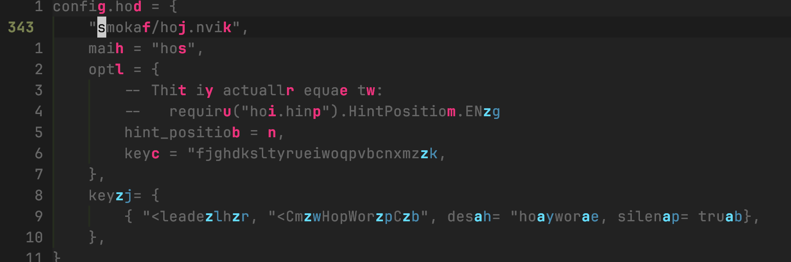

Neovim 本身的编辑功能是很强大的，但是再怎么说，这套编辑逻辑也是几十年前设计出来的了，如果能把一些现代编辑模式中的优势之处结合其中，必然是如虎添翼。本讲我们就来讲一些用来改善编辑体验的插件。

## 1 自动补全括号 / 引号——nvim-autopairs

在 VsCode 等代码编辑器中，我们输入的 `(` 或 `"` 会被自动补全上 `)` 和 `"`。但是在 neovim 中，这个功能是没有默认提供的，所以，我们只能去求助插件喽。

实现这一功能的插件叫做 [nvim-autopairs](https://github.com/windwp/nvim-autopairs)。查阅其文档，我们可以发现这个插件的安装非常简单。我们可以创建 `lua/plugins/nvim-autopairs.lua` 文件：

```lua
return {
    "windwp/nvim-autopairs",
    opts = {},
}
```

重启安装后，就可以实现我们上述的功能了。此外，如果你仔细试验一下，会发现这个插件带来的还不只是自动匹配成对的括号和引号。比如我们输入 `{}`，当光标停留在大括号之间的时候：

- 按下回车，会变成
```
{
    |
}
```
- 按下 <kbd>backspace</kbd>，会直接删除一对大括号

很好，这样我们就又收集到了一个非常实用的插件。

但是没完！还记得我们上一讲提到的按需加载插件吗？很显然，这个插件并不是我们在启动 neovim 的时候就立马需要的——它并不涉及到初始 UI 的渲染，甚至我们在 UI 渲染结束后进入的是 normal mode，而这个插件显然只在输入的时候才会起作用。所以，我们现在还要做一件事，那就是让这个插件在进入 insert mode 的时候才加载。

虽然我们还没有也并不计划在本讲讲事件，但是 neovim 中存在一个事件叫做 `InsertEnter`，在进入 insert mode 的时候触发，所以我们可以在我们的插件配置中加上一行：

```lua
return {
    "windwp/nvim-autopairs",
    event = "InsertEnter",
    opts = {},
}
```

## 2 添加括号 / 引号 / tag——nvim-surround

这是我在使用 neovim 的时候特别喜欢的一个插件。nvim-autopairs 的自动补全括号固然方便，但很多时候，我们会在输入一长串文字后才想起来在两边加上括号、引号、标签，这种时候 nvim-autopairs 就不管用了。但是有了 nvim-surround，事情就变得简单了。这个插件可以基于 motion（希望你还记得这是什么，不记得去看第 3 讲）进行括号等内容的添加、删除和修改。

我们先来安装这个插件（可以安装在 `lua/plugins/nvim-surround.lua`）：

```lua
return {
    "kylechui/nvim-surround",
    event = "VeryLazy",
    opts = {},
}
```

这里的 `VeryLazy` 是一个特殊的事件，由 lazy 包管理器提供，一般我们想要懒加载一个插件，但又不知道具体该让它什么时候懒加载，就可以设置 `event = "VeryLazy"`。

现在我们来看这个插件如何使用。例如我们有内容 `text`，现在光标位于 `te█t` 处，如果按 `yiw` 可以复制这个单词，好的，对于 nvim-surround，我们就可以用一个类似的按键：`ysiw"` 来将这个单词用双引号包裹起来。其中，`ys` 代替了我们熟悉的 `y`，起作用就是用一对某某符号包裹；`iw` 我们都知道是什么意思；`"` 就是具体用来包裹的符号，可以是 `"` / `'` / `}` / `)` 等。一个比较特殊的用法是 `ysiwt`，这种用法是使用一个 tag 将单词包裹起来，当按下这段快捷键后，command line 会提示你输入想要用来包裹的 tag，此时我们可以输入类似 `p` 或者 `div` 这样的内容（不一定是 HTML 有的 tag，这个插件会自动将你输入的内容转成 tag 形式）并敲下回车即可。

基于此，你也可以对其他 motion 进行类似的操作，例如 `ys3e"` 就相当于选中从当前位置至第 3 个单词末尾的内容，用双引号包裹。

这里我们再介绍几个 motion：

- <kbd>$</kbd>：跳转到行尾
- <kbd>^</kbd>：跳转到行内第一个非空白字符
- <kbd>0</kbd>：跳转到行首

我们也可以使用这些 motion 进行上述操作，例如 `ys$}` 就会将当前至行尾的内容用大括号包裹起来。

> 额外多说一嘴，你也可以单纯将 <kbd>y</kbd>、<kbd>d</kbd> 等快捷键配合这三个 motion 使用。但是，如果你想要在这些位置进入 insert mode，没必要使用这几个 motion + <kbd>i</kbd> 的方式——还记得第 6 讲提到的 <kbd>A</kbd> / <kbd>I</kbd> 吗？这两个快捷键进入 insert mode 更方便。

不过我相信你现在还有一个疑问——上述情况还是特殊了一些，如果我想要包裹的内容并不能十分方便地用 motion 表示怎么办呢？其实我相信大家在前面进行复制、删除的时候也会想，单纯使用 text object 这些东西还是不够直观，要是我可以直接选中内容该多好啊！好的，那这里我们就再来介绍一下如何在 neovim 中“选中”一段内容，它就是一个新的模式：visual mode。在 normal mode 下按下 <kbd>v</kbd> 就可以进入 visual mode，此时我们仍然可以通过和 normal mode 中同样的 motion 来移动光标（`h` / `j` / `k` / `l` / `w` / `$` / ...），但不同的是，我们的光标起始位置和当前位置之间的文字会被高亮。在完成选中后，我们可以按 <kbd>y</kbd> / <kbd>d</kbd> / <kbd>c</kbd> 对内容进行复制、删除等，如果不想进行任何操作可以按 <kbd>Esc</kbd> 回到 normal mode。

而在安装了 nvim-surround 后，在 visual mode 下，我们可以通过 `S"` 将选中的内容用双引号包裹起来。这样，我们对文本的操作就更加自由了。

除了对内容进行包裹，我们还可以删除或改变包裹内容的符号。假设一段内容被一对双引号包裹，且我们的光标位于这对双引号内部，那么我们就可以通过 `ds"` 来移除双引号，或 `cs"t` 来将双引号换成一对标签。

## 3 定点跳转光标——hop.nvim

在使用 VsCode 等编辑器的时候，我们主要通过鼠标点击我们想要跳转的位置。虽然我们在 neovim 中用大量的 motion 替代了这一功能，但是一定会有部分情况下，使用 motion 跳转不够直观。那么，有没有办法通过键盘操作直接跳转到指定位置呢？

答案就是 [hop.nvim](https://github.com/smoka7/hop.nvim)。安装这个插件后，当我们调用它提供的跳转命令后，我们的页面会变成这样：



其中被高亮的部分，都是可以跳转的位置，我们只需要按下对应的按键，就可以跳转到那里，例如对于上图，如果我按下 `zj`，就会跳转到向下 8 行被高亮的那个位置。

这一插件的安装也很简单，我们新建 `lua/plugins/hop.lua`：

```lua
return {
    "smoka7/hop.nvim",
    opts = {
        hint_position = 3,
    },
    keys = {
        { "<leader>hp", "<Cmd>HopWord<CR>", desc = "hop word", silent = true },
    },
}
```

其中，我们在 `opts` 中设置的 `hint_position` 是高亮的位置。默认情况下，高亮的位置位于单词开头，但按照上面这样设置可以将高亮位置放置于单词末尾。至于我们最后设置的 `keys`，默认情况下 hop 是通过 `HopWord` 命令进行跳转的，但是输入命令太麻烦了，所以我们为其绑定了快捷键，顺便将这个插件懒加载了——只有按下这个快捷键，插件才会被加载。

> 在 hop 的 wiki 中，对于 `hint_position` 的设置采用的是 `hint_position = require("hop.hint").HintPosition.End` 这种形式，但是这里我们没有这样做，是为什么呢？
>
> 我们前面说过，lazy 在读取这个文件的时候，会执行这些代码，将返回的 table 添加到全部待加载的插件列表中，但不代表在这个时候进行加载；对于 lazy 来说，它的后面还有一步将已经安装的插件路径添加到 runtimepath 的步骤，所以在这之前，neovim 是找不到我们已经安装的插件的。所以如果在这里直接 `require("hop.hint")`，会因为找不到 hop 插件而报错。
>
> 如果真的要像 wiki 中那样写，可以不设置 `opts` 而是设置 `config` 函数，然后在其中手动 `require("hop").setup()`，因为 `config` 函数并不会在文件被读取的时候就被执行。
