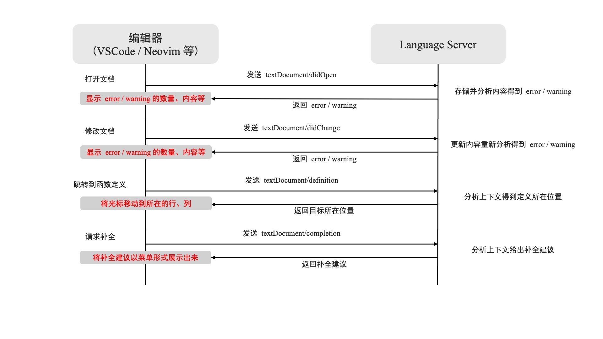
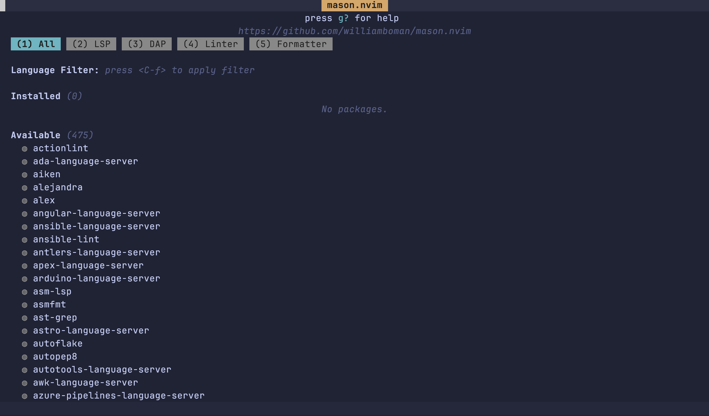
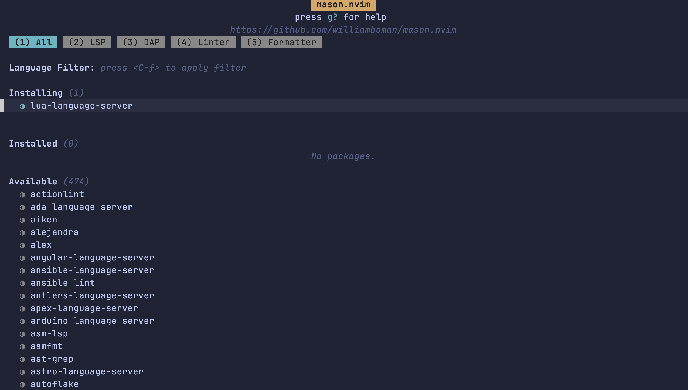
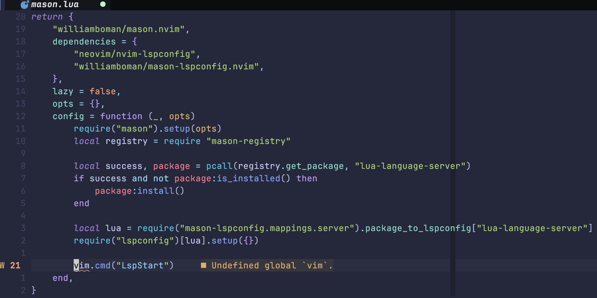

很多人对 neovim 有一个误解，那就是它很原始、功能短缺。这也是为什么很多人不愿意尝试它。譬如，你能看到很多人煞有介事地质问 neovim 使用者：“这玩意连自动补全都没有，还敢说好用？”

我们不否认古早时期的 vim 的补全并不好用。虽然我未曾经历过那个时期，但是我看到很多文章提到那个时候需要使用到一个叫做 YouCompleteMe 的插件，这个插件号称 vim 最难装的插件；而即使安装了这个插件，补全效果也很一般。然而事实上，现在的 neovim 的补全功能并不再是短板——它甚至原生提供了补全，虽然这个补全并不好用。而在 neovim 内置了由微软发明的 lsp (language server protocol) 之后，补全功能更是变得愈发强大——VSCode 的补全功能就是使用了 lsp，而我们在 neovim 中也可以借由这个协议和各种插件得到和 VSCode 几乎一致的智能补全体验；甚至，由于 neovim 的高度可自定义，你可以把自动补全调教得更加顺手。

当然，话虽如此，我仍然必须提前做一下预警：lsp 仍然是目前 neovim 最难配置的部分，因为它的背后涉及到了太多机制，包括 lsp 自己的工作机制还有 neovim 自身的一些机制，代码经常莫名其妙就耦合到一块，而且有时候一个功能需要几个插件协同配合才能实现。虽然我不可能深入讲解 lsp 的实现，甚至连 neovim 自己的 lsp 模块也不会详细阐释，但是我还是有必要把这些插件配置背后的逻辑讲清楚的；现在太多教程只会将 lsp 的配置代码扔在读者脸上，这样会导致初学者在后续自己修改配置的时候对于代码补全这一块完全无法下手。我希望经过我本节的讲解，我的读者至少能够大概了解我提供的配置的含义，并能自主按需修改配置。


## 1 LSP

不深入讲解 lsp 不代表我不会简单讲讲 lsp，否则后面的内容根本无法开展下去。或许有读者在读前面的内容的时候会好奇，为什么微软发明的本来用于 VSCode 的 lsp 可以被 neovim 拿来用？因为这是一个协议，它的目的就是为了将语言相关的功能如代码补全和编辑器本身解耦。当然这样说还是太抽象了，我们还是大致看一下 lsp 的工作流程。

当我们在编辑器中打开一个文件的时候，就会启动一个 language server，此时文档内容就会被保存在这个语言服务器上。每当我们对文档内容进行修改的时候，就会向语言服务器发送相应信号，服务器端会对存储的文档内容进行更新并重新进行分析，将 error 和 warning 信息返回给编辑器；当我们执行跳转功能的时候，就会向语言服务器发送请求，语言服务器会将跳转的目标位置（行、列等）返回给编辑器；当我们请求补全的时候，语言服务器也会结合服务器上存储的文档内容进行上下文分析，返回补全建议



不难看到，图中真正分析代码上下文、给出补全建议的工作都是在语言服务器上实现的，我们的编辑器只是相当于一个前端，对语言服务器返回的内容按照自己的设计进行呈现。所以，只要语言服务器的实现不变，其在不同编辑器上的工作效果理论上就可以达到一致。

所谓 neovim 内置了 lsp 功能，意味着 neovim 可以与语言服务器进行通信，并对返回的结果进行简单的处理，例如服务器返回的当前的 buffer 的 warning 就可以通过 `vim.diagnostic.get(0, { severity = vim.diagnostic.severity.WARN })` 进行查看。所以，留给我们做的其实就是两部分：

- 获取语言服务器——这些是第三方提供的，我们要像安装插件一样安装这些服务器
- 对 neovim lsp 处理过的返回信息进行展示——补全、error 等，这部分内容我们可以依赖一些插件

其实，语言服务器这个概念倒也不是微软首创，毕竟把语言解析和编辑器本身解耦是一件很符合直觉的事情。但是，lsp 的重要意义在于自己实现了一套标准的协议，以前一种语言服务器可能对应了一种通讯的方式，非常麻烦，但是有了 lsp 之后，这种差异被抹平了。

## 2 安装语言服务器——使用 Mason

### 2.1 安装 Mason 并学习安装第一个 lsp

在插件安装那一部分，我们就提到过手动管理插件的麻烦之处。对于语言服务器的安装，情况也是一样的，我们的确可以手动下载、引入这些 server，但是非常麻烦，所以不如用一个“包管理器”去进行更方便的管理。对于 lsp 来说，我们要使用的工具叫做 [Mason](https://github.com/williamboman/mason.nvim)。

在安装之前，我们需要确保我们使用的系统安装了以下内容（这部分内容可以在 README 中找到）：

- Unix:
  - git
  - curl or wget
  - unzip
  - GNU tar (tar or gtar depending on platform)
  - gzip
- Windows:
  - pwsh or powershell
  - git
  - GNU tar
  - 以下之一:
    - 7zip
    - peazip
    - archiver
    - winzip
    - WinRAR

相信大家现在对于安装插件已经炉火纯青了，Mason 的安装可以通过如下方式进行。我们把下面这段代码放到 `lua/plugins/mason.lua` 中：

```lua
return {
    "williamboman/mason.nvim",
    event = "VeryLazy",
    opts = {},
}
```

此时重启 neovim 进行安装，安装完毕后执行 `Mason` 命令，就会打开一个窗口。第一次打开这个窗口的时候，mason 会自动为你更新 registry，即可以安装的 lsp 的列表.不过这个过程可能有一点点不顺利，因为我们总是不可避免地遇到一些人为的网络因素。比较烦人的是，有些情况下，你可能需要把你的代理软件关掉再运行 `MasonUpdate` 才能正常拉取这个列表。



<center class="caption">如果没有拉取 registry，你可能看不到下面这一长串语言列表</center>

现在我们已经可以在这个界面中通过一些快捷键选用 lsp 进行安装了，但是我们这里不这样做——既然都已经使用包管理器了，怎么能手动进行安装呢？我们要通过代码控制 mason 进行安装。mason 提供了相关的 api，我们可以通过下面这串代码（在已经加载了 mason 之后）安装 lsp；

```lua
local registry = require "mason-registry"

-- 以 lua 为例，我们在 mason 中查找得到其 lsp 的名字是 lua-language-server
--
-- 这里的 pcall 类似于其他语言的 try...catch...
-- 我们这里判断该 lsp 是否存在，因为有可能我们的 registry 并没有正常被下载，而且也可以防止我们写错 lsp 名字
-- 还要判断一下这个 lsp 是否已经被安装，避免重复安装
--
-- 注意这里 package 后面跟的是 `:`，我们在前面的教程中提到过
local success, package = pcall(registry.get_package, "lua-language-server")
if success and not package:is_installed() then
    package:install()
end
```

现在我们把这段代码放在 `config` 里面，并手动加载 mason：

```lua
return {
    "williamboman/mason.nvim",
    event = "VeryLazy",
    opts = {},
    config = function (_, opts)
        require("mason").setup(opts)
        local registry = require "mason-registry"

        local success, package = pcall(registry.get_package, "lua-language-server")
        if success and not package:is_installed() then
            package:install()
        end
    end,
}
```

此时重启 neovim 并打开 mason，会看到 lua-language-server 正在被安装。



### 2.2 使用安装好的 lsp——nvim-lspconfig 和 mason-lspconfig

顺利的话，在经过一段时间的等待后，lua-language-server 就成功安装了（这个 lsp 还挺大的，需要一些时间）。但是安装后，问题就来了，我们怎么用它呢？且不说后续如何借用它的功能进行补全等操作，就说最基础的，我们怎么在打开一个 lua 文件的时候和这个 lsp 建立联系呢？

这里我们就需要用到 neovim 官方的一个插件了：[nvim-lspconfig](https://github.com/neovim/nvim-lspconfig)。这个插件的作用就是为各种 lsp 提供了配置，你只要调用这个配置就可以很方便地在打开文件的时候连接到对应的 lsp。不过这个插件并不负责 lsp 的安装，其官方 repo 也说了它是 "data-only"，所以我们需要 mason 来帮我们进行安装。

我们先来安装这个插件。因为它和 mason 基本是捆绑在一起进行工作的，我们可以直接把它写进 mason 的 dependencies 中：

```lua
return {
    "williamboman/mason.nvim",
    event = "VeryLazy",
    dependencies = {
        "neovim/nvim-lspconfig",
    },
    -- 下面的代码不变
}
```

然后，我们就要在 `config` 中对已经安装好的 lsp 进行调用了。调用方式很简单，这个插件本身并不需要我们手动 setup，只需要运行 `require("lspconfig")[<lsp-name>].setup(<config>)` 就可以完成插件的调用。

但是，非常讨厌的是，这个插件的 lsp 命名规则和 mason 是不一样的！比如，mason 中的 lua-language-server 在这里叫做 lua_ls。我不清楚为什么会有这种命名的差异，但我知道的是，如果我们安装的 lsp 变多了，那么需要手动修改 lsp 名字的场景就会变多，编写配置就会变得麻烦。

所以，在进行 lspconfig 的使用之前，我们还要再引入一个插件：[mason-lspconfig](williamboman/mason-lspconfig.nvim)，这个插件可以将 mason 中的 lsp 的名字转换为 nvim-lspconfig 中对应的名称：

```lua
return {
    "williamboman/mason.nvim",
    event = "VeryLazy",
    dependencies = {
        "neovim/nvim-lspconfig",
        "williamboman/mason-lspconfig.nvim",
    },
    -- 下面的代码不变
}
```

例如，我们可以通过 `require("mason-lspconfig").get_mappings().package_to_lspconfig["lua-language-server"]` 获取 lua-language-server 在 nvim-lspconfig 中的名称。

> mason-lspconfig 还有一个功能，允许我们设置一个 `ensure_installed` 的列表，这个列表中的 lsp 会被自动安装。但是我选择不用这个功能，因为 mason 并不仅负责安装 lsp，后面我们会看到它还负责安装 formatter 之类的东西，而这些没有办法通过 mason-lspconfig 自动安装，为了统一，我选择完全自己编码进行安装。

然后，我们开始使用这新添加的两个插件进行配置：

```lua
return {
    "williamboman/mason.nvim",
    event = "VeryLazy",
    opts = {},
    config = function (_, opts)
        require("mason").setup(opts)
        local registry = require "mason-registry"

        local success, package = pcall(registry.get_package, "lua-language-server")
        if success and not package:is_installed() then
            package:install()
        end

        local nvim_lsp = require("mason-lspconfig").get_mappings().package_to_lspconfig["lua-language-server"]
        require("lspconfig")[nvim_lsp].setup({})
    end,
}
```

### 2.3 意外状况：为什么 lsp 没有被附加到 buffer

现在重启 neovim。因为安装了 nvim-lspconfig，这个插件为我们提供了一个命令：`LspInfo`，我们可以用它来查看当前 buffer 中 lsp 附加的状况：

```
lspconfig: require("lspconfig.health").check()

LSP configs active in this session (globally) ~
- Configured servers: 
- OK Deprecated servers: (none)

LSP configs active in this buffer (bufnr: 1) ~
- Language client log: ~/.local/state/nvim/lsp.log
- Detected filetype: `lua`
- 0 client(s) attached to this buffer

Docs for active configs: ~
```

作为新手，你可能会对此不太敏感，但是请看，这段报告中有这样一句：`0 client(s) attached to this buffer`。这就不对了吧，我们不是说过 nvim-lspconfig 是会自动启动 lsp 吗？（这我就要吐槽了，为什么这一讲难讲，因为就是这种奇奇怪怪的小细节，我必须不停地偏离主线）这里涉及到了一个加载顺序的事情，nvim-lspconfig 确实在代码层面编写了自动将 lsp client 附加到 buffer 上的功能，其具体实现是在检测到 `FileType` 事件触发—— neovim 会在打开 buffer 的时候自动检测文件类型，这个检测会触发 `FileType` 事件——的时候将 lsp 附加到 buffer 上。但是，在我们的配置中，nvim-lspconfig 是在 mason 加载后才 setup lsp 的，而 mason 是在 `VeryLazy` 事件触发的时候才加载。你可以这样认为，`VeryLazy` 是在启动阶段所有事件都触发完毕后才触发的，所以当我们启动 neovim 打开一个文件的时候，neovim 先读取了 buffer 并检测了文件类型，然后才经由我们的配置启动 lazy 并最终触发 `VeryLazy` 事件。所以，在我们设置好 nvim-lspconfig 之后，早就晚了，这第一个 buffer 是不会被附加 lsp 的；但是如果你此时再开一个 buffer，会发现这个 buffer 就被附加上了 lsp，因为新的 buffer 打开重新触发了 `FileType` 事件，而这时 nvim-lspconfig 已经被配置好了。

很多教程中并不会涉及到这个内容是因为他们没有对 mason 进行懒加载，所以 mason 在进入 buffer 之前就已经启动了，nvim-lspconfig 也启动了，所以第一个打开的 buffer 也可以被正确添加 lsp。但是这样做影响启动速度。所以，如果我们既要启动速度快，又要对第一个打开的 buffer 正确附加 lsp，可以手动调用 nvim-lspconfig 提供的另一个命令：`LspStart`，这个命令会为当前 buffer 启动需要的 lsp。所以，我们只需要在我们配置的后面调用这个命令即可：

```lua
return {
    "williamboman/mason.nvim",
    event = "VeryLazy",
    opts = {},
    config = function (_, opts)
        require("mason").setup(opts)
        local registry = require "mason-registry"

        local success, package = pcall(registry.get_package, "lua-language-server")
        if success and not package:is_installed() then
            package:install()
        end

        local nvim_lsp = require("mason-lspconfig").get_mappings().package_to_lspconfig["lua-language-server"]
        require("lspconfig")[nvim_lsp].setup({})

        vim.cmd("LspStart")
    end,
}
```

### 2.4 Neovim 提供的 lsp 相关功能

现在我们重启 neovim，再运行 `LspInfo` 就能看到附加在当前 buffer 上的 lsp client 不为 0 了。如果你直接打开了我们用来配置 mason 的文件，你甚至可以省去运行这个命令的步骤，因为你会看到现在的 buffer 里面多了一些警告信息。



这个功能是 neovim 自己提供的，不是任何插件带来的——当然显示这个内容的前提是 lsp 被正确启用，这部分还是要依赖插件的。neovim 中有一个 api：`vim.diagnostic.config`；前面我们说过，neovim 会针对 lsp 返回的 diagnostic 进行自己的一些处理，而这个 api 就是配置如何显示诊断结果的。默认情况下，这个 api 启用了 `virtual_text`（你在图中看到的黄色文字，这些文字虽然显示在 buffer 上但是无法对其进行任何操作）、`underline`（对有问题的部分添加下划线）等。这里，我们还要进一步对其进行配置，因为其中有一个很好用的选项没有被开启。

我们会发现，现在如果我们进入 insert mode 并手动添加一些 bug，此时 neovim 并没有更新诊断信息；只有我们重新回到 normal mode 才更新诊断信息。此时，我们可以做如下设置：

```lua
vim.diagnostic.config({ update_in_insert = true })
```

我们可以将这段配置添加在 `config` 的最后面。

### 2.5 一些建议

在配置 lsp 的时候，我们**一定**要看[文档](https://github.com/neovim/nvim-lspconfig/blob/master/doc/configs.md)，文档中可能对 setup lsp 的时候可以传入怎样的参数进行了说明，例如 lua-language-server 就以外链的形式提供了文档。比如说，上面我们的 `vim` 被加上了 warning，就是因为 lua-language-server 并不认识这个变量，我们需要在配置中将其显式标记为全局变量：

```lua
require("lspconfig")[nvim_lsp].setup({
    settings = {
        Lua = {
            diagnostics = {
                globals = { "vim" },
            },
        },
    },
})
```

这些配置，毫无规律，你几乎只能通过查阅上面说的文档、nvim-lspconfig 的文档或者网上检索去解决问题，这也是为什么这一部分的配置这么麻烦。不过幸运的是，多数 lsp 是开箱即用的，lua-language-server 属于是配置相对比较复杂的那一类了。多数情况下，你的 lsp 根本不需要做任何配置（除了我们后面会讲到的所有 lsp 都需要做的配置）就可以直接使用。

另一个建议是将我们的配置进行封装。我们不可能只用 neovim 写 lua，而如果配置别的 lsp 还要重复这些代码的话就太麻烦了。所以我们可以这样做：

```lua
local function setup(name, config)
    local success, package = pcall(registry.get_package, name)
    if success and not package:is_installed() then
        package:install()
    end

    local lsp = require("mason-lspconfig").get_mappings().package_to_lspconfig[name]
    require("lspconfig")[lsp].setup(config)
end

setup("lua-language-server", {
    settings = {
        Lua = {
            diagnostics = {
                globals = { "vim" },
            },
        }
    }
})
```

## 3 （可选）基于 LSP 功能对 Bufferline 进行拓展

有时候我们希望直观看到当前文件中存在多少 error / warning。此时，我们可以将 bufferline 和 lsp 进行结合，显示诊断情况。此前在配置 bufferline 的时候，我们没有做任何多余的设置，但是现在为了实现这个功能，我们可以在 `opts` 下的 `options` 中设置 `diagnostics = "nvim_lsp"`，然后在 `diagnostics_indicator` 函数中设置显示的内容。该函数返回一个字符串，会被添加在 buffer 名称的右面，如下图：


该函数接受四个参数，分别是：

- error 的总数
- 错误等级，如果有 error 则为 `"error"`，如果只有 warning 则为 `"warning"`
- 具体的错误数量，形如 `{ error = 1, warning = 2 }`
- 当前的上下文

此处我们想要显示具体的 error 和 warning 数量，所以只需要第三个参数：

```lua
opts = {
    options = {
        diagnostics = "nvim_lsp",
        diagnostics_indicator = function (_, _, diagnostics_dict, _)
            local indicator = " "
            for level, number in pairs(diagnostics_dict) do
                local symbol
                if level == "error" then
                    symbol = " "
                elseif level == "warning" then
                    symbol = " "
                else
                    symbol = " "
                end
                indicator = indicator .. number .. symbol
            end
            return indicator
        end
    }
}
```

---

本讲的内容量非常庞大，涉及的知识点也非常繁杂。我们这里不妨再来做一些小练习，试着来为 python 和原生的网页开发（HTML + CSS + JavaScript）配置 lsp：

<details>
    <summary>解析</summary>

在经过我们上面的封装之后，安装 lsp 已经变得非常简单了，这里我们只需要找到相应的 lsp 进行安装并阅读文档进行必要的设置即可。

对于 python，我个人推荐 pyright，当然你也可以选择 jedi 或者是其他的工具。寻找 lsp 的时候，你可以在前面提到的 lsp 文档中进行寻找。

对于前端开发，我们需要 html-lsp、css-lsp、typescript-language-server 来负责原生开发的三件套，以及前端开发常用的 emmet 的 lsp emmet-ls。

为了方便，我们这里直接调用一个循环来把包括前面 lua 的配置全部写在一块：

```lua
local servers = {
    ["lua-language-server"] = {
        settings = {
            Lua = {
                diagnostics = {
                    globals = { "vim" },
                },
            }
        }
    },
    pyright = {},
    ["html-lsp"] = {},
    ["css-lsp"] = {},
    ["typescript-language-server"] = {},
    ["emmet-ls"] = {},
}

for server, config in pairs(servers) do
    setup(server, config)
end
```
</details>
