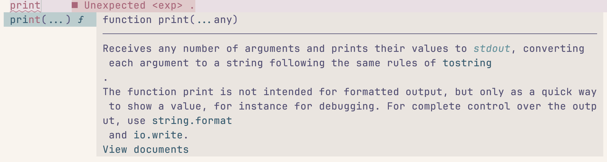

在费了好大劲配置完 lsp 之后，我们下一步要做的就是使用这些 lsp 了，毕竟如果只是像前面那样显示当前文件中的 warning、error，那这个功能还是太孱弱了。所以这一节，我们就来配置一下代码补全功能。

## 1 发展历史

在前面我们讲解 lsp 的时候就提到过，语言服务器端会实时根据光标位置计算并返回补全结果，仅通过 neovim 自己的 lsp 相关功能就可以拿到这些结果。但是，将这些结果呈现出来、在浏览这些补全项的时候显示相应的文档以及其他一些更复杂的功能，仅仅依靠 neovim 自己提供的功能还是不够的。所以，我们需要依赖补全引擎。

Neovim 的代码补全经历了很多变革。我们前面说过，vim / neovim 自己带有基础的补全功能，但这个补全功能是在太弱了，所以人们搞出了各种插件，其中最知名的应该要属 YouCompleteMe (YCM)，但前面我们提到这个插件的时候也说过，这个东西配置实在是太太太复杂了。此外，同类型的补全插件还有 NCM（neovim completion manager，不是网易云音乐）NCM2（NCM 的续作）、deoplete 等。

后来，LSP 被发明了，于是（我个人认为）补全走上了两条路。其中一条也是我在一开始使用 vim 的时候采用的，即 Coc.nvim 插件，这个插件由国人大佬赵启明开发，其本质仍然是我们之前说的那样和 lsp 进行通讯，但是它没有依赖 neovim 自己的 lsp 功能——这个插件推出的时候 neovim 还没有支持 lsp 功能——而是自己用 node 实现了一套处理 lsp 和 neovim 之间通讯的逻辑。所以，coc 相当于一个插件实现了 lsp 安装 + 与语言服务器通讯 + 使用 lsp 返回结果进行补全的功能。得益于不依赖 neovim lsp，这个插件甚至在 vim 上也可以使用。

另一条路则是在 neovim 内置 lsp 功能之后走出来的，上面所说的 coc 自己所负责的多个模块被拆分开来，lsp 的安装出现了 nvim-lsp-installer 插件（这个插件的作者后来写了 mason，替代了它）；代码补全则出现了各种补全引擎，从一开始的 nvim-compe，到后来被它的作者重写的 nvim-cmp、coq、以及最新的使用了 rust 的 blink。

随着 lsp 协议的引入，我们现在可以确保在使用的 lsp 相同的情况下，即便使用了不同的插件，得到的补全功能也是大同小异的。所以，无论你是使用 coc，还是用 nvim-cmp、blink，都不至于出现某一个的补全效果会明显好于另一个的情况。于我而言，我还是更喜欢使用第二种方案，借用赵启明大佬自己的话，coc 因为多了一层和 node client 远程通讯所以性能会稍微差一点（而且，毕竟这中间可是依赖了 node 这个庞然大物，必然是会有性能损耗的），而且是基于配置文件的所以自定义能力有限。当然，具体选择哪种方案见仁见智，coc 的用户绝对不在少数，甚至现在 YCM 也仍然在频繁更新说明其用户同样很多。

## 2 Blink 的配置

话虽如此，这篇教程最终还是要选定一个方案的。我选择的是在我的配置里近期切换过来的 [blink](https://github.com/Saghen/blink.cmp)。blink 最大的卖点就是快，不过我从 nvim-cmp 切换过来并没有感受到明显的速度提升（可能是我老年人反应了）；但我确实感觉到它配置更加方便，这也是我选择从 nvim-cmp 切换过来的原因之一。

安装 blink 的代码如下，我们可以把它放在 `lua/plugins/blink.lua` 中：

```lua
return {
    "saghen/blink.cmp",
    version = "*",
    dependencies = {
        "rafamadriz/friendly-snippets",
    },
    event = "VeryLazy",
    opts = {},
}
```

Blink 要求我们设置 `version` 是因为它还要额外下载一些资源，如果不设置这个值会导致报错；这里的 `dependencies` 看名字也能猜到，主要是提供了一系列常用的 snippet，即代码模板，比如 idea 中的 `psvm`、`sout` 等。

然后，我们要来给 blink 进行一些设置。需要说明的是，blink 的设置项超级多，如果要详细了解需要去[文档](https://cmp.saghen.dev/)查看，这里我们只做一些最基础的配置。

```lua
opts = {
    completion = {
        documentation = {
            auto_show = true,
        },
    },
    keymap = {
        preset = "super-tab",
    },
    sources = {
        default = { "path", "snippets", "buffer", "lsp" },
    },
    cmdline = {
        sources = function()
            local cmd_type = vim.fn.getcmdtype()
            if cmd_type == "/" or cmd_type == "?" then
                return { "buffer" }
            end
            if cmd_type == ":" then
                return { "cmdline" }
            end
            return {}
        end,
        keymap = {
            preset = "super-tab",
        },
        completion = {
            menu = {
                auto_show = true,
            },
        },
    },
}
```

这里，`documentation` 那一部分的作用是在我们将光标移动到项目上的时候在旁边显示帮助文档：



`keymap` 部分设置了相关键位，这里我们选择的预设是、使用 <kbd>Tab</kbd> 进行选择、使用 <kbd>Enter</kbd> 进行换行、使用 `<C-p>` / `<C-n>` 向前 / 向后切换。完整版键位见 <https://cmp.saghen.dev/configuration/keymap.html>，你也可以自己定义键位或者选择其他预设。

`sources` 设置了补全内容的来源。其中，`path` 用于在输入路径的时候进行补全，`buffer` 是从当前 buffer 中选取内容进行补全（比如你在写 markdown，文稿中反复出现一些单词，这个时候 buffer 这个 source 就会从文稿中选取你已经输入的单词作为补全的备选项），`lsp` 表示基于 lsp 进行代码的补全。这是我认为 blink 配置方便的重要原因，之前在使用 nim-cmp 的时候，这些 sources 都需要以插件的形式进行安装，非常麻烦。

当然我们也能看到，这是默认情况下的补全来源，下面我们还有一个 `cmdline`，看名字也能才出来这是我们在 cmdline 的时候选用的源。但是为什么这里我要基于 `cmd_type` 进行判断呢？明明 cmdline 就是用来输入命令的，哪来的类型呢？

这里我们就要阔别许久地讲解一下 neovim 的编辑技巧了。在 VsCode 中，我们可以输入 <kbd>Ctrl</kbd> + <kbd>f</kbd> 进行查找，可以用 <kbd>Ctrk</kbd> + <kbd>h</kbd> 进行替换，这些在 neovim 中也可以做到。

向下进行查找是按下 <kbd>/</kbd> 键，我们在输入后如果不想查找了可以按下 <kbd>Esc</kbd>，而按下 <kbd>Enter</kbd> 键就会跳转到下面第一个匹配项的位置，此时我们按 <kbd>n</kbd> 可以查看下一个，按 <kbd>N</kbd> 可以查看上一个。同理，我们可以用 <kbd>?</kbd> 进行向上查找。

我们回到刚才的配置，可以看到，我们判断如果 `cmd_type` 为 `:` 也就是在输入命令的时候（可以 `:h getcmdtype()` 查看一下可能的取值），选择 `cmdline` 这个 source；如果是在查找，则选择 `buffer` 这个 source；其他情况下，不选择任何 source。

另外，既然讲到了这里，我们还需要对我们的 `core/basic.lua` 进行修改，因为 neovim 默认的一些配置并不合理：

```lua
-- 如果查找的内容中不存在大写，则大小写不敏感
vim.opt.ignorecase = true
vim.opt.smartcase = true

-- 不要在查找之后继续高亮匹配结果
vim.opt.hlsearch = false
```

## 3 （可选）设置 `capabilities`

虽然 lsp 协议制定了一份规范，但是语言服务器和编辑器本身都不一定支持全部的特性（类比一下，我们即便制定了 web 标准，也可能存在一些浏览器不支持其中的部分特性）。所以，在和 lsp 建立连接的时候，编辑器需要告诉服务器自己支持什么功能，也就是我们的标题里所说的 `capabilities`。我们可以运行 `:= vim.lsp.protocol.make_client_capabilities()` 来查看一下它大概是什么样子：

<details>
    <summary><code>vim.lsp.protocol.make_client_capabilities()</code> 默认生成的 <code>capabilities</code></summary>

```lua
{
  general = {
    positionEncodings = { "utf-16" }
  },
  textDocument = {
    callHierarchy = {
      dynamicRegistration = false
    },
    codeAction = {
      codeActionLiteralSupport = {
        codeActionKind = {
          valueSet = { "", "quickfix", "refactor", "refactor.extract", "refactor.inline", "refactor.rewrite", "source", "source.organizeImports" }
        }
      },
      dataSupport = true,
      dynamicRegistration = true,
      isPreferredSupport = true,
      resolveSupport = {
        properties = { "edit" }
      }
    },
    completion = {
      completionItem = {
        commitCharactersSupport = false,
        deprecatedSupport = false,
        documentationFormat = { "markdown", "plaintext" },
        preselectSupport = false,
        snippetSupport = false
      },
      completionItemKind = {
        valueSet = { 1, 2, 3, 4, 5, 6, 7, 8, 9, 10, 11, 12, 13, 14, 15, 16, 17, 18, 19, 20, 21, 22, 23, 24, 25 }
      },
      completionList = {
        itemDefaults = { "editRange", "insertTextFormat", "insertTextMode", "data" }
      },
      contextSupport = false,
      dynamicRegistration = false
    },
    declaration = {
      linkSupport = true
    },
    definition = {
      dynamicRegistration = true,
      linkSupport = true
    },
    diagnostic = {
      dynamicRegistration = false
    },
    documentHighlight = {
      dynamicRegistration = false
    },
    documentSymbol = {
      dynamicRegistration = false,
      hierarchicalDocumentSymbolSupport = true,
      symbolKind = {
        valueSet = { 1, 2, 3, 4, 5, 6, 7, 8, 9, 10, 11, 12, 13, 14, 15, 16, 17, 18, 19, 20, 21, 22, 23, 24, 25, 26 }
      }
    },
    formatting = {
      dynamicRegistration = true
    },
    hover = {
      contentFormat = { "markdown", "plaintext" },
      dynamicRegistration = true
    },
    implementation = {
      linkSupport = true
    },
    inlayHint = {
      dynamicRegistration = true,
      resolveSupport = {
        properties = { "textEdits", "tooltip", "location", "command" }
      }
    },
    publishDiagnostics = {
      dataSupport = true,
      relatedInformation = true,
      tagSupport = {
        valueSet = { 1, 2 }
      }
    },
    rangeFormatting = {
      dynamicRegistration = true
    },
    references = {
      dynamicRegistration = false
    },
    rename = {
      dynamicRegistration = true,
      prepareSupport = true
    },
    semanticTokens = {
      augmentsSyntaxTokens = true,
      dynamicRegistration = false,
      formats = { "relative" },
      multilineTokenSupport = false,
      overlappingTokenSupport = true,
      requests = {
        full = {
          delta = true
        },
        range = false
      },
      serverCancelSupport = false,
      tokenModifiers = { "declaration", "definition", "readonly", "static", "deprecated", "abstract", "async", "modification", "documentation", "defaultLibrary" },
      tokenTypes = { "namespace", "type", "class", "enum", "interface", "struct", "typeParameter", "parameter", "variable", "property", "enumMember", "event", "function", "method", "macro", "keyword", "modifier", "comment", "string", "number", "regexp", "operator", "decorator" }
    },
    signatureHelp = {
      dynamicRegistration = false,
      signatureInformation = {
        activeParameterSupport = true,
        documentationFormat = { "markdown", "plaintext" },
        parameterInformation = {
          labelOffsetSupport = true
        }
      }
    },
    synchronization = {
      didSave = true,
      dynamicRegistration = false,
      willSave = true,
      willSaveWaitUntil = true
    },
    typeDefinition = {
      linkSupport = true
    }
  },
  window = {
    showDocument = {
      support = true
    },
    showMessage = {
      messageActionItem = {
        additionalPropertiesSupport = false
      }
    },
    workDoneProgress = true
  },
  workspace = {
    applyEdit = true,
    configuration = true,
    didChangeConfiguration = {
      dynamicRegistration = false
    },
    didChangeWatchedFiles = {
      dynamicRegistration = true,
      relativePatternSupport = true
    },
    inlayHint = {
      refreshSupport = true
    },
    semanticTokens = {
      refreshSupport = true
    },
    symbol = {
      dynamicRegistration = false,
      symbolKind = {
        valueSet = { 1, 2, 3, 4, 5, 6, 7, 8, 9, 10, 11, 12, 13, 14, 15, 16, 17, 18, 19, 20, 21, 22, 23, 24, 25, 26 }
      }
    },
    workspaceEdit = {
      resourceOperations = { "rename", "create", "delete" }
    },
    workspaceFolders = true
  }
}
```
</details>

可以看到这里面包含了 completion、definition、diagnostics 等，我们大概也能猜到这些分别对应了编辑器里的什么功能。这也是为什么这个标题里面写着“可选”，因为默认情况下启动 lsp 的时候这些选项已经为我们配置好了，这也是为什么我们安装好了 blink 之后就直接可以使用 lsp 进行补全了。

不过，blink 的作者仍然建议我们手动配置一下 `capabilities`。作者本人在我提出为什么要这样的时候给出的[解释](https://github.com/Saghen/blink.cmp/discussions/1210#discussioncomment-12189488)是：

- 部分 lsp 在不做这个配置的时候可能会出问题，如 jdtls
- 可以让 lsp 少返回一些内容，降低延迟
- 获得一些有用的功能

所以，虽然作者也告诉我说可以不设置 `capabilities`，但是既然设置了它更好，那我们还是按照要求把它加上。这个值是作为 lsp 的配置项之一进行设置大的，所以是在 lspconfig 那里进行设置。我们对 `mason.lua` 做一下修改：

```lua
local function setup(name, config)
    local success, package = pcall(registry.get_package, name)
    if success and not package:is_installed() then
        package:install()
    end

    local lsp = require("mason-lspconfig").get_mappings().package_to_lspconfig[name]
    config.capabilities = require("blink.cmp").get_lsp_capabilities() -- 新添加的内容
    require("lspconfig")[lsp].setup(config)
end
```

## 4 使用 Snippets

这一部分要讲的内容其实不多，因为我们在安装 blink 的时候顺手也安装了 friendly-snippets 并且在 sources 中设置了 snippet，所以现在我们已经可以正常使用了。例如，我们可以在一个 html 文件中输入 `html5`，就会为我们自动补全 html 的基础代码。

不过，我们可不只是使用插件提供的 snippet，如果可以自己定义一些 snippet 的话，对我们的开发、写作等工作都有着很大的帮助。blink 默认支持的是 VsCode 格式的 snippet，可以参照其[官方文档](https://code.visualstudio.com/docs/editor/userdefinedsnippets)。默认情况下，blink 会在 neovim 的配置路径下的 `snippets/` 文件夹下寻找 snippet，如果你要给 markdown 写 snippet 就把文件放在 `markdown.json` 文件中，以此类推。
