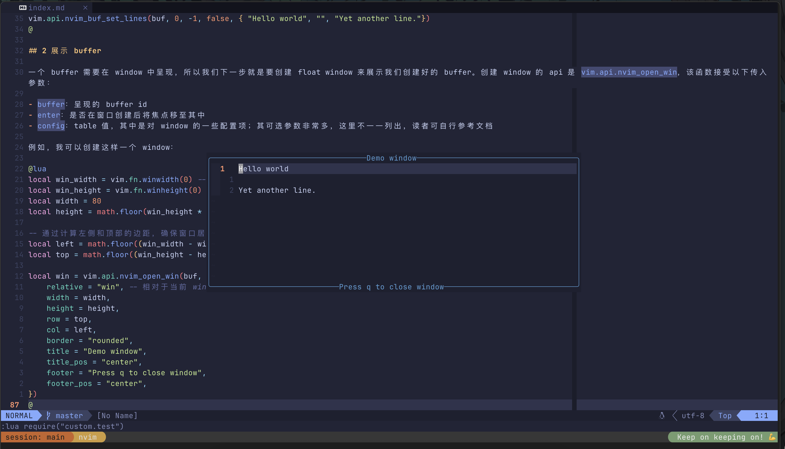

在 neovim 中，我们有些时候会需要去呈现一些文字内容，比如说弹出一段报错的消息、一段关于缺失依赖的警告，这种时候我们会怎么做呢？

你可能会说，我们可以用弹窗类的插件，比如说 nvim-notify、fidget 之类的。诚然，这种插件可以用一种很漂亮的方式把内容呈现出来，但是如果我们需要的不只是撇一眼这段内容，而是需要长时间查看，这些插件可就没有那么方便了。譬如说，在我的配置中有一个用来查看当前已经安装的插件多久没有更新的功能，这类信息该怎样呈现呢？


这就要用到 neovim 中一个非常好用的功能了：弹窗。如果你用过 lazy 或者 telescope，应该知道 neovim 中是可以创建 float window 的——不同于我们从一开始学习 neovim 的时候就接触的 split window，这一类窗口是显示在其他窗口之上的，这样我们在打开一个 float window 之后，就可以不受干扰地查看其中的内容，在查看完毕后就可以将窗口直接关掉。而上图中，我也是用了一个 float window 去呈现这些内容的。

那么，该如何创建这样一个 float window 呢？你可能会看到有人给你推荐 nui 这个插件。我曾经尝试过 nui 这个插件，它的功能非常强大，但是它提供的很多功能对于我来说是多余的，而我所需要的那部分功能完全可以用 neovim 原生提供的 api 解决——我的观点是，除非插件能显著简化我们配置的过程，否则就没有必要引入这个插件。neovim 自带的 api 使用起来相当简洁，因此我在创建弹窗的时候并没有使用 nui。

## 1 创建 buffer

我们知道，neovim 的 window 中显示的内容是一个 buffer，对于 float window 也同样如此。所以，如果我们要创建一个弹窗的话，第一步就是先创建好用来呈现内容的 buffer。这一步我们可以使用 `vim.api.nvim_create_buf` 来完成。

该函数接受两个传入参数：

- `listed`: 是否设置 `buflisted`；如果为 `true`，那么可以通过 `:buffers` 命令直接查看，也可以被 bufferline 之类的插件列出来
- `scratch`：是否将其作为一个 scratch buffer 被创建。一般来说，这种特殊的 buffer 会用来暂时呈现一些内容（你可以理解成一张草稿纸）。此时，neovim 会自动为其做一些设置，如将 `buftype` 设置为 `nofile`

因此，我们创建 buffer 的代码就是：

```lua
-- 创建一个不被列出的 scratch buffer
-- 返回值是 buffer id，等会会用到
local buf = vim.api.nvim_create_buf(false, true)
```

接着，我们就可以设置 buffer 的内容了。这一步是通过 `vim.api.nvim_buf_set_lines` 完成的。该 api 函数的作用是将 buffer 中某几行的内容替换为指定内容，接受五个传入参数：

- `buffer`: 目标 buffer 的 id
- `start` / `end`：替换第 `start` 行到 `end - 1` 行的内容；从 `0` 开始，`-1` 表示最后一行
- `strict_indexing`：如果行号超出范围是否报错
- `replacement`：是一个 table，其中每一个字符串代表一行内容

那么，我们就可以接着上面创建 buffer 的代码继续这样写：

```lua
-- 共计三行内容
vim.api.nvim_buf_set_lines(buf, 0, -1, false, { "Hello world", "", "Yet another line."})
```

## 2 展示 buffer

一个 buffer 需要在 window 中呈现，所以我们下一步就是要创建 float window 来展示我们创建好的 buffer。创建 window 的 api 是 `vim.api.nvim_open_win`，该函数接受以下传入参数：

- `buffer`：呈现的 buffer id
- `enter`：是否在窗口创建后将焦点移至其中
- `config`：table 值，其中是对 window 的一些配置项；其可选参数非常多，这里不一一列出，读者可自行参考文档

例如，我可以创建这样一个 window：

```lua
local win_width = vim.fn.winwidth(0) -- 单位为列
local win_height = vim.fn.winheight(0) -- 单位为行
local width = 80
local height = math.floor(win_height * 0.3)

-- 通过计算左侧和顶部的边距，确保窗口居中显示
local left = math.floor((win_width - width) / 2)
local top = math.floor((win_height - height) / 2)

local win = vim.api.nvim_open_win(buf, true, {
    relative = "win", -- 相对于当前 window 定位新的 window
    width = width,
    height = height,
    row = top,
    col = left,
    border = "rounded",
    title = "Demo window",
    title_pos = "center",
    footer = "Press q to close window",
    footer_pos = "center",
})
```

此时，我们可以得到这样的一个 window：



## 3 进一步完善

就目前我用过的插件来说，非常常见的做法是用 <kbd>q</kbd> 键来关闭 float window。所以，我们可以给这个 buffer 绑定一个快捷键：

```lua
vim.keymap.set("n", "q", "<C-w>c", { buffer = buf })
```

此外，这个窗口也不是非常美观，我们可能并不希望显示行号、signcolumn、colorcolumn 等内容，也不希望我们会一不小心修改了弹窗中的内容：

```lua
vim.api.nvim_set_option_value("number", false, { win = win })
vim.api.nvim_set_option_value("relativenumber", false, { win = win })
vim.api.nvim_set_option_value("signcolumn", "no", { win = win })
vim.api.nvim_set_option_value("cursorline", false, { win = win })
vim.api.nvim_set_option_value("colorcolumn", "", { win = win })

vim.api.nvim_set_option_value("modifiable", false, { buf = buf })
```

此时，我们的窗口就变得好看多了：


