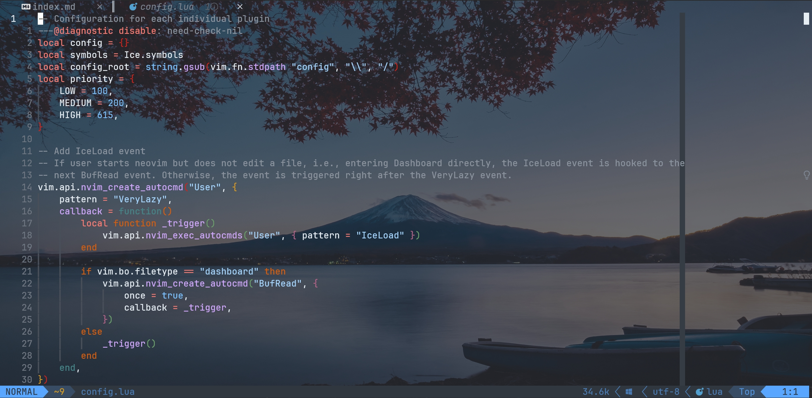
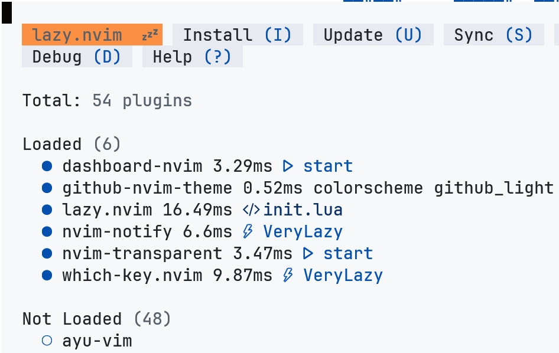

去年 12 月末，我在 B 站上发布了一条我自己的 neovim 配置的视频，现在这条视频已经有了 30000+ 的播放量，在全站的 neovim 相关视频中排名前 15。


然后，我就在评论区发现了一些对于 neovim 启动速度的讨论，有的讨论集中在 windows 和 linux 系统上启动速度的差异，但也有人指出我的配置启动速度比较慢，在 350 ms 以上。


作为一个有着老年人反应的年轻人，我如果不是通过 lazy 包管理器提供的 profile 功能查看了一下启动时间，是真的没有感受到 windows 和 linux 系统上启动速度的差异；而我的电脑大概是配置较好，启动速度也在 200 ms 上下——这个速度对于我是可以接受的，但显然这对于对启动速度过分敏感的 neovim 用户是不可接受的。

不过，由于目标是把我的 neovim 配置做成一个合格的发行版，我还是花费了一段时间对启动速度进行了优化，最终成功将启动速度缩减到了 20 ms——足足减少了 90% 的时间。于是，我决定写这一篇博客，记录这次的优化过程。

## 1 优化的基础：懒加载

我在一开始学习 neovim 的时候使用了 Packer 包管理器。那个时候，我的配置基本上是跟着掘金小册上的内容一行一行抄下来的，而很遗憾，那位作者似乎并没有对启动速度优化这件事情有任何关注，于是我的第一份 neovim 配置每次启动的时候都会把几十个插件全部加载。得益于 neovim 本身的优秀性能，这样的加载方式也并没有显著拖慢启动速度，此时我的 neovim 在 windows 上的启动速度在 1 s 左右——现在看来，这个速度不太能接受，但那个时候在我眼中，这个速度已经把 vscode 爆得渣都不剩了，所以我还是满足的。

直到后来，我发现很多人都在推荐把包管理器迁移到 lazy 上，于是我也这样做了，也第一次接触到了懒加载的概念。何为懒加载？简单来说就是不在启动的时候一股脑加载所有插件，而是在需要用到的时候再去加载，这样可以大幅度提高加载速度。而我们可以怎样通过 lazy 实现懒加载呢？

Lazy 使用一个 table 来配置一个插件，最简单的情况下这个 table 应该包括对应插件的 repo 的 url 以及相应的配置项（写在 `opts` 属性内）。默认情况下，所有插件都会被懒加载，如果要加载它的话，需要在 lua 代码中手动使用 `require` 语句。例如：

```lua
-- config 是我的配置中定义的一个 table
-- 我会把这个 table 传给 lazy 处理
config["flutter-tools"] = {
    "akinsho/flutter-tools.nvim",
    opts = {
        ui = {
            border = "rounded",
            notification_style = "nvim-notify",
        },
    },
}

-- 加载插件
require "flutter-tools"
```

我们当然可以通过 neovim 的 autocmd 来控制何时去 require 相应的插件，比如说执行某个命令的时候、进入某种类型的文件后……比如说，我可以设置只有进入 dart 文件才加载 flutter-tools 插件，这样如果我只是打开了 dashboard，就不会加载这个插件，从而实现提高启动速度。而这就要说到 lazy 的强大之处了，它为我们提供了 `ft` / `keys` / `cmd` / `event` 这几个属性，允许我们在进入特定文件类型 / 按下特定按键 / 执行某个命令 / 触发某个事件的时候执行插件的加载。

尤为值得一提的是 `keys` 和 `event` 属性。我们可以将插件相关的快捷键在 `keys` 中进行绑定，这样既可以直观看到快捷键的设置，又可以实现对应快捷键按下的时候进行懒加载。例如，我在使用 hop 插件的时候就使用了这样的配置：

```lua
config.hop = {
    "smoka7/hop.nvim",
    main = "hop",
    opts = {
        hint_position = 3,
        keys = "fjghdksltyrueiwoqpvbcnxmza",
    },
    keys = {
        { "<leader>hp", ":HopWord<CR>", desc = "hop word", silent = true, noremap = true },
    },
}
```

这样，只有在我按下 <kbd>spc</kbd> + <kbd>h</kbd> + <kbd>p</kbd> 才会加载这个插件，然后执行对应的跳转功能。

而 `event` 属性则是在特定事件触发时执行加载。例如，你可以设置其为 `BufEnter` 以实现进入新的 buffer 之后加载插件。但真正让这个属性变得无比常用的是 lazy 提供的一个新的事件类型：`VeryLazy`。如果你给插件设置了启动类型为 `VeryLazy`，那么它会在所有启动完成、进入 neovim 后才加载插件。显然，你不会在启动后立马开始编辑，所以 VeryLazy 就是在进入 neovim、完成画面绘制之后到你开始编辑之前这段空窗期对插件进行加载，从而提高启动速度。

## 2 主题插件的加载

上述的优化是在 IceNvim——也就是我的这份 neovim 配置——发布之初就做好的。如前文所述，经过这些配置，我的 50+ 个插件的启动速度被成功控制在了 200 ms 左右。那么后续我又做了什么优化呢？

在 lazy 的 README 中，有这样一句话：

> NOTE: since start plugins can possibly change existing highlight groups, it's important to make sure that your main colorscheme is loaded first. To ensure this you can use the priority=1000 field.

于是，我在我的配置里给所有的主题插件添加了一个 `priority` 属性。我的理解是，这个优先级是在所有使用 VeryLazy 加载的插件中的优先级，结果当我看了一眼 lazy profile，才发现这个属性会导致对应插件不被懒加载，而所谓优先级是所有没有懒加载的插件中的优先级。所以，我傻乎乎地在启动时加载了一堆主题插件……

发现了这一点后，解决方案就很简单了，只需要将对应的配置项中的 `priority` 移除，然后添加 `lazy = true` 即可——lazy 默认不会对配色主题进行懒加载：

```lua
config["tokyonight"] = {
    "folke/tokyonight.nvim",
    lazy = true,
}
```

## 3 使用 nvim-transparent 带来的问题

有一段时间，我很喜欢使用暗色主题 + 背景图片，因为背景图片是加在终端上的，所以这就需要我将 neovim 设置为透明，于是我用到了 [nvim-transparent](https://github.com/xiyaowong/nvim-transparent) 插件。鉴于我希望 neovim 一启动就是透明的，而不是先呈现一闪而过的不透明界面，所以我需要为这个插件禁用懒加载。

然后，问题就来了——我使用了一个插件就做 bufferline，这个插件会在页面顶端展示当前打开的 buffer，然而 nvim-transparent 把它也变得透明了，像这样：



乍一看似乎没什么问题，但是 bufferine 一个重要的用处在于让我看清现在处于哪个 buffer，而一旦透明了……这完全啥也看不清了。

nvim-transparent 实现透明的方式是清空 highlight group 的 guibg，它也提供了一个 `exclude_groups` 属性来控制哪些 highlight group 的 guibg 不需要被清除，然而问题在于，bufferline 的颜色使用了另外一系列 BufferLine 开头的 highlight group，而这些颜色取自 Normal 这个 highlight group，这个 group 已经在初始阶段被 nvim-transparent 清除了。

你问我为什么不把 Normal 添加到 `exclude_groups` 中？neovim 最主要的界面就是用 Normal 的，如果不清除 Normal 的背景颜色，我还透明个啥……

所以为了使 bufferline 不透明，我不得不也不让它懒加载，而且还得给它设置一个比 nvim-transparent 更高的优先级。这就显著拖慢了加载速度，因为 bufferline 还有别的依赖项（nvim-web-devicons），这一个不懒加载所增加的可不只是一个插件的时间。

经过长时间的思考后，我终于想到了一个办法：我可以在 nvim-transparent 插件启动前，先复制一份 Normal 的配色到另外一个没有人会用到的 highlight group：

```lua
local autogroup = vim.api.nvim_create_augroup("transparent", { clear = true })
vim.api.nvim_create_autocmd("ColorScheme", {
    group = autogroup,
    callback = function()
        local normal_hl = vim.api.nvim_get_hl(0, { name = "Normal" })
        local foreground = string.format("#%06x", normal_hl.fg)
        local background = string.format("#%06x", normal_hl.bg)
        vim.api.nvim_command("highlight default IceNormal guifg=" .. foreground .. " guibg=" .. background)

        require("transparent").clear()
    end,
})
```

这段代码会在每次使用 `ColorScheme` 的时候更新这个 `IceNormal` 的配色。然后，我只要让 bufferline 使用 IceNormal 调整配色即可。但这一步怎么实现呢？毕竟 bufferline 并没有提供这个选项。答案是，我可以替换掉 neovim 默认的 `nvim_get_hl` 方法。bufferline 使用这个方法获取一个 highlight group 的配色，那么我只需要在查询的 group 为 Normal 的时候让其指向 IceNormal 即可：

```lua
local old_get_hl = vim.api.nvim_get_hl
vim.api.nvim_get_hl = function(ns_id, opt)
    if opt.name == "Normal" then
        local attempt = old_get_hl(0, { name = "IceNormal" })
        if next(attempt) ~= nil then
            opt.name = "IceNormal"
        end
    end
    return old_get_hl(ns_id, opt)
end
```

## 4 当你使用了 dashboard——VeryLazy 真的万能吗

这个题目的两部分，看起来八竿子打不着——用 dashboard 和 使用 VeryLazy 事件，有什么关系呢？

我们先来看使用 dashboard 这一部分，因为这个界面除了好看几乎没啥复杂的功能，所以此时也不需要加载很多插件，什么 Mason、bufferline 这些插件在这里都用不到。



那么问题来了：我们应该给这些在 dashboard 阶段用不到、但是在真正写代码时候需要用到的插件设置什么 `event` 呢？

用万能的 `VeryLazy` 吗？即便插件会在启动后加载，在 dashboard 界面，这还是相当于加载了一堆用不到的插件，况且这也是会拖慢速度的。而且最严重的是，这会导致 bufferline、lualine 等插件在 dashboard 界面中同样被显示，这，很，丑。

用 `BufEnter` 吗？我试过，但是 dashboard 也是一种 buffer。

我倒是查到一种解决方案，使用 `BufRead`。这个事件的节点在：

> When starting to edit a new buffer, after reading the file into the buffer

这确实区分开了 dashboard 和常规的 buffer，因为 dashboard 不涉及编辑和文件读取，所以 BufRead 确实只会在常规 buffer 中触发。然而，问题看似解决了， 但如果你直接用 `nvim` 启动一个文件，此时 BufRead 事件触发得是很早的，远早于 VeryLazy，这差不多和不使用懒加载没啥区别了。我尝试了使用 BufRead 事件，结果就是启动 dashboard 嗖嗖快，打开文件就又被打回原形。

那么，有没有一种办法可以创建一个事件，如果打开了文件，则在 VeryLazy 后触发，如果进入了 dashboard，则在下一次打开文件后触发呢？我写了这样一段代码：

```lua
vim.api.nvim_create_autocmd("User", {
    pattern = "VeryLazy",
    callback = function()
        local function _trigger()
            vim.api.nvim_exec_autocmds("User", { pattern = "IceLoad" })
        end

        if vim.bo.filetype == "dashboard" then
            vim.api.nvim_create_autocmd("BufRead", {
                once = true,
                callback = _trigger,
            })
        else
            _trigger()
        end
    end,
})
```

需要说明的是，neovim 中创建用户事件的方式，是手动调用 `nvim_exec_autocmds`。用户事件都位于 User 事件下，用不同的 pattern 进行区分。

上述代码中，我给 VeryLazy 添加了一个 hook——反正 VeryLazy 事件一定是会被触发的——如果当前不是 dashboard，则直接触发一个 User IceLoad 事件；否则，则设定下一次 BufRead 的时候再触发 User IceLoad。

然后，在 lazy 中将 `event` 设置为 `User IceLoad`。问题解决。

## 5 尾声

这篇博客写的并不是一些 general 的优化技巧——它更多是在展示我优化的一些思路。你需要在优化的时候考虑几个插件之间的依赖关系，考虑清除到底哪些插件需要被加载，等等。事实上，针对不同的配置，优化手段一定是有所不同的，但是整体的思路，是大同小异的。
