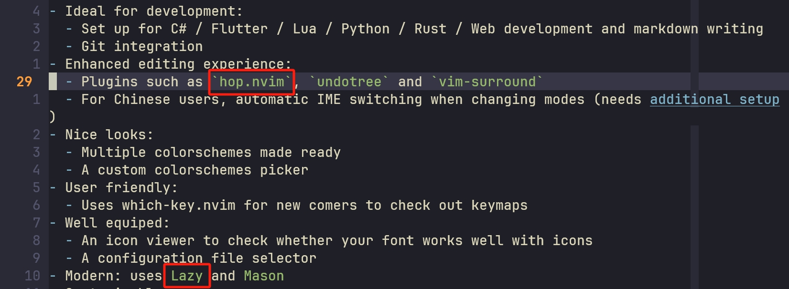

1000 个 neovim 用户，可能会有 1000 份不同的 neovim 配置。有人喜欢自带的 lsp，也有人更爱 coc；有人选择 lazy 作为包管理器，也有人选择继续拥抱 packer 或是更激进的 rocks.nvim；更不要说主题配色以及其他的插件了。这种多样性，也正是 neovim 的迷人之处——之一。不过，有这样一个插件，我相信是绝大多数 neovim 用户会安装的。这个插件的底层功能已经在 neovim 中预装了，而插件本身的存在则是对这个基础的功能进行了增强、提高了易用性。至少，在各种主流的发行版中，你都可以看到这个插件的存在。

这个插件就是 [nvim-treesitter](https://github.com/nvim-treesitter/nvim-treesitter)。

## 1 nvim-treesitter 是做什么的

有很多 neovim 入门教程在告诉新手安装 nvim-treesitter 的时候，只会含糊地说这个插件会给 neovim 提供更好的高亮功能。这样做，好，也不好。新手入门的时候确实不需要知道这个东西具体的功能是什么，但是如果一直以为这只是个负责高亮的插件的话，在之后安装其他插件的时候可能会很懵——比如，代码的 folding 和一个管高亮的插件有什么关系？为什么一个注释的插件要求我安装 nvim-treesitter？

实际上，nvim-treesitter——或者更准确地说，是 treesitter——的真正功能，是把代码内容解析为抽象语法树（abstract syntax tree, AST），用树上的节点表示源代码中的一些结构。例如，这样一段 lua 代码：

```lua
local function foo(target)
    print("hello " .. target)
end

foo("world")
```

解析出的 AST 就是这样的：

```scheme
(chunk ; [0, 0] - [5, 0]
  local_declaration: (function_declaration ; [0, 0] - [2, 3]
    name: (identifier) ; [0, 15] - [0, 18]
    parameters: (parameters ; [0, 18] - [0, 26]
      name: (identifier)) ; [0, 19] - [0, 25]
    body: (block ; [1, 4] - [1, 29]
      (function_call ; [1, 4] - [1, 29]
        name: (identifier) ; [1, 4] - [1, 9]
        arguments: (arguments ; [1, 9] - [1, 29]
          (binary_expression ; [1, 10] - [1, 28]
            left: (string ; [1, 10] - [1, 18]
              content: (string_content)) ; [1, 11] - [1, 17]
            right: (identifier)))))) ; [1, 22] - [1, 28]
  (function_call ; [4, 0] - [4, 12]
    name: (identifier) ; [4, 0] - [4, 3]
    arguments: (arguments ; [4, 3] - [4, 12]
      (string ; [4, 4] - [4, 11]
        content: (string_content))))) ; [4, 5] - [4, 10]
```

传统的 vim 高亮是基于正则匹配进行的，如果你稍微写过一些正则，就会知道想要精确识别关键字、变量、函数这些东西，仅仅依靠正则几乎是不可能做到的。相比之下，AST 可以对代码中各个成分的识别更加细化，而正是有这种更加精细的描述，我们才能做到更好的代码高亮。实际上，treesitter 本身不包含高亮，真正进行高亮的是在 treesitter 基础上提供了更多功能的 nvim-treesitter 插件。而除了高亮以外，nvim-treesitter 还基于 treesitter 对各种语言提供了例如缩进、折叠等功能。

## 2 查看 nvim-treesitter 提供的高亮（等）规则

你可以打开你的包管理器所在的目录查看一下。如果你使用 Lazy 作为包管理器，那么 nvim-treesitter 自带的这些高亮、缩进相关的文件位于 `$XDG_DATA_HOME/lazy/nvim-treesitter/queries/` 文件夹下，你可以看到这里面有很多很多种语言。

> 如果你不知道 `$XDG_DATA_HOME` 在哪里的话，可以运行下面这行命令查看（打印该函数输出结果）：
>
> ```vim
> := vim.fn.stdpath "data"
> ```

在不同的语言文件夹下，你可能会看到 `highlights.scm`、`injections.scm`、`indents.scm` 等。这些文件很容易猜到分别对应着什么：

- `highlights.scm`：高亮
- `indents.scm`：缩进
- `folds.scm`：折叠

只有 `injections.scm` 的作用这个稍微难猜一点；其作用是在一种语言中注入另一种语言相关的规则。例如，当我们在写 HTML 的时候，可能会遇到写在 `script` 标签里的 JavaScript 代码。显然，HTML 的高亮规则并不能正确识别 JavaScript，而如果我们为了正确的呈现效果就将全套的 JavaScript 高亮规则也写进 HTML 中，显然也是不合适的。所以这种时候，我们可以编写一些“注入”规则，在识别到某些模式的时候将其他语言的规则注入进来，进行高亮等操作。

## 3 以 markdown 高亮为例——如何编写高亮规则

我们不妨点进一个文件中看一下具体的规则是如何编写的。这里，我们就以 markdown 的高亮为例，看一下 nvim-treesitter 都做了什么。可以看到，nvim-treesitter 提供了 markdown 和 markdown_inline 两份高亮规则，显而易见，markdown_inline 负责的是一些行内相关的内容，比如说链接、图片这类。这里我们截取一部分内容看一下：

```scheme
; Conceal inline links
(inline_link
  [
    "["
    "]"
    "("
    (link_destination)
    ")"
  ] @markup.link
  (#set! conceal ""))

[
  (link_label)
  (link_text)
  (link_title)
  (image_description)
] @markup.link.label

(inline_link
  (link_text) @_label
  (link_destination) @_url
  (#set! @_label "url" @_url))

; Conceal image links
(image
  [
    "!"
    "["
    "]"
    "("
    (link_destination)
    ")"
  ] @markup.link
  (#set! conceal ""))
```

使用过 Emacs 或者是对于上古时期语言有所涉猎的朋友一定会感受到一股熟悉的感觉扑面而来：这不是 Lisp 嘛！其实，也差不多。这门语言叫做 Scheme 语言，它是 Lisp 的一种方言。当然，你也不用非要花很长时间先学习一门新的语言才能开始编写 nvim-treesitter 的高亮规则（不过如果你想学的话，可以看看[这里](https://wizardforcel.gitbooks.io/teach-yourself-scheme/content/)），毕竟 nvim-treesitter 只会涉及到一些简单的内容。

事实上，关于 nvim-treesitter 的规则（我们一般称之为 query）怎么写，已经在 treesitter 的官方文档中写好了，我们可以看看[这篇文档](https://tree-sitter.github.io/tree-sitter/using-parsers#query-syntax) 的 query syntax 部分。只不过，个人认为这篇文档写的对于新手来说不是很清楚——至少我在阅读这篇文档的时候也是花了 2 个多小时的时间才勉强弄明白一些细节。所以，这篇博客的作用也是用一种我认为可以让新人理解的方式讲一讲这些内容。

### 3.1 选中节点

首先，最最最最基本的一种写法：

```scheme
(binary_expression)
```

这一段代码选中了名为 `binary_expression` 的节点。关于如何查看节点叫什么名字，我们可以在目标文档中运行 `InspectTree` 命令进行查看（在这个新打开的 buffer 中按 <kbd>I</kbd> 可以查看当前节点对应哪种语言的 query）。例如，`(inline_link)` 这句 Scheme 代码就是选中了 markdown 文档中所有名为 `inline_link` 的节点（即，链接）。只不过，这段代码只是选中了这些节点，还什么都没有做。


我们姑且先不讲如何对选中的节点进行进一步的操作。很显然，到目前为止，我们选中节点的方式还是不够完善。例如，对于 markdown 中的一个链接，既可以只包含链接地址，又可以同时包含对链接的描述：

```markdown
[](https://example.com)
[link description](https://example.com)
```

我们可能会希望能够区分这两种链接。例如，我们可以在高亮 query 中设置隐藏字符（可以通过 `set conceallevel=2` 启用）。默认情况下，nvim-treesitter 会只保留链接中的对于链接描述的部分，这就会导致第一种情况下，我们会看不到链接，只有在第二种情况下才能够看到链接的一部分。虽然说我们鼓励更加规范的写法，但这种情况下，如果让我们自定义的话，更好的选择肯定是对两种链接做不同的设置，比如说第一种链接应该转而显示链接地址。

此时，细化对节点的选择就显得十分必要了。为此，我们可以给我们的“选择器”添加一些条件，其语法是这样的：

```scheme
(binary_expression (child-node-1) (child-node-2))
```

这句代码的作用是，选择名为 `binary_expression` 且包含了 `child-node-1` 和 `child-node-2` 的节点。官方文档在这里很贴心地告诉我们，这并不意味着 `child-node-1` 和 `child-node-2` 一定要紧挨着。例如，`[link description](https://example.com)` 解析出来的 AST 是这样的（现在你看到的并不是完整的 AST，因为一些匿名节点被隐藏了起来，你可以按 <kbd>a</kbd> 键查看）：

```scheme
(inline_link
    "["
    (link_text)
    "]"
    "("
    (link_destination
    ":"
    "/"
    "/"
    ".")
    ")")
```

不难看到，`link_text` 和 `link_destination` 之间是隔着 `](` 的。但是下面这段代码仍然能够匹配到这个节点：

```scheme
(inline_link
    (link_text)
    (link_destination))
```

也就是说，只要**包含**相应的节点就行，并不是说只能包含这些节点。

当然，你可以将这些匿名节点加入到 query 当中：

```scheme
(inline_link
    (link_text)
    "]"
    (link_destination))
```

不过，空口无凭，我们怎么知道这样写就可以选中相应的节点呢？那么我们就来试着对被选中的节点进行一些操作。

### 3.2 对捕获的节点进行操作

既然我们现在在讨论高亮，那不妨看看如何对捕获的节点设置高亮。

Treesitter query 允许我们对**子节点**设置一个 capture name，格式是在子节点后面加上 `@name`。例如，

```scheme
(inline_link
  (link_text) @comment
  (link_destination) @markup.link.url)
```

我们知道，neovim 是通过给内容设置 highlight group 来改变颜色、粗体、斜体、下划线等信息的。我们可以运行 `highlight @comment` 这一命令。此时可以看到，高亮组中存在名为 `@comment` 的高亮。因此，在添加了这条规则后，所有**同时具有 `link_text` 和 `link_destination`** 的链接的链接描述都会被添加上 `@comment` 的高亮，链接地址会被添加上 `@markup.link.url` 的高亮。

我们可以在 neovim 配置文件所在路径下新建一个 `quries/markdown_inline/highlights.scm` 文件，并添加上述代码。这种做法会强制覆盖掉现有的 highlight query；虽然这并不是理想的做法，但出于方便演示、避免现有 query 干扰的考虑，还是先这样写了。然后，我们可以重新打开一下相应的文件，就可以看到我们的新增加的高亮规则生效了。

再比如，highlight query 中会设置对部分字符的隐藏，如下图：



<center class="caption">可以看到，没有获得焦点的那一行里的<code>&grave;</code>被隐藏了</center>

这是如何实现的呢？我们只需要加上一行 `#set! conceal` 语句即可

```scheme
(inline_link
  (link_text) @markup.link
  (link_destination) @markup.link.url
  (#set! conceal ""))
```

这就是 Lisp 的写法：将一句函数写在一个括号里，但是函数调用放在一开始，所以 `(#set! conceal "")` 的意思就是将 `conceal` 设置为 `""`。

此时，所有包含链接描述和地址的链接都会被完全隐藏。不过需要说明的是，这里隐藏的并不是整个节点，而是节点中被添加了 capture name 的子节点。如果我们将代码改成下面这样，那么只有链接描述部分会被隐藏：

```scheme
(inline_link
  (link_text) @conceal
  (link_destination)
  (#set! conceal ""))
```

我们还可以在 `conceal` 前面添加 capture name 对要隐藏的部分进行精细控制。下面这段代码就只会隐藏链接地址部分：

```scheme
(inline_link
  (link_text) @markup.link
  (link_destination) @markup.link.url
  (#set! @markup.link.url conceal ""))
```

除了 `set` 命令之外，还有很多其他命令。你可以运行 `:h treesitter-directives` 来查看这些命令。

### 3.3 更复杂的获取节点的方式

在 3.1 中，我们提到只要包含相应的子节点即可。然而，官方文档并没有告诉我们，子节点的相对顺序是不可变的。对于大部分情况下，如果你改变几个子节点的相对顺序的时候，会报一个 `impossible pattern` 的错误（视具体配置而定，但反正你打开对应语言的文件的时候也会报一大串错误），因为这种对已命名的节点的精确匹配会根据一些内置的规则进行检查，判断到子节点之间的顺序是不正确的时候会进行提示。

可是，也有特例。例如，<code>&grave;a.b&grave;</code> 解析出来的 AST 如下：

```scheme
(code_span
    (code_span_delimiter)
    "."
    (code_span_delimiter))
```

那么，下述两段 query 都可以正确匹配到这段行内代码；然而，两段代码隐藏后的结果完全不同：

```scheme
; displayed as `ab
(code_span
  "." @conceal
  (code_span_delimiter) @conceal
  (#set! conceal ""))

; displayed as ab`
(code_span
  (code_span_delimiter) @conceal
  "." @conceal
  (#set! conceal ""))
```

我知道这个例子看起来比较牵强，那我们再来看一个更加合适的例子。在正则表达式中，我们可以用 `[abc]` 来匹配 a 或 b 或 c。在 query 中，我们也可以使用类似的方式。例如，在 neovim 自带的 markdown_inline query 中对于图片的处理是这样的：

```scheme
; Conceal image links
(image
  [
    "!"
    "["
    "]"
    "("
    (link_destination)
    ")"
  ] @markup.link
  (#set! conceal ""))
```

它的作用是匹配包含了 `!` / `[` / `]` / `(` / `link_destination` / `)` 任一的 `image` 节点，并将其中所有的 `!` / `[` / `]` / `(` / `link_destination` / `)` 都设置 `@markup.link` 的 capture name，然后将这些内容隐藏。实际上，结果就是如果图片没有描述文本的话，就会被全部隐藏；如果有描述文本的话，就只显示描述文本。

然而我觉得这种规则并不好。我希望在没有描述文本的时候，转而显示图片地址。于是，我编写了这样一段规则：

```scheme
(image
  [
    "!"
    "["
    "]"
    "("
    ")"
  ] @markup.link
  (link_destination)
  (#set! conceal ""))

(image
  (image_description)
  [
    "!"
    "["
    "]"
    "("
    ")"
    (link_destination)
  ] @markup.link
  (#set! conceal ""))
```

然后对 <code>!&lsqb;&rsqb;(image)</code> 和 <code>!&lsqb;description&rsqb;(image)</code> 两段 markdown 进行了测试，结果如下图：


嘶~

那就一点一点来吧。先讲一下我这段代码的思路：首先优先用更宽松的规则匹配，只要包含了 `!`、`[`这些字符和链接地址的图片都被纳入进来，然后只将这些匿名节点隐藏；接着，采用更严的规则匹配，只匹配还包含了图片文本描述的图片节点，但这次同时也要将图片地址隐藏起来。

看起来没问题对吧，如果没有图片文本，只能通过第一条规则，所以只显示地址；如果有图片文本，则进入下一条规则，将图片地址隐藏。那为什么结果和我们想的不太一样呢？

这就是我前面说的顺序问题了：第一条匹配规则隐含了一个信息，就是只对出现在图片地址前面的匿名节点进行隐藏，所以结果是最后的 `)` 没有被隐藏。

OK，那现在你可能又有疑问了：按这个说法，第二段 markdown 应该显示为 `![description` 啊，为啥这回反而正确了呢？这就涉及到 query 的执行原则了：因为这第二段 markdown 同样匹配第一条规则，所以会先执行第一段代码，将图片地址前的所有匿名节点标记为需要隐藏，显示为 `descriptionimage)`（可以注释掉第二段 query 看一下）。接着，继续执行第二段代码，此时将图片文本描述后面的匿名节点和图片地址隐藏起来，所以显示为 `description`，即正确结果。

所以，这段代码该怎么写呢？可以这样改一下：

```scheme
; The more lenient rule:
; Conceal all anonymous nodes before / after link_destination
(image
  [
    "!"
    "["
    "]"
    "("
    ")"
  ] @markup.link
  (link_destination)
  [
    ")"
  ] @markup.link
  (#set! conceal ""))

; The strict rule:
; Conceal anonymous nodes and link_destination before / after image_description
(image
  [
    "!"
    "["
  ] @markup.link
  (image_description)
  [
    "]"
    "("
    (link_destination)
    ")"
  ] @markup.link
  (#set! conceal ""))
```

除了这些以外，query 还允许我们进行更进一步复杂的匹配。例如，我们只想对特定内容的节点进行操作，该怎么办呢？可以看一下 neovim 自带 query 中的这一段：

```scheme
((entity_reference) @character.special
  (#eq? @character.special "&amp;")
  (#set! conceal "&"))
```

这里的第二行出现了一个 `#eq?`。我们完整来看，第一行的作用就是匹配名为 `entity_reference` 的节点，并将该节点命名为 `@character.special`；第二行的作用就是判断，只匹配 `@character.special`  的值等于 `&amp;` 的节点。因此，这一段代码的作用就是，将 `&amp;` 替换为 `&`。关于更多这一类语句，可以使用 `:h treesitter-predicates` 查看。

## 4 一些杂七杂八

这一部分的内容，我也不知道该怎么起名字。或者说，单独为这些内容分别开一个小节有些不值当。但是吧，不讲这些内容又不太行，所以就把它们合并到这一节里了。

首先是，我们在日常使用的时候，该把我们自己写的 query 放在哪里？答案是放在 neovim 配置文件路径下的 `after/` 文件夹内，例如 `after/queries/markdown_inline/highlights.scm`，并**在行首添加一行代码**：

```scheme
;extends
```

这样，我们的代码就会在内置的 query 的基础上执行，而不是覆盖它。这里 nvim-treesitter 的 github 页面上写的操作是不对的，必须要添加 `;extends` 才能正确覆盖。不过，这种做法需要考虑到我们前面说的 query 执行原则的问题，即我们自己的 query 有可能受到内置 query 的影响。

然后，是前文给出的示例代码中的一个片段：

```scheme
(inline_link
  (link_text) @_label
  (link_destination) @_url
  (#set! @_label "url" @_url))
```

这段代码中的 `set!` 语句是什么意思呢？它是将 `@_label` 的 `metadata` 中的 `url` 属性设置为 `@_url` 的值。前面我们写的 `#set! @markup.link conceal ""` 实际也是将 metadata 的 `conceal` 属性设置为空字符串。那这里的 `url` 属性的作用是什么呢？有一些终端可以通过点击链接将其打开，但是现在我们的文本被隐藏起来了，终端就无法将其识别为链接了。此时，设置 `url` 属性就可以确保终端继续将其识别为练级，并且在点击后可以跳转到正确的地址。

最后，还是说说怎么继续深入了解 treesitter query 的事情。你可以看到 treesitter 官方文档比我写的长很多，实际上有好些特性和语法是我这里没有讲到的；此外，markdown 相对来说也没有那么复杂，你也可以去用别的语言来练练手，写写高亮以外的其他 query 之类的。neovim 自己带的帮助文档也不错，可以 `:h treesitter` 查看一下。我也只是对 treesitter 有一个极其皮毛的了解，真正深入学习，还是要读读文档。
