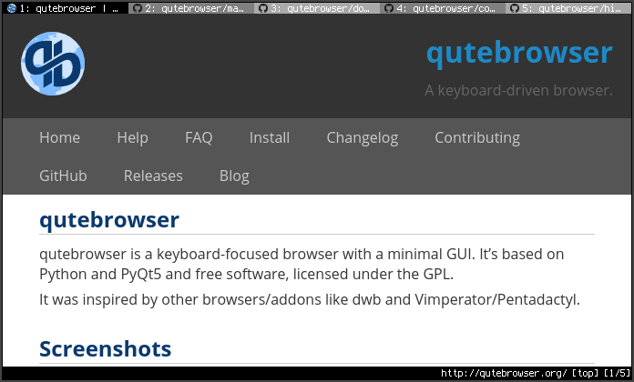
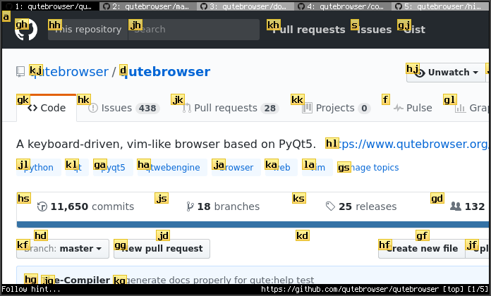

很长一段时间，我经常会问自己一个问题：一味追求全键盘操作真的有必要吗？

我是一名 neovim 用户，编辑工作已经完全脱离了鼠标；而在体验到了不需要反复挪动右手去拿鼠标的舒适之后，我愈发希望在其他使用场景下也可以完全依赖键盘。于是，我开始折腾平铺桌面管理器，从在 linux 上捣鼓 hyprland 到现在在 mac 上完全迁移到 aerospace + sketchybar。我使用鼠标的时间确实越来越少，但是却始终有一处使用场景，我没有办法摆脱鼠标。

浏览器。

因为我自己也会做一些前端开发，所以在我的观念中，将本就比较复杂的网页上的复杂交互简化到可以完全依靠键盘描述的程度确实是有些困难。我倒是听说过一些解决方案比如 vimium，但当我知道这些工具是以浏览器扩展的形式提供的时候，难免怀疑这种层面的 hack 到底能不能真的实现理想的效果（实际上，vimium 这类工具确实有些时候无法正确将按键拦截下来）。所以，对于全键盘操作浏览器，我真正想要的是一个将按键拦截做进应用最底层、具有非常强自定义能力的浏览器。所以，相当长的一段时间内，我都在纠结，如果我在开发期间查看文档的时候不可避免要去使用鼠标，那么我这样去追求编辑阶段全键盘操作的意义是什么。

但现在，我认为我终于是找到了这个问题的答案：qutebrowser。

## 1 简单介绍 qutebrowser

关于 qutebrowser 的介绍在它的官网上是这样的：

> qutebrowser is a keyboard-focused browser with a minimal GUI. It’s based on Python and Qt and free software.

可以看到，qutebrowser 的定位就是 keyboard-focused **browser** 而不是一个扩展。而且，它还有一个很大的优势，就是极简的界面——我个人是不太喜欢传统的浏览器上面那些乱七八糟的控件，书签栏以及一些按钮始终占据空间是没有道理的，因为我并不总是需要看到这些信息。而 qutebrowser 真的就是把界面做到了极致的清爽，整个界面上除了顶部的标签和底部的简单状态栏，什么多余的都没有：



这种风格是否好看见仁见智，反正我可是太喜欢了。

## 2 基本的使用

qutebrowser 的设计和 vim 一脉相承，采用了不同的 mode。默认情况下，我们处于 normal mode 下，此时我们可以通过：

- <kbd>h</kbd> /<kbd>j</kbd> /<kbd>k</kbd> /<kbd>l</kbd>：上下左右滚动页面
- <kbd>o</kbd> / <kbd>O</kbd>：在当前标签页 / 新的标签页打开链接
- <kbd>f</kbd> / <kbd>F</kbd>：在当前标签页 / 新的标签页打开链接（进入 hint mode，如下图）
- ...



默认的快捷键有很多，但和 vim 一样我们没有办法把所有的功能都绑定到快捷键上，所以 qutebrowser 还支持 command mode，我们只需要在 normal mode 下输入 <kbd>:</kbd> 就可以开始输入命令，例如 `:help -t` 是在新的标签页打开帮助文档，`:wq` 是保存当前已经打开的标签页并退出。此模式支持 emacs style 的快捷键，你也可以使用 <kbd>Tab</kbd> 去选择补全建议。

## 3 配置 qutebrowser

qutebrowser 非常棒的一点是支持我们使用 python 进行配置。配置文件的默认位置可以通过 `:version` 命令查看，在 mac 上这个位置是 `~/.qutebrowser`，入口文件为 `config.py`。默认情况下这个文件夹的结构是：

```
📂 .qutebrowser
--  📄 config.py
--  📄 quickmarks
--  📂 bookmarks
----  📄 urls
--  📂 greasemonkey
```

其中，quickmarks 和 bookmarks 都是书签（后面我们会详细了解），greasemonkey 则用来存放油猴脚本。

### 3.1 基本的配置

在 `config.py` 中，我认为至少应该做这些基本配置：

```python
config.load_autoconfig(False)

import os

old_path = os.environ["PATH"]
os.environ["PATH"] = f"/opt/homebrew/bin:{old_path}"

c.scrolling.bar = "always"
```

在配置文件中，我们可以使用两个全局变量：`c` 和 `config`，后者主要是提供了一些方法供我们调用，我们更多还是使用 `c` 对象中的一些字段进行配置。

在上述的配置中，我们做了三件事情：

- 禁用了 qutebrowser 的 autoconfig；我们可以在浏览器界面直接通过 `:set` 修改属性，而默认情况下这个修改会被记录下来，下次启动的时候继续生效。我希望我所有的配置都由我自己编写，所以选择禁用了这个选项
- 修改了 `PATH` 变量：这是一个针对 mac 的配置，在 mac 上通过 .app 打开 qutebrowser 的时候会启动一个类似沙箱的环境，其中一些环境变量与我们的终端设置可能不同，由于后续我们会尝试从 qutebrowser 中调用一些外部工具，如果不正确设置 `PATH` 会导致这些工具找不到。我们可以通过 `:pyeval os.environ["PATH"]` 查看当前的环境变量
- 启用了滚动条：默认情况下 qutebrowser 会像 vim 一样只以百分比显示当前在文档中的位置，这显然没有滚动条直观。这里我们调用了 `c` 对象的 `scrolling` 字段进行配置

### 3.2 我推荐的配置


下面这些配置是我认为可以大幅提高使用体验的：

```python
# 默认的字体大小还是有点小的
c.fonts.default_size = "16pt"

# 默认情况下 qutebrowser 是使用英语的，这会导致很多网页也使用英语呈现
c.content.headers.accept_language = "zh-CN;q=0.9,en-US,en;q=0.8"

# 修改 header，伪装成 chrome。qutebrowser 的内核本就是 chromium，这样做问题不大
c.content.headers.user_agent = "Mozilla/5.0 (Windows NT 10.0; Win64; x64) AppleWebKit/537.36 (KHTML, like Gecko) Chrome/120.0.0.0 Safari/537.36"

# 修改一下 hint 的外观以及备选的字母
# 默认情况下这些字母只有 hjkl 那一行，这里我选择增加一行
c.hints.padding = {"bottom": 1, "left": 5, "right": 3, "top": 1}
c.hints.chars = "asdfghjklzxcvbnm"
c.hints.border = "none"

# 启用平滑滚动（只针对 hjkl 生效）
c.scrolling.bar = "always"
c.scrolling.smooth = True

# 修改底部状态栏的大小并精简呈现的内容
c.statusbar.padding = {"bottom": 2, "left": 0, "right": 5, "top": 2}
c.statusbar.widgets = ["search_match", "text:|", "url", "text:|", "scroll"]

# 增加上面标签栏的大小
c.tabs.padding = {"bottom": 5, "left": 10, "right": 10, "top": 5}

# 设置启动页面、默认页面、搜索引擎
c.url.default_page = "https://bing.com"
c.url.searchengines = {"DEFAULT": "https://bing.com/search?q={}"}
c.url.start_pages = "https://bing.com"
```

我们可以重启 qutebrowser 让配置生效，也可以直接运行 `:config-source` 命令，但需要注意，后者只是在当前的基础上运行你的配置文件，而不会将已经修改的配置重置，所以如果你删除了某些配置然后再去刷新，会发现删除的配置仍然生效。

### 3.3 配置快捷键

因为快捷键比较多，所以我选择将其放在了一个单独的文件中，这个文件和 `config.py` 同级：

```
📂 .qutebrowser
--  📄 config.py
--  📄 keymaps.py
--  📄 quickmarks
--  📂 bookmarks
----  📄 urls
--  📂 greasemonkey
```

首先，我们要在 `config.py` 中引入 `keymaps.py`：

```python
config.source("keymaps.py")
```

然后我们就可以开始配置快捷键了。首先我选择解绑一些默认快捷键：

```python
unbind = [
    "<Alt-1>",
    "<Alt-2>",
    "<Alt-3>",
    "<Alt-4>",
    "<Alt-5>",
    "<Alt-6>",
    "<Alt-7>",
    "<Alt-8>",
    "<Alt-9>",
    "d",
    "H",
    "J",
    "K",
    "L",
]

for unbind_lhs in unbind:
    config.unbind(unbind_lhs)
```

其中，<kbd>Alt</kbd> 系列（在 mac 上也就是 <kbd>option</kbd>）的快捷键是用于切换标签页的，但是因为我的 aerospace 也是用这些快捷键切换 workspace，所以我需要把这些解绑掉。至于其他的：

- <kbd>d</kbd>：关闭当前标签页；太容易误触了
- <kbd>J</kbd> / <kbd>K</kbd>：前往左侧的 / 右侧的标签页；容易误触且不直观，明明标签页是左右排布的
- <kbd>H</kbd> / <kbd>L</kbd>：在历史记录中向前 / 向后；容易误触且不直观，因为我习惯用上一条历史和下一条历史这样来进行描述

然后，是绑定我们自己的快捷键：

```python
keymap = {
    "<Ctrl-1>": "tab-focus 1",
    "<Ctrl-2>": "tab-focus 2",
    "<Ctrl-3>": "tab-focus 3",
    "<Ctrl-4>": "tab-focus 4",
    "<Ctrl-5>": "tab-focus 5",
    "<Ctrl-6>": "tab-focus 6",
    "<Ctrl-7>": "tab-focus 7",
    "<Ctrl-8>": "tab-focus 8",
    "<Ctrl-9>": "tab-focus 9",
    "<Ctrl-0>": "tab-focus -1", # 最后一个标签页
    "<Ctrl-h>": "tab-prev",
    "<Ctrl-l>": "tab-next",
    "<Ctrl-j>": "forward",
    "<Ctrl-k>": "back",
    "<Ctrl-f>": "hint all hover", # 模拟鼠标悬停
    "<Ctrl-y>": "hint links yank", # 选中比ing复制链接
    "<Ctrl-q>": "tab-close",

    # 默认情况下这两个快捷键用不到平滑滚动，但如果改为模拟多次 j / k 的调用则可以
    "<Ctrl-d>": "cmd-run-with-count 15 scroll down",
    "<Ctrl-u>": "cmd-run-with-count 15 scroll up",
}

for lhs, rhs in keymap.items():
    config.bind(lhs, rhs)
```

### 3.4 书签的使用

前面我们在介绍配置目录结构的时候看到了 bookmark 和 quickmark，这二者都是书签，但区别在于 quickmark 可以自定义名称，所以我更多使用它。其格式为 `标题 网址`。之后，我们可以按下 <kbd>B</kbd> 并键入标题或链接打开书签。

然而，quickmark 不支持文件夹，如果我们的书签数量增加，上面的选取方式不是很清晰。所以针对这一点，我们可以在设置标题的时候采用一些小技巧，例如如果我们有如下书签：

```
The Modern JavaScript Tutorial https://javascript.info/
R for Data Science https://r4ds.had.co.nz/
Julia Tutorial https://ucidatascienceinitiative.github.io/IntroToJulia/
ArchWiki https://archlinux.org/
Starship https://starship.rs/zh-CN/
Stow https://www.gnu.org/software/stow/manual/stow.html
```

原本我们想把前三条放在 learn 文件夹下，将后三条放在 doc 文件夹下。那么此时，我们可以改成下面的样子：

```
learn - The Modern JavaScript Tutorial https://javascript.info/
learn - R for Data Science https://r4ds.had.co.nz/
learn - Julia Tutorial https://ucidatascienceinitiative.github.io/IntroToJulia/
doc - ArchWiki https://archlinux.org/
doc - Starship https://starship.rs/zh-CN/
doc - Stow https://www.gnu.org/software/stow/manual/stow.html
```

这样我们在查找书签的时候就可以先输入 `learn` 或 `doc` 来精简备选项。

当然，这还不是最快的，如果我们真的有一些非常频繁访问的网站，可以直接设置快捷键打开：

```python
really_quick_marks = {
    "gh": "https://github.com",
    "zh": "https://zhihu.com",
    "bl": "https://shaobin-jiang.github.io/blog",
    "ds": "https://chat.deepseek.com",
}

for suffix, url in really_quick_marks.items():
    config.bind(f"<Space>{suffix}", f"open -t {url}")
    config.bind(f",{suffix}", f"open {url}")
```

如上，我们设置以 <kbd>space</kbd> 开头加上后缀在新标签页打开链接，以 <kbd>,</kbd> 开头加上后缀在当前标签页打开链接，这样就可以非常迅速地打开常用网页。

## 4 点击空白处 / 特定位置

在真正开始使用前，你或许会觉得 qutebrowser 这种设计非常美妙。但是，事实并非如此。我们设想一种情况：我们打开了知乎，点开了私信，现在该怎么把私信关掉呢？一般情况下，我们只要点页面空白处就可以了，但是现在用键盘操作，我们该怎么实现这个操作呢？qutebrowser 的 hint 是基于一定的规则选中它认为可以点击的元素，而 body 似乎并不在这个范围之中。这种情况下，我们可以：

- 使用 javascript 来让当前有焦点的元素失去焦点：`:jseval -q document.activeElement.blur()`（`-q` 是不打印返回值）
- 要求 qutebrowser 点击 body 元素：`click-element css body`（使用 css 选择器选中 body）

当我们在使用必应、github issue 将焦点放在输入框的时候可以使用第一种方式重新获取焦点，而在知乎这种与焦点无关的案例中，则可以使用第二种方式。然而，第二种方式也并不稳妥，因为它经常会很神奇地显示 body 不在页面范围中而无法点击。

这还没完，我们设想另一种情况，我们的页面上有一段很长的代码块，一行的内容超出了屏幕的宽度，现在我们想要左右拖动代码块，那么问题来了，qutebrowser 如何知道我们是要让这个代码块左右移动而不是让整个页面左右移动呢？此时，我们就需要先让代码块获取焦点，但是现在我们没有办法像刚才选中 body 一样选中具体的代码块——你当然可以针对具体的页面做具体的设置，但这里我们讨论的是一些更加 general 的解决方案。

于是我选择编写一个脚本，可以将鼠标居中或将鼠标向特定方向移动 200 px，然后在 qutebrowser 中调用。在 mac 上，我在 d 老师的帮助下使用了 swift 编写了这段脚本：

```swift
import Foundation
import Cocoa
import CoreGraphics

func moveMouse(direction: String?, position: String?) {
    let screenFrame = NSScreen.main?.frame ?? NSRect(x: 0, y: 0, width: 1920, height: 1080)
    let centerPoint = NSPoint(x: screenFrame.midX, y: screenFrame.midY)
    var currentMouseLocation = NSEvent.mouseLocation
    currentMouseLocation.y = screenFrame.height - currentMouseLocation.y // convert to Cocoa coordinates
    
    var newPoint: NSPoint
    
    if let pos = position {
        let components = pos.components(separatedBy: ",")
        if components.count == 2,
           let x = Int(components[0]),
           let y = Int(components[1]) {
            newPoint = NSPoint(x: CGFloat(x), y: CGFloat(y))
        } else {
            print("Invalid position format. Use x,y")
            return
        }
    } else if let dir = direction?.lowercased() {
        let distance: CGFloat = 200
        switch dir {
            case "up":
                newPoint = NSPoint(x: currentMouseLocation.x, y: currentMouseLocation.y - distance)
            case "down":
                newPoint = NSPoint(x: currentMouseLocation.x, y: currentMouseLocation.y + distance)
            case "left":
                newPoint = NSPoint(x: currentMouseLocation.x - distance, y: currentMouseLocation.y)
            case "right":
                newPoint = NSPoint(x: currentMouseLocation.x + distance, y: currentMouseLocation.y)
            case "center":
                newPoint = centerPoint
            default:
                print("Invalid direction. Use up/down/left/right/center")
                return
        }
    } else {
        print("No direction or position specified")
        return
    }
    
    newPoint.x = max(0, min(screenFrame.width, newPoint.x))
    newPoint.y = max(0, min(screenFrame.height, newPoint.y))
    
    let event = CGEvent(mouseEventSource: nil, mouseType: .mouseMoved, mouseCursorPosition: newPoint, mouseButton: .left)
    event?.post(tap: .cghidEventTap)
}

func clickMouse() {
    guard let currentMouseLocation = CGEvent(source: nil)?.location else {
        print("Cannot get cursor position")
        return
    }
    
    let mouseDownEvent = CGEvent(mouseEventSource: nil, mouseType: .leftMouseDown, mouseCursorPosition: currentMouseLocation, mouseButton: .left)
    let mouseUpEvent = CGEvent(mouseEventSource: nil, mouseType: .leftMouseUp, mouseCursorPosition: currentMouseLocation, mouseButton: .left)
    
    mouseDownEvent?.post(tap: .cghidEventTap)
    mouseUpEvent?.post(tap: .cghidEventTap)
}

let help = """
Usage:
swift cursor.swift [up|down|left|right|center]
swift cursor.swift position x,y
swift cursor.swift click
"""

if CommandLine.arguments.count > 1 {
    let argument = CommandLine.arguments[1].lowercased()
    
    if ["up", "down", "left", "right", "center"].contains(argument) {
        moveMouse(direction: argument, position: nil)
    } else if argument == "position" && CommandLine.arguments.count > 2 {
        moveMouse(direction: nil, position: CommandLine.arguments[2])
    } else if argument == "click" {
        clickMouse()
    } else {
        print(help)
    }
} else {
    print(help)
}
```

我将其命名为 `cursor.swift`，并在 qutebrowser 中添加了下述快捷键：

```python
import os
CURSOR_PATH = os.path.join(os.environ["HOME"], ".qutebrowser", "cursor.swift")

{
    "\\c": f"spawn swift {CURSOR_PATH} center",
    "\\h": f"spawn swift {CURSOR_PATH} left",
    "\\j": f"spawn swift {CURSOR_PATH} down",
    "\\k": f"spawn swift {CURSOR_PATH} up",
    "\\l": f"spawn swift {CURSOR_PATH} right",
    "\\\\": f"spawn swift {CURSOR_PATH} click",
}
```

这样我就可以将鼠标调整到一个大致的位置并进行点击。这虽然不是完美的解决方案，但是也一定程度上解决了我的问题。

## 5 观看视频

qutebrowser 是用 qt 写的，使用了 qtwebengine。但是，相信大家应该知道 qt 那非常恶心的许可证问题，反正这这那那的各种问题，最终导致 qutebrowser 在 mac 上的 qtwebengine 不支持 mp4 等视频的播放。你当然可以选择从头编译一份带有 proprietary codecs 的 qtwebengine，但是这个编译流程很恶心很麻烦很费时（我还没编译成功）。所以，qutebrowser 官方推荐的做法是用 mpv 播放。

首先，我们要能够选中视频。我们在 hint 中添加一类 video，并要求其选中所有的 video 元素，这样我们就可以通过 `hint video <something-to-do>` 这样来操作视频元素了：

```python
c.hints.selectors["video"] = ["video"]
```

在对 hint 的操作中，有一种是使用 `spawn` 命令，所以我们可以这样选中视频元素并在 mpv 中播放： `hint video spawn mpv {hint-url} --keep-open=yes --geometry=80%+200+200`。这里面，`spawn` 后面的都是我们一般在命令行执行的内容，`--keep-open` 是 mpv 的参数，要求其在视频播放完成后不要立刻关闭；`--geometry` 则是控制 mpv 宽度为屏幕的 80%，左侧和顶部距离屏幕左侧和顶部各 200 px。

## 6 补全 hint

qutebrowser 默认情况下基于 css 选择器选中可以 hint 的元素，这样做肯定是不全的，比如用 `addEventListener` 添加点击事件的元素就不会被选中。这时，我们可以使用内置的油猴脚本功能，在页面加载之前执行一些 javascript 代码。我们在 `greasemonkey/` 中创建 `hint.js`：

```javascript
(function () {
    'use strict';

    const class_name = 'qutebrowser-custom-hint';
    const old_add_event_listener = Element.prototype.addEventListener;
    Element.prototype.addEventListener = function () {
        if (arguments[0] === 'click') {
            this.classList.add(class_name);
        }

        return old_add_event_listener.apply(this, arguments);
    };
})();
```

但是这种做法仍然不够全面，有一些奇怪的网页在这种情况下仍然会漏过一些可点击的元素（比如 deepseek，我不知道为什么那个“开启新对话”的按钮就是无法选中），所以我们还可以继续针对特定网页制定一些特定的规则：

```javascript
(function () {
    'use strict';

    const host = window.location.host;
    const class_name = 'qutebrowser-custom-hint';

    window.addEventListener('load', function () {
        if (host === 'chat.deepseek.com') {
            let target_text = '开启新对话';
            let walker = document.createTreeWalker(document.body, NodeFilter.SHOW_TEXT, null);

            // 我不知道为什么直接在 createTreeWalker 中编写 filter 不好用，好像是 greasemonkey 特殊的沙箱机制造成的
            let node;
            while ((node = walker.nextNode())) {
                if (node.nodeType === Node.TEXT_NODE && node.nodeValue === target_text) {
                    node.parentNode.classList.add(class_name);
                    break;
                }
            }
        }
    });
})();
```

## 7 总结

其实即便经过了这么多的配置，qutebrowser 还是会有着一些问题，比如 bilibili 视频的播放，比如文本的选中（确实是有一个 caret mode 但是体验很烂），毕竟用户交互过于复杂，仅靠键盘描述确实存在困难。不过，如果你的需求仅仅是浏览网页，比如查看文档、刷刷 github，那 qutebrowser 还是绰绰有余的。至于更复杂的操作，比如刷 b 站、前端调试，我选择将其交给传统的浏览器。
