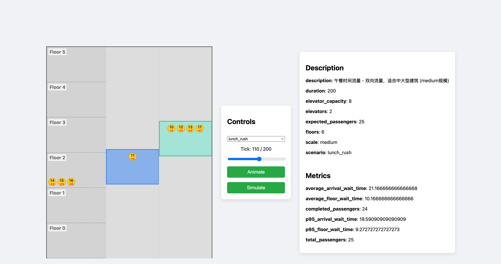
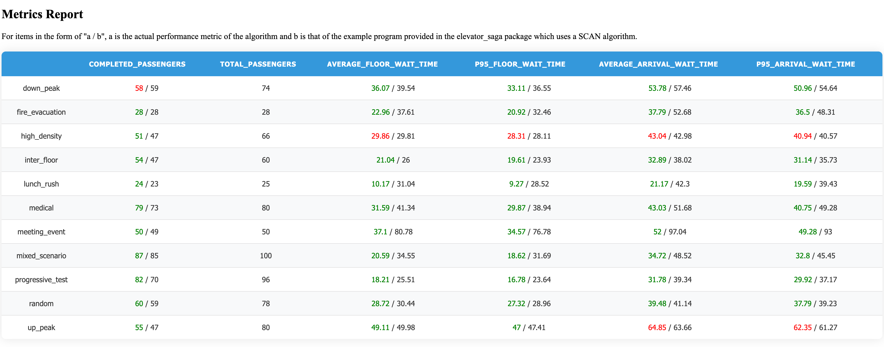

> 作业地址：<https://github.com/Shaobin-Jiang/elevator-simulator>

我的搭档这周退课了，也许是上周，我不知道。

总之就是，前面忘了后面忘了，反正这个结对编程最后做成了独立编程。倒不是我故意不想结对的，我一开始的想法是先做出一个能跑的电梯调度 demo，然后再和搭档一起优化，结果 demo 搭建起来的第二天，我的搭档告诉我她决定退课。我看着这一坨我觉得还挺像屎山的东西，寻思着大概不会有人愿意来和我一块继续做下去，而我自己也不太想这个时候进别人的组里窃取胜利果实；反正第一次作业提交时间也已经临近了，干脆就自己做了。

所以，我确实也没办法在这篇总结里覆盖要求撰写的全部内容，毕竟像“结对的过程”这种于我而言确实没有经历过的东西我属实没有办法写下来。能写的就只有我真的做了的部分。

## 1 算法的关键

说实话，当我看到第一次作业提交之后，我的算法效率排在全班第二的时候，是震惊的，因为我在搭档退课之后就直接摆烂了。我做梦也没想到，《功夫熊猫》里面好吃的面条的秘诀其实就是清汤面这种剧情能发生在我头上。

所以我的算法是什么？就是一个简单的 LOOK 算法：让电梯向一个方向运动，如果那个方向没有需要接的乘客就调头（在第二次作业要求更新之后就变成了，如果反方向也没有乘客，就停下来）。

如前文所说，我一开始是带着先做一个 demo 出来的想法编写了这套算法；而在搭档退课之后，我一开始还是打算自己挣扎一下做做优化的，于是设计了一套自以为非常智慧的 cost 函数，计算怎样调度代价最小。然后，新算法不仅没有之前的 LOOK 算法快，甚至比助教给出来的 SCAN 算法（就是电梯一直运行到头再调头，不管前方有没有乘客）还慢。

（我必须给自己正名，这个算法烂我只应该背一半的锅，因为一开始模拟器有 bug 会让乘客在电梯没到的时候就跳进电梯井里）

于是，我摆烂了。正如同软件工程课上黄金点问题的那次测试一样，我选择直接放弃努力——要想找到黄金点问题的最优解，我至少要知道班级同学对这个问题思考深入程度的分布情况，which 我没有办法知道；要想找到当前这个电梯调度的最优算法，我需要摸清关于这个模拟器一大堆 undocumented 的细节，比如电梯到达之后必须先预设一个方向否则乘客不会进入电梯，比如我不知道可能藏在什么犄角旮旯的 bug……我一直秉持着一个想法：与其绞尽脑汁机关算尽去花时间在一个几乎不可控的东西上面，那我不如直接开摆，这样最后得不到好的结果我也可以安慰自己是当初选择了不努力。

（插一句这种做法在心理学上我们称之为自我设障，也算是比较常见的行为）

所以你大概可以理解为什么我在看到我的算法能跑到全班第二的效率的时候为什么会这么惊讶。我当然可以马后炮地分析一下，“在如此小尺度且随机的测试样本上进行优化是完全多余的、本来就没有一种通用的调度算法、只有针对不同流量类型的优化”诸如此类云云，但实际上，

并非并非。

## 2 PSP 表格

| PSP 各个阶段 | 预估时间 （分钟） | 实际记录 （分钟） |
| :--- | :---: | :---: |
| **计划：** 明确需求和其他因素，估计以下的各个任务需要多少时间 | 60 | 60 |
| **开发**（包括下面 8 项子任务） | 695 | 735 |
| &emsp;· 需求分析（包括学习新技术、新工具的时间） | 5 | 5 |
| &emsp;· 生成设计文档（整体框架的设计、各模块的接口、用时序图、快速原型等方法） | 60 | 30 |
| &emsp;· 设计复审（和同事审核设计文档，或者自己复审） | 30 | 30 |
| &emsp;· 代码规范（为目前的开发制定或选择合适的规范） | 60 | 0（我自己有 lint 工具，没了搭档也不需要管别人了） |
| &emsp;· 具体设计（用伪代码、流程图等方法来设计具体模块） | 60 | 10 |
| &emsp;· 具体编码 | 300 | 480 |
| &emsp;· 代码复审 | 120 | 0 |
| &emsp;· 测试（自测测试、修改代码、提交修改） | 60 | 180 |
| **报告** | 125 | 60 |
| &emsp;· 测试报告（发现了多少 bug，修复了多少） | 60 | 0 |
| &emsp;· 计算工作量（多少行代码、多少次提交、多少测试用例、其他工作量） | 5 | 0 |
| &emsp;· 事后总结，并提出改进计划（包括写文档、博客的时间） | 60 | 60 |
| **总共花费的时间**（分钟） | 880 | 855 |

## 3 当需求发生变化时，你们是如何重构代码的

涉及到需要重构代码的需求变动有两次：

### 运行脚本中不能包含启动模拟器的部分

本来我是在提供的模拟器上包裹了一层，其实也是符合 mvc 架构的，但是这个需求变动直接让这种设计变得无法使用。

于是我一开始选择了新开一个 flask server，然而同时运行多个 flask 进程是会出现奇怪的 bug 的，于是我最终将后端换成了 fastapi。

### 加入 engery consumation 的指标

第二次作业中增加了一个性能指标，即电梯运行的能耗。这倒是很简单，原来我的算法中电梯会在没有乘客的时候在一层内反复横跳，现在我只需要在这种情况下让电梯停下来即可，几乎没有增加什么代码量。

## 4 程序的代码规范，设计规范。 你们两如何达成共识，采用了什么规范

其实也没有什么共识可言。我一开始倒确实是想要用 github workflow 对代码做自动格式化的，但搭档退课之后我放弃了这一点，因为我自己配置了 lint 工具，本地开发的过程中每隔一小会就会检查一下。最后，python 就采用了 pep 8 的规范，而前端则采用了我之前一直习惯使用的一份 prettier 配置。

## 5 界面模块的详细设计过程

在我最初的设想中，我想让我的搭档帮忙兼职一下美工，因为我自己的设计能力实在是有些不堪入目。但最后，迫于现实我选择了让 AI 帮我生成了一套简单的界面，然后我自己做了一些微调。

一开始的界面是这样的：

然而后来，我发现实际提交的作业并不是使用模拟器里提供的测试案例；此外，由于新的需求要求我不能自己启动模拟器，仅通过 http 请求拿不到电梯的具体位置，我只能在新版 gui 中设计了一套有点麻烦的计算电梯位置的方式，这种情况下继续支持滑动条查看每个 tick 电梯位置显然得不偿失；另外，测试案例中包含 4 台电梯和 20 层楼，出于 ui 设计的考虑我也没有办法在页面上呈现这么多信息。于是我把报告和滑动条这些部分都砍掉了。界面变成了这样：

## 6 收获

虽然说确实没有真的结对吧，但“结对”这个作业要求还是对这次的项目有了一些影响，因为我想着之后总归要和搭档配合，所以前期编写代码的时候增加了注释的编写、减少了代码压行这种写起来方便读起来痛苦的做法。相比于之前注释能省则省、只保留自己实在可能看不懂记不住的部分的做法，我觉得这次开发中我在这方面也算是有了很大的进步。

技术难点嘛……我倒是很难说我遇到了什么难点，因为用到的都是我非常熟悉的工具和语言，唯一一个全新的知识点是不要把多个 flask instance 同时在一台机器上跑起来（虽然短期内我是不会有任何写 flask 项目的打算了）。

AI 确实是帮了我大忙，在做 gui 的时候，接口设计真没花费我多少时间，但是怎样设计一个合理的界面把电梯调度的过程呈现出来，我真想不到，于是我直接把我的接口设计和想要呈现的信息告诉了 GPT-4，它也很快帮我生成了一个界面，我小修小补之后就可以用了。不过 AI 也帮了倒忙，用 cost function 决定电梯调度这个思路就是 Gemini 提供的，于是我成功在这条路上浪费了好几个小时。

说实话，这次作业写得我挺难受的，雄心壮志想要做个好点的项目结果最后落到摆烂；自己认认真真设计的算法效果烂得不行，最后交上去一份自己完全瞧不上的算法反而结果不错；需求变更导致我还挺喜欢的一些功能被迫砍掉；虽然说这在开发中并不是什么很罕见的事情，但是真落到自己身上还是不太好受的。
