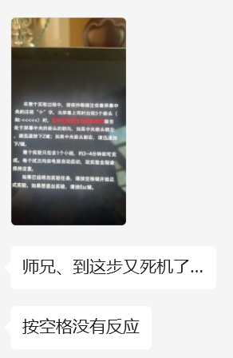
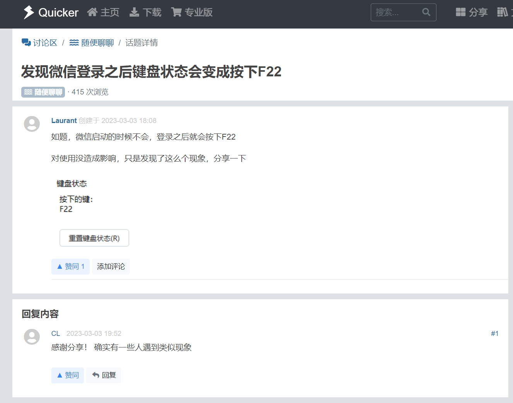

就在刚才，我在帮一个师妹讲 PsychToolbox，主要任务是帮她把老师给的程序跑起来。因为我自己是八百年不用一次 PTB，加上讲的内容主要还是环境的搭建，所以我带着她安装了 PTB 后就让她自己去跑代码去了。那段代码我自己是没运行的，但是我大概扫了一眼感觉应该是没什么大问题的，而且这还是老师发过来的，所以也没多想。直到……



我倒没怎么当回事——大概是又少了什么依赖吧，毕竟这个代码中用了一些工具包可能对面没装，导致程序跑不起来。不过为了以防万一，我决定自己也跑一下。

然后，我也卡了……

啊？

具体来说，表现出的问题是这样的：程序运行到了呈现指导语的那一步，此时我应该可以通过按下空格键进入正式实验，但无论此时我怎么按键，程序都没有反应。因此，问题显然出现在指导语附近：

```matlab
Screen('FillRect', wPtr, bgColor, screenRect);
Screen('DrawTexture', wPtr, insTexture, [], instructPosn);
Screen('Flip', wPtr);

while KbCheck; end

while 1
    [keyIsDown, ~, keyCode] = KbCheck;
    if keyIsDown && keyCode(KbName('space'))
        break;
    end
end
```

很正常吧，呈现指导语，然后等到现有的按键都抬起之后再开始监听空格。已知指导语呈现正常，后面监听空格那段看着也没什么大问题，那问题只能出现在 `while KbCheck; end` 这一句了？

于是我运行了这样一段代码：

```matlab
pause(1);
KbCheck
```

输出是 `1`……但是我之所以加了一个 `pause` 就是为了有时间松开按键，怎么可能还能监听到按键呢？我又试了好多次，甚至重启了 Matlab，但每次都是同样的结果。于是我决定看看到底是哪个键被占用了。比较蠢的是我第一次打开了 Windows 下的屏幕键盘，因为我想着如果有按键，那么屏幕键盘上会显示出来。然而，还是什么都没有。

这时我才反应过来，`KbCheck` 可以查找哪些键被按下，于是我改了一下刚才的代码：

```matlab
pause(1);
[~, ~, keys] = KbCheck;
find(keys)
```

此时，命令行窗口中输出了一个 `133`。So？这是什么键？我查了一下，是 <kbd>F22</kbd> 键。所以问题的一部分解决了，<kbd>F22</kbd> 并不存在于大多数键盘上，屏幕键盘上也没有，所以显示不出来。但是问题又来了，这个键为什么会被按下啊？

于是我就查到了这[一条](https://getquicker.net/QA/Question/16369)：



这下对上了。我在运行程序的时候确实全程开着微信。于是我将微信退出，重启 Matlab 然后再运行代码，一切正常。

所以，一条小建议，以后运行 PTB 的时候，切记先把微信退了……虽然我还是不懂，为什么微信要占一个按键呢？
