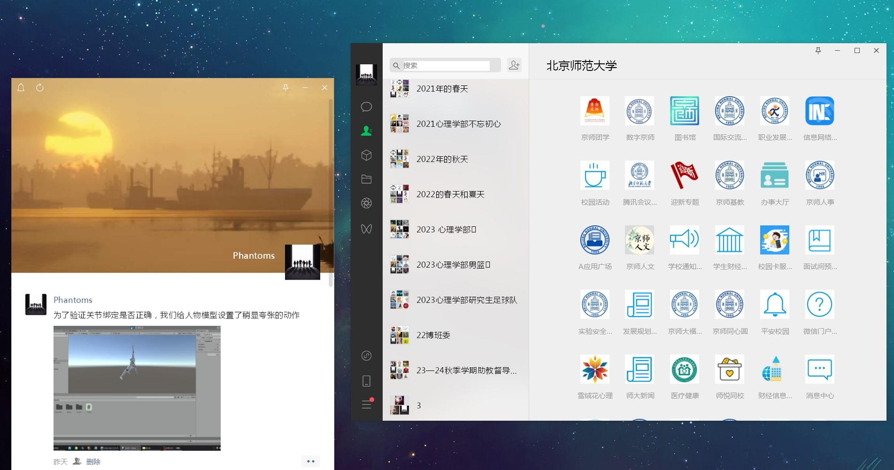
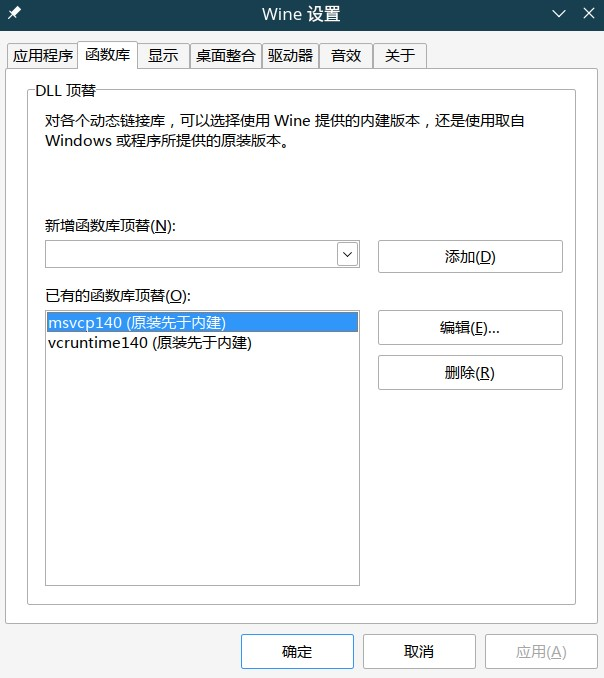

如果说，Linus 那句著名的 "So, Nvidia, f\*\*k you" 道出了世界范围内无数 Linux 用户的心声，那么中国的 Linux 用户在引用这句话的时候，大抵还应该加上一句 "Tencent f\*\*k you" 才对。除却很多人对腾讯本身一些行为的厌恶之外，很多 Linux 用户讨厌腾讯的理由还要算上其对自己旗下软件的 Linux 支持几乎毫无作为。很长一段时间内，人们如果要在 Linux 下使用 QQ 或者是微信，完全没有原生的解决方案——用倒是可以用，但是得通过 wine 这样的兼容层，体验并不好。而在 2023 年末的今天，腾讯虽然终于是用 electron 重构了 QQ 并发行了 Linux 原生版本，但是微信那边，腾讯还是丝毫没有推进 Linux 支持的意思。

的确，腾讯在部分系统——比如说统信 UOS——上推出了所谓原生微信，像 Deepin 这种发行版也自己做了 Deepin Wine 来给微信使用带来更好的体验，但是真的会有人为了一个微信就去用统信的系统或者是 Deepin 吗？我连将桌面换成 DDE 都不愿意，更不要说用这些国产的发行版了，而且我确信持有这种想法的人不在少数。也就是说，对于主流发行版上使用微信这件事，腾讯真的是管都不管。

但没辙，微信该用还是得用，所以我们也只能捏着鼻子，找出一个相对来说靠谱一点的解决方案——凑合着用总比完全用不了要好。

到目前为止，我查找到的方法大概包括：

- 下载统信特供版微信，用 bubblewrap 伪装系统信息，让微信以为系统是 UOS
- 使用 wine
- 使用 crossover（带商业支持的 wine）
- 使用 winapps

这几种方法各有优缺。其中，方法一可以保证基本的使用体验（虽然腾讯这个 Linux 原生微信本身体验也没多好），但是没人可以保证这个方法会不会像社区提供的很多其他解决方案——比如说，基于 docker 的微信，调用微信 api 开发的 electron 客户端——一样被 ban 掉。而 winapps 虽然可以最大程度保持和 windows 上一致，但是这个项目现在处于一个半死不活的状态，即便有一群热心的开发者试图给这个项目续命，但进度也不甚理想；况且，winapps 太重了，部署也很麻烦，你真的需要为了使用微信而装一个 win 10 / win 11 吗？

因而，论稳定、论功能、论简易程度，还是使用 wine 或是其衍生品更好。我尝试了 crossover，但是它本身提供的功能也没比原始的 wine 全面到哪里去，除了一个图形化界面外，很多该解决的问题它还是解决不了；而且 crossover 并不是免费产品，我并不想为了一个微信额外支出几百块钱。所以，最终我选择的解决方案是使用原生的 wine 安装微信。

## 问题 1：字体缺失

在使用过程中，我主要遇到了两个问题。其一，是中文字体缺失，导致微信中中文乱码。关于这一问题的解决，可以查到的方案有两种，一种是向 `WINEPREFIX/drive_c/Windows/Fonts` 中复制字体。但是，我在 openSUSE 并没有成功用这个方法修复问题。第二种方法则是将一份微软雅黑字体复制到系统范围的字体文件夹下：

```bash
sudo cp msyh.ttc /usr/share/fonts/
fc-cache -fv
```

此时，我的微信就可以正常显示中文了。



## 问题 2：微信启动报错

这里所谓的报错并不会影响微信启动，但是在微信启动前我总会收到这样一条报错：`启动微信时报错“程序wechatocr.exe遇到严重的问题”`，我必须手动关闭报错窗口才行。不过，报错里倒是写明白了问题所在，即缺少一些 dll。最终我在[官方论坛](https://forum.winehq.org/viewtopic.php?t=29466)上找到了解决方案，即在 `winecfg` 中添加一下 `msvcp140.dll` 和 `vcruntime140.dll`：



## 未解决的问题

到目前为止，没解决的问题还有很多，比如窗口阴影（见 [Arch Wiki](https://wiki.archlinux.org/title/WeChat) 2.1.1），比如输入法窗口位置错误，比如不能截图，但至少，我勉强可以在我的 openSUSE 上使用微信了。
